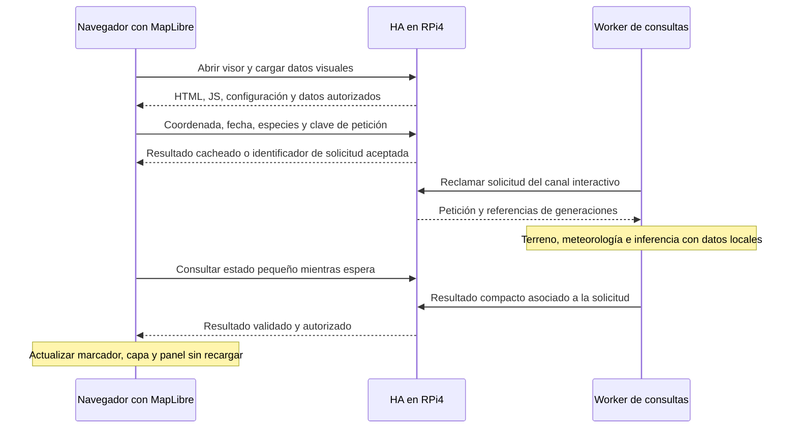

# GIS, DEM y SoilGrids: datos y cálculo entre HA y workers

**Anexo técnico de la [especificación central del Mapa de predicción](prediction-map-specification-es.md).**
Aquí se mantienen el reparto detallado, contratos propuestos y evidencia de código.
Objetivo, alcance y secuencia general se rigen por la especificación central.

**Actualización 14/09:** generación portable de lectores actuales y paridad de
cálculo instaladas/probadas en HA local y worker existente. [Estado y límites](prediction-map-local-worker-setup-es.md).
RPi4 usará el worker en principio, sin fallback local. La selección local se
mantiene para pruebas de paridad; no extrapolar sus tiempos al destino real.
GEODE/MFE nacional y conexión a generaciones privadas de HA real siguen pendientes.
El usuario exige reutilizar meteorología del precálculo y fichas sin cambios:
referencias compactas durante el clic y sincronización solo de datos ausentes o
modificados. La caché del runtime ya proporciona esa base; el mapa aún no la usa.
[Contrato y aceptación de transporte pendientes](prediction-map-local-worker-setup-es.md#sincronización-privada-y-caché-requisito-acordado-integración-pendiente).
El alcance es nacional; el paquete actual de 14,54 GB no lo completa. Los análisis
y propuestas históricos que siguen no sustituyen este estado verificado.

**Revisión posterior del 12/09:** el usuario permite ejecución local explícita
como alternativa al worker, elegida desde el grupo Predicción del visor nuevo.
Sustituye las propuestas de ejecución exclusivamente remota de este anexo.
Selector y canal de informes implementados y probados aisladamente; despliegue
pendiente. Configuración, límites y alcance actualizado en §5 central.

Revisión del 11/09/2026 a petición del usuario. **Reparto geográfico diseñado,
sin implementación ni transferencia de datasets.** El prototipo visual local
iniciado el 12/09 se detalla en §5.1 central; no ejecuta este circuito del worker.
Complementa y corrige el reparto del
[lector SoilGrids](mushroom-prediction-map-soilgrids-reader-design-es.md).

## Decisión de arquitectura

La RPi4 es el coordinador y atiende ediciones pequeñas. Los workers realizan
la preparación pesada de terreno, reconstrucción, entrenamiento, precálculo
y cálculo a demanda del nuevo Mapa de predicción. Cada worker habilitado para
esas funciones debe disponer de una copia local persistente de todas las capas
operativas que pueda necesitar en el territorio que anuncia.

«Compartido» significa mismo lector, contratos y generaciones de datos, con una
copia por máquina que los necesita. No significa un único disco en HA que todos
los workers tengan que consultar remotamente. Tampoco una copia por trabajo,
modelo, especie, día o coordinador de archivos cartográficos idénticos.

Tener los mapas locales permite construir o reparar contextos sin cargar la
RPi4. Si un contexto ya es válido se reutiliza: no se vuelve a muestrear el
suelo en cada entrenamiento, predicción o día del precálculo. Los mapas son
una dependencia estática del worker; los contextos son resultados reutilizables.

La propuesta anterior de reservar el lector y la autocura al coordinador y no
instalar SoilGrids en workers queda reemplazada. Se mantienen índice local,
ventanas, límites, identidad, conservación de contextos y ausencia de hashes
completos por consulta. El worker necesita también lectores vectoriales y DEM;
resolver únicamente SoilGrids no completa la arquitectura del mapa.

## Situación actual comprobada en código

Se consultaron arquitectura, símbolos y llamadas mediante MCP; se contrastaron
las posiciones desactualizadas del grafo con los ficheros actuales. Esta revisión
no inspeccionó discos o procesos del worker real ni de HA real: no certifica qué
capas están efectivamente instaladas allí.

| Recorrido | Evidencia actual | Consecuencia |
|---|---|---|
| Dataset GIS del worker | `mushroom_rebuild_snapshot.py:205`, `mushroom_gis_lab.py:73`, `:109` | Selección explícita: MVC50, geología ICGC, DEM catalán y DEM opcionales de Andorra, hoja IGN 0592 y Francia. No recorre todos los nuevos mapas ni incluye rásteres SoilGrids. |
| Sincronización GIS | `mushroom_worker_transport.py:680`, `:901`; `mushroom_worker_dataset_cache.py:115`, `:328` | Descarga/reutilización persistente por identidad, staging y activación; el contrato actual de reconstrucción exige un dataset y el cache acepta su identificador previsto. No basta añadir carpetas para tener varios paquetes nuevos. |
| Reconstrucción en worker | `mushroom_worker_service.py:1781`; `mushroom_rebuild_pipeline.py:270`, `:320` | Ya cruza GIS/DEM de las observaciones con la raíz GIS suministrada. Es un consumidor directo de mapas. |
| Preparación SoilGrids | `web_server.py:14203`, `:14408`; `mushroom_soilgrids_reconciler.py:134` | Antes del snapshot, el coordinador intenta reparar contextos. Este coste puede quedar en HA incluso cuando el trabajo posterior se ejecuta en worker. Hay que mover esa preparación pesada. |
| Construcción de features | `mushroom_observation_features.py:330` | Une resultados GIS ya persistidos y meteorología; no necesita repetir la lectura de mapas para esa unión. |
| Entrenamiento base | `mushroom_worker_transport.py:1034` | Recibe especificación, features y `known_sites`; no sincroniza ahí la nueva base cartográfica. |
| Predictor y precálculo del worker | `mushroom_worker_service.py:1313`, `:1458`; `mushroom_predictor_runtime.py:173` | Comparten runtime de modelos, meteorología, perfiles y contextos. Tener GIS cacheado por una reconstrucción no lo integra automáticamente en este runtime. |
| Consulta interactiva vigente | `mushroom_predictor_service.py:48`, `:708` | La petición normalizada usa área/especie/fecha; no conserva una coordenada arbitraria como entrada geográfica. El nuevo mapa necesita contrato y constructor propios. |
| Resultados recibidos en HA | `mushroom_worker_results.py:64`, `:537` | Hay validación/promoción y adaptación de rutas del worker a rutas de HA. El esquema nuevo debe referenciar fuentes por identidad, sin inventar una ruta local a un mapa que HA no tiene. |

Todos los paths de esta tabla son relativos a `rainmapper_core/`, salvo
`web_server.py`, situado en `rainmapper-app/app/`. La ausencia de los nuevos
mapas en esos contratos se refiere a estos recorridos actuales, no a un
inventario del disco privado del worker.

## Matriz de consumidores y reparto previsto

| Consumidor | Qué necesita | Ejecutor y residencia propuesta |
|---|---|---|
| Crear/editar microárea | Geometría, DEM y SoilGrids; GIS para previsualizar hábitat/geología | HA puede hacer la consulta acotada desde su copia local. Para operación extensa o sin capa local, servicio de contexto del worker; resultado candidato, nunca geometría anterior presentada como vigente. |
| Crear/editar área | Actualmente no dispara SoilGrids; la vista previa sí consulta GIS/DEM | Mantener guardado barato. Informe puntual/local acotado; informe extenso delegado. No recalcular todas las microáreas al cambiar el padre. |
| Altitud de observación, cambio de coordenadas y foto sin altitud | DEM; no necesitan todas las capas SoilGrids | HA, lectura pequeña local; lote de importación/enriquecimiento en worker. Preservar valor observado/EXIF y procedencia. |
| Reparar contextos para reconstruir/entrenar | GIS/DEM/SoilGrids de las geometrías que falten o hayan cambiado | Worker con mapas locales; devolver cambios derivados por fila. HA conserva autoridad de aceptación. Reutilizar los vigentes. |
| Reconstruir observaciones y entradas geográficas | Mapas, reglas de correspondencia, observaciones y meteorología de la generación fijada | Worker. Agrupar puntos por bloques y polígonos; contexto estático una vez, no por especie/fecha/modelo. |
| Entrenamiento base y multiversión | Features, contextos y series; mapas si debe preparar entradas nuevas | Worker con todas las dependencias cartográficas de su función disponibles. No sustituir el uso de contextos válidos por relecturas forzosas. |
| Precálculo del Predictor actual | Runtime y contextos de áreas/microáreas; mapas si hay que preparar algún contexto | Worker preparado. Resolver pendientes antes de congelar la generación, no iniciar GIS repetidamente dentro de cada día/modelo. HA recibe y activa el resultado compacto. |
| Predictor actual: consulta, recomendación, comparación, backtest | Runtime ya preparado o resultado precalculado | Conservar comportamiento del producto y sus ejecutores autorizados. No convertirlo en consulta nacional de píxeles. El trabajo pesado debe usar worker según su política operativa. |
| Nuevo mapa: terreno y compatibilidad ecológica | DEM, vegetación/cubiertas, geología, SoilGrids, leyendas y reglas | Worker de consultas, con todos los mapas del ámbito anunciado preparados localmente. HA envía coordenada y devuelve/renderiza el informe. |
| Nuevo mapa: predicción al clic | Contexto del punto, meteorología/historia, modelos geográficos validados y reglas | Worker de consultas. Cálculo a demanda y caché limitada; sin precálculo de todos los puntos de España ni fallback pesado automático a HA. |
| Normalizar fuentes, generar índices y capas de visualización | Originales, metadatos, diccionarios y herramientas GIS | Máquina de preparación o worker designado. Tarea explícita fuera de consultas; no en la RPi4. |
| Revisar correspondencias GIS y extraer valores sin mapear | Capas vectoriales y catálogos de reglas | Lotes en worker/preparación; HA muestra y edita propuestas compactas. Mantener idénticas reglas entre consulta y reconstrucción. |
| Evaluación científica, regresión, laboratorio y QGIS | Mapas de la edición reproducida y resultados derivados | Entorno de desarrollo/evaluación; reutilizar su copia existente. No lanzar una evaluación por un clic. |
| Navegador y superposiciones del mapa | Teselas visuales, geometrías acotadas e informes | Recibe productos de visualización preparados; no descarga todos los TIFF/GeoPackage ni ejecuta los lectores científicos. |
| Promoción, Diagnostics y copias de datos de usuario | Identidades, estados, tamaños y resultados | HA. No repetir GIS/DEM/SoilGrids para comprobar un resultado ni introducir las bases nacionales en backups ordinarios. |

Consumidores pequeños adicionales comprobados en `web_server.py`:
`enrich_media_fields_with_dem_altitude` (`:18653`), endpoint
`/api/mushrooms/dem-altitude` (`:22319`), edición de coordenadas (`:23933`),
vista previa GIS de Setales (`:23334`) y refresco de microárea (`:11537`, `:11541`).
La reconstrucción local también existe (`:17953`): no debe convertirse en
fallback automático del mapa cuando el worker esté ausente.

Para correspondencias y revisión: `mushroom_gis_lab.py:530`, `:1230`, `:1299`
y `scripts/reconstruct-mushroom-gis-mappings.py`; exportar puntos QGIS no exige
por sí mismo volver a leer todas las capas. Importar un módulo GIS tampoco
demuestra lectura física: la unión de features y la adaptación de rutas son
ejemplos de consumidores de resultados/metadatos, no de píxeles.

## Qué copia debe tener cada máquina

El worker que sirve España debe tener **antes de anunciarse listo** todos los
archivos operativos e índices necesarios para ese ámbito: DEM seleccionado por
zona, vegetación/cubiertas, geología y SoilGrids. Incluye las fuentes actuales
necesarias para compatibilidad (también los recortes exteriores usados por los
setales) y las nuevas fuentes cuando estén normalizadas e integradas. MFE25,
cubiertas ICGC, GEODE, geología ICGC, IGN MDT25 y SoilGrids nacional forman parte
del inventario de preparación documentado; no se afirma que estén operativos.

Un worker de entrenamiento/precálculo dispondrá de ese conjunto si también
prepara datos nacionales; para un ámbito limitado puede declarar una instalación
limitada. No asignarle una tarea exterior a su conjunto. Si entrenamiento y
consultas usan la misma máquina, compartir archivos físicos; si son máquinas
distintas, cada una necesita su copia. Elegir otro worker requiere comprobar
su preparación, no dar por compartido el disco del primero.

HA conserva sus mapas actuales y los necesarios para las ediciones locales.
No necesita una réplica nacional completa solo por ser coordinador. Una consulta
de edición fuera de su instalación puede delegarse al worker. Esta revisión no
autoriza recortar, mover ni borrar los archivos que ya tenga HA. Cualquier
ampliación local se medirá y publicará explícitamente, no al guardar un formulario.

«Todos los mapas necesarios» no obliga a copiar originales ZIP, descargas
duplicadas, auditorías nacionales o scripts de investigación a cada worker.
Se distribuyen archivos de lectura, índices, máscaras justificadas, leyendas,
unidades, licencias y políticas de prioridad. Los originales y evidencias se
conservan en preparación/archivo; nunca se borran por esta separación. Si un
TIFF original es también el archivo operativo de lectura, se referencia una vez.

Las capas de sustitución respetarán la política del mapa: ICGC geología donde
cubra en Catalunya, GEODE donde corresponda; ausencia explícita en huecos.
No sustituir automáticamente el DEM 5 m del Predictor por el MDT25 nacional:
cambiar resolución o fuente es una decisión de contrato, no un efecto de copiar
datos. El servicio geográfico nuevo puede usar políticas distintas, versionadas.

## Distribución e identidades sin sobrecargar la RPi4

**Decisión aceptada por el usuario el 12/09/2026:** imagen con código/lectores
y dependencias; volumen persistente con GIS, DEM, SoilGrids, municipios y sus
índices ya preparados. Recrear/actualizar el worker conserva esos datos.
Las generaciones cartográficas se distribuyen aparte, sin reconstrucción desde
HA real ni repetición por trabajo. La primera instalación debe recibirlas y
validarlas antes de anunciar capacidad. No se ha cambiado ningún montaje,
contenedor, destino de coordinador o dataset operativo por esta decisión.

**Exportación portable exigida:** entregar imagen para el equipo destino,
paquete de cartografía e índices, manifiesto de compatibilidad e instalador
del volumen. Exportar solo la imagen no transporta los datos persistentes.
Sin rutas absolutas del Mac; importación verificable/reanudable, sin sobrescribir
generación activa ni configuración del coordinador. Datos públicos separados
de credenciales y artefactos privados. Validar ARM64/AMD64 y un destino limpio
sin reconstrucción cartográfica desde HA. Detalle y alcance normativo en
[§6 central](prediction-map-specification-es.md#6-cartografía-copias-locales-y-lectores).

Propuesta de publicación: catálogo pequeño de paquetes por familia/edición y
ámbito, manifiestos paginados e índices locales. Cada objeto lleva identidad,
tamaño y ruta lógica; cada conjunto fija versiones de lectores y políticas.
Los nombres del contrato de publicación se decidirán al implementarlo; no son
capacidades existentes del worker.

1. Preparar/normalizar/indexar en la máquina de datos o worker designado usando
   las descargas terminadas. Medir bytes físicos, archivos y espacio de staging;
   no reconstruir artefactos grandes solo para estimar su tamaño.
2. Publicar una generación inmutable con referencias deduplicadas. HA administra
   qué generación está aprobada, sin construir un TAR nacional ni volver a
   hashear sus archivos por trabajo. Ser autoridad no obliga a almacenar todos
   los bytes ni a servirlos a través de Python en la RPi.
3. Instalar la copia del worker antes de habilitar su función. La primera carga
   puede hacerse desde la máquina que ya conserva los datos mediante un canal
   autorizado; no implica descargar de nuevo ISRIC/IGN ni pasar todo por HA.
   Transporte/origen concreto deberá seleccionarse y probarse antes de usarlo;
   no se configura aquí una URL nueva ni se modifica ningún coordinador.
4. Transferir solo objetos ausentes por streaming, verificar una vez al recibir,
   activar atómicamente tras validación y conservar la generación anterior
   necesaria. Reutilizar objetos idénticos con referencias/enlaces cuando el
   soporte lo permita. Presupuestar copias reales si no permite enlaces.
5. Anunciar preparado solo tras instalar y abrir los índices del ámbito y fijar
   un recibo de generación. Durante el clic verificar identidad/disponibilidad
   acotada; no recorrer manifiestos nacionales ni transferir mapas. Un fallo
   marca la función no disponible o degradada, sin redescarga automática en ella.

«Sin red por consulta» se refiere a mapas y fuentes externas: sí existen el
mensaje pequeño HA–worker y la respuesta. El modelo y la meteorología deben
estar sincronizados también; su actualización sigue un circuito propio de
generaciones, separado de la cartografía estática.

El caché GIS actual es una base útil, pero hay que adaptar sus supuestos de
un dataset, validación de todos los registros y rutas. No resolver el volumen
nacional elevando los límites actuales o metiéndolo en cada runtime. La prueba
de aceptación exigirá cero transferencia cartográfica y cero hash completo de
mapas en un segundo trabajo y en una consulta con generación ya instalada.

En workers multicoordinador: deduplicar únicamente mapas públicos idénticos.
Permisos, selección de generaciones, observaciones, reglas privadas, modelos,
contextos y resultados siguen separados por coordinador. El recibo de una
fuente no autoriza reutilizar los datos privados de otra asociación. Ningún
paso exige cambiar las URLs persistidas.

## Preparación remota antes de entrenar o precalcular

Hoy la autocura ocurre en HA antes de congelar el snapshot. No basta copiar
SoilGrids al worker: esa fase seguiría ejecutándose en la RPi4. Cambiar el
circuito deliberadamente, con entradas y resultados candidatos:

1. HA identifica contextos vigentes sin abrir rásteres. Congela geometrías,
   revisiones de filas y generación cartográfica del lote pendiente.
2. Asigna una fase remota de preparación al worker listo para esas capas. Es un
   contrato nuevo previo al snapshot final, no una tarea que necesite el propio
   snapshot final para arrancar. Evita una dependencia circular de la autocura.
3. El worker reutiliza contextos válidos y calcula los faltantes desde mapas
   locales, por bloques/lotes acotados. Devuelve solo deltas derivados, identidad
   de geometría/fuentes, calidad y diagnóstico limitado.
4. HA valida esquema, tamaños, procedencia y revisión de las filas; acepta solo
   resultados que correspondan a datos aún vigentes. Una edición concurrente
   conserva la fila nueva y deja la afectada pendiente. No restaura el catálogo
   completo ni recompone los mapas para verificar el cálculo.
5. Después se congela el snapshot final utilizado por reconstrucción y
   entrenamiento. Precálculo usa ese runtime y sus contextos; no reabre una
   autocura general dentro del bucle de especies/días/modelos.

Si falta worker o una capa requerida, informar preparación pendiente. Mantener
exclusión explícita de contextos incompletos donde el contrato la exige; no
rellenar ni ejecutar la preparación pesada en HA por defecto. Un entrenamiento
que ya dispone de entradas válidas puede reutilizarlas según su contrato.
Mover preparación no autoriza regenerar o promover modelos existentes.

## Nuevo mapa: cálculo a demanda en worker

Recorrido propuesto, todavía sin implementar:

```text
Navegador → HA: coordenada, especies solicitadas, fecha/horizonte
HA → worker listo: solicitud acotada + identidades aprobadas
Worker: terreno local → meteorología local → entradas → inferencia por lote
Worker → HA → navegador: informe compacto y procedencia
```

HA autentica y autoriza al usuario, limita petición/respuesta, selecciona un
worker preparado, gestiona cancelación y sirve resultados. No prepara allí
las entradas nacionales ni carga modelos/Parquet para atender este clic.
El navegador no recibe credenciales del worker ni acceso a sus ficheros.
Reutilizar el canal autenticado existente, con un contrato distinto del
Predictor por áreas; no guardar el punto como área o microárea ficticia.

El worker del mapa necesita cartografía, índices, diccionarios, reglas ecológicas,
catálogo de estaciones/historia suficiente y modelos/selector geográficos
aprobados. Un worker con la capacidad actual del Predictor no es suficiente:
debe anunciar además versiones compatibles, generaciones, ámbito y disponibilidad
de recursos para el nuevo servicio. Dataset presente no equivale a cobertura
científica completa ni a predicción validada para todas sus regiones.

Cachear terreno por celda/geometría y política de fuentes; meteorología por su
ámbito real y generación; inferencia por entradas/modelos/corte. No cuantizar
todos los mapas a 250 m: dos puntos en la misma celda SoilGrids pueden caer en
bosques distintos. Tampoco usar la tesela SoilGrids de 128 km como zona de lluvia.
Compartir buffers/contexto entre especies y siete horizontes, sin duplicarlos
en la respuesta. Consultas repetidas pueden reutilizar resultado; no generar
un precálculo de todas las coordenadas de España.

Si el worker está ocupado, cola corta o estado de espera. Si está desconectado,
respuesta cacheada identificada con su fecha/generación o servicio no disponible;
no invocar silenciosamente el cálculo en la RPi4. Una predicción nueva exige
datos y modelo válidos; el informe de terreno puede estar disponible por separado.

Compartir un worker entre entrenamiento y clics requiere reservar recursos,
prioridad interactiva y cancelación entre unidades de trabajo; no lanzar ambos
a máxima concurrencia. Si no cabe de forma medida, usar workers distintos o
dejar la consulta esperando. No prometer interrupción segura instantánea de un
ajuste de modelo ya iniciado. El lector residente del worker atiende sus carriles
con un presupuesto total; no crear una caché completa por hilo/job/coordinador.
Para los subprocesos de reconstrucción, acceso local al servicio de lectura o
serialización explícita de fases: no multiplicar el presupuesto inadvertidamente.

## Visor MapLibre y entrega de resultados al navegador

Revisión específica del visor: **diseño acordado; primer prototipo demo local
implementado el 12/09**, con código y evidencia en §5.1/§9.1 centrales. La tabla
siguiente conserva el análisis que precedió a esa implementación.
Un único visor MapLibre y código compartido, servido inicialmente por dos rutas:
meteorología actual y meteorología con función predictiva opcional. La ruta nueva
es una entrada al mismo visor, no una copia de su implementación.
Mantener el cálculo geográfico en worker. Servir la página
y transmitir resultados compactos no significa calcular la predicción en HA:
MapLibre dibuja las capas en el navegador del usuario.

Evidencia actual, contrastada en los archivos del repositorio:

| Pieza reutilizable | Código comprobado | Adaptación necesaria |
|---|---|---|
| Página, configuración y datos protegidos | `web_server.py:25141`, `serve_protected_maplibre` sirve HTML/JS/CSS y protege `data/` mediante autenticación. | Dos rutas con una plantilla y recursos comunes; configuración de capacidades por ruta y permisos de predicción. Acceso a resultados limitado a su usuario/coordinador. No publicar resultados privados en el directorio meteorológico público. |
| MapLibre y navegación | `viewers/maplibre-viewer/app.js:1355`: mapa, estilos y controles; `:3785`: cambio de estilo. | Reutilizar mapa base, navegación, idioma y preferencias; conservar posición/zoom y selección al consultar y al cambiar estilo. |
| Meteorología visible | `app.js:3735`: descarga GeoJSON por período; `:2851`: capas de estaciones y heatmap. | Capas opcionales de referencia visual, independientes de la fecha/corte del modelo. No usar automáticamente ese GeoJSON como entrada del predictor. |
| Autenticación del visor | `app.js:665`, `:675`: cabeceras de sesión y `authFetch`. | Reutilizar con URLs de la propia aplicación; no pasar credenciales a fuentes cartográficas externas ni al worker desde el navegador. |
| Permisos de capas existentes | `app.js:345`, `:360`: `authPermissionEnabled` y `canUseEstimatedField`; `web_server.py:20370`: `auth_required_config_js`. | Extender el patrón con una capacidad predictiva explícita, denegada si falta autorización. La configuración del navegador no sustituye la comprobación del servidor. El permiso nuevo todavía no existe. |
| Terreno visual y eventos | `app.js:41`: Terrarium externo; `:3337`, `:3395`, `:4423`: pulsación larga/estaciones. | Resolver interacción entre consulta de predicción, estación y navegación. El DEM visual no sustituye al DEM científico local del worker. |
| Trabajo interactivo remoto | `mushroom_worker_jobs.py:1353`, `mushroom_worker_service.py:1313`. | Reutilizar asignación, identidad, cancelación y entrega; nuevo contrato por coordenadas y worker preparado. |
| Espera actual del Predictor | `web_server.py:21056`: respuesta HTML con recarga de página cada segundo mientras espera. | No copiar este comportamiento al visor: estado JSON pequeño y actualización del panel/capa sin recargar el mapa. |

`app.js` está bajo `rainmapper_core/viewers/maplibre-viewer/`; los módulos
Python de worker bajo `rainmapper_core/`; `web_server.py` bajo
`rainmapper-app/app/`. La plantilla meteorológica referencia MapLibre 4.7.1,
mientras la página general de HA incluye 5.24.0 (`web_server.py:527`). La
reutilización debe escoger y probar una versión por vista; no cargar ambas
ni hacer una actualización global incidental. La prueba posterior del prototipo
usa MapLibre 4.7.1 en Chrome aislado; no comprueba la publicación en HA real.

### Dos rutas iniciales y una sola implementación

**Condición de aceptación del usuario:** el mapa meteorológico actual conserva
exactamente su comportamiento, controles e interacciones. Las funciones nuevas
se habilitan únicamente en la ruta del Mapa de predicción. Cualquier diferencia
funcional introducida en la ruta actual es una regresión que debe corregirse,
no un cambio aceptado por este diseño. Habilitar allí la predicción requiere una
decisión posterior expresa del usuario.

| Entrada | Código que utiliza | Función predictiva inicial |
|---|---|---|
| Meteorológica actual: `/protected/maplibre/index.html` | Plantilla, núcleo MapLibre, navegación, estilos, sesión y módulo meteorológico compartidos. | Deshabilitada por configuración de la ruta. Conservar comportamiento y URL. |
| Nueva: `/protected/prediction-map/index.html` | La misma plantilla y los mismos recursos comunes, con configuración propia de capacidades. | Disponible para administradores y activable/desactivable desde el visor; ejemplos simulados en el prototipo. |

El módulo predictivo añade su fuente/capas, panel e interacción al mapa existente.
Interacción acordada el 12/09/2026: botón en las opciones del lateral derecho
inmediatamente debajo de IDW, con diana/dardo como preferencia de icono para el
prototipo. Activa modo predicción; al tocar un punto fuera de estaciones se muestra la predicción por
especies de esa zona. Todo ocurre dentro del mismo visor de la ruta nueva,
sin exigir selección previa de especie/fecha. La salida del modo restaura las
interacciones meteorológicas. Detalle vigente en la
[experiencia de consulta central](prediction-map-specification-es.md#4-experiencia-de-consulta-e-informe).
Contenido inspirado en Sporas, presentado en popup anclado al punto con flecha
y estilo del visor actual, no en panel lateral. Reutilizar mecanismo y aspecto
sin modificar el comportamiento de la ruta meteorológica.
Horizonte de hasta siete días; por decisión del
12/09/2026 no incorpora previsión meteorológica y muestra viento solo si hay una
serie utilizable. Integrar cartografía en el cálculo no significa reconstruir
el mapa visual. La matriz de información está en §4.3 de la especificación central.
No crear un segundo `app.js`, copiar la plantilla ni mantener variantes completas
del visor. Extraer únicamente las piezas necesarias del código actual y definir
un ciclo de activación/desactivación del módulo. Deshabilitado, no cargar su
módulo ni consultar sus datos; al apagarlo, retirar sus eventos/capas/panel,
detener el sondeo y desvincular la solicitud pendiente. Las respuestas tardías
no deben volver a activarlo. Meteorología y navegación siguen funcionando.

Separar tres decisiones: la ruta ofrece la capacidad, la sesión autoriza su uso
y el usuario enciende la capa. Una preferencia guardada o un parámetro de URL no
concede permisos. HA comprueba autorización al crear solicitudes, consultar su
estado y entregar resultados, incluidos los cacheados; la revocación debe
impedir accesos posteriores. No heredar un bypass experimental de otras capas.
Desactivar la capa no borra datos u observaciones.
Acuerdos revisados del 12/09/2026: durante pruebas, acceso solo para administradores
con permiso individual preparado para una fase posterior. En modo predicción,
clic y hover sobre estaciones conservan sus popups meteorológicos, sin solicitud
predictiva ni modal de cálculo. El clic fuera de estaciones solicita predicción;
el manejador de estación tiene prioridad para evitar ambos recorridos simultáneos.

Tras aceptación local y una decisión posterior de publicación, la ruta actual
podrá habilitar esa misma capacidad; la nueva podrá mantenerse como alias. El
visor seguirá siendo único, con predicción opcional según permisos. Esta
posibilidad no implica sustituir ahora la entrada vigente ni el Predictor actual.
La ruta separada aísla la activación, pero un cambio en código común puede causar
regresiones: validar ambas configuraciones antes de cualquier despliegue.

### Arquitectura recomendada para el clic

Presentación acordada: modal inmediato «Calculando predicción…» durante la espera
y cálculo; al recibir resultado, cerrar el modal y mostrar el popup anclado al
punto. Cancelación y estados terminales sin recargar la página; detalle en §4
de la especificación central. El sondeo siguiente actualiza esa espera visible.



El worker mantiene comunicación saliente al coordinador por el canal ya
existente; no abrir un servidor público en cada worker ni cambiar URLs.
HA valida coordenadas, permisos, tamaños y disponibilidad del ejecutor; devuelve
rápidamente aceptación o caché, sin dejar la petición HTTP esperando a que
termine GIS/inferencia. Si no hay worker preparado, informar no disponibilidad
o mostrar un resultado cacheado con su antigüedad. Nunca calcular ese punto
en HA como fallback automático.

Propuesta inicial de transporte de UI: sondeo JSON aproximadamente cada segundo
mientras exista una consulta activa, con retroceso y pausa al ocultar la pestaña;
solo devuelve estado/revisión y enlace o referencia del resultado. No hidratar
ni serializar la respuesta completa en cada sondeo. SSE/WebSocket no son
necesarios para el primer prototipo; reconsiderarlos solo si la medición del
sondeo o el volumen de usuarios lo justifica. No se da por existente esta API.

La solicitud debe ser idempotente para reintentos de red; una clave del contenido
permite reutilizar cálculo dentro del ámbito autorizado. Separar esa identidad
de la revisión visual del clic: respuesta antigua nunca reemplaza la selección
actual. Un nuevo clic cancela/desvincula el anterior; mantener como máximo una
selección activa y una sustitución pendiente por vista. No lanzar trabajos al
mover el puntero, arrastrar, hacer zoom o descargar cada tesela de mapa base.

Presupuestos candidatos del contrato geográfico: petición ≤32 KiB, estado
≤2 KiB y resultado del punto ≤256 KiB; comprobar cardinalidad antes de generar
matrices/JSON en productor y antes de encolar en HA. Son objetivos de diseño
pendientes de medir. El límite de 64 MiB del resultado del Predictor actual
(`mushroom_worker_jobs.py:39`) no es apropiado como presupuesto de este clic.
Una respuesta común de terreno/meteorología con referencias por especie/día,
sin copiar el contexto entero en cada predicción. Retención de resultados y
cola acotadas; no acumular cada movimiento como histórico permanente.

### Qué significa «capa de predicción»

Para la primera entrega basada en clic, la capa es el punto consultado y, cuando
esté justificado, la celda o geometría que realmente describe el resultado;
el panel muestra terreno, compatibilidad y evolución. El worker devuelve datos
y valores; el navegador aplica estilos y actualiza una fuente GeoJSON pequeña.
MapLibre permite actualizar esa fuente con `setData` sin recrear el mapa.
[API GeoJSONSource de MapLibre](https://maplibre.org/maplibre-gl-js/docs/API/classes/GeoJSONSource/).

Una superficie coloreada de probabilidades por toda la pantalla es otra carga:
requiere múltiples ubicaciones, resolución espacial definida y validación de
su significado. No se obtiene pintando un radio alrededor del punto ni copiando
el heatmap de lluvia. Si se pide, diseñar después un lote acotado del área
visible o teselas de predicción generadas por worker, con especie/fecha/modelo,
límite de celdas y caché. No crear un job por píxel/tesela solicitado por el
renderizador ni precalcular España completa. No está incluida implícitamente
en la primera entrega por clic.

También se pueden ofrecer capas estáticas de bosque, suelo o geología:
prepararlas fuera de HA en formatos de visualización y leer únicamente la vista
necesaria. MapLibre admite fuentes vectoriales y ráster por teselas.
[Especificación de fuentes](https://maplibre.org/maplibre-style-spec/sources/).
HA puede autorizar y servir artefactos ya preparados de tamaño acotado; no
convertir GeoPackage nacionales, rasterizar GIS o generar pendientes por cada
petición. La entrega de teselas grandes requerirá validar streaming/caché y
medir tráfico; el camino de estáticos actual no acredita ese presupuesto.
Si ese tráfico supera la capacidad medida de HA, separar el servidor de
artefactos de visualización manteniendo autenticación y coordinación. No hace
falta introducirlo para un punto con un informe compacto.

Los fondos actuales usan servicios externos definidos en `app.js`; reutilizar
el visor no convierte esos fondos en mapas offline. Esta dependencia visual
es distinta de exigir GIS/DEM/SoilGrids locales para calcular en el worker.

### El visor pasa a ser una fase explícita del plan

Primero una prueba local de las dos rutas del mismo visor, con selección de
punto, panel, estados de espera/error y respuesta simulada identificada como tal.
No necesita esperar a la migración SoilGrids ni simular probabilidades válidas.
Después conectar el servicio real de terreno del worker y, tras evaluación,
las predicciones. Extraer piezas comunes del visor y mantener módulos de
meteorología y predicción con responsabilidades separadas, sin duplicar `app.js` ni mezclar
dominio nuevo en `web_server.py`.

Probar navegador móvil/escritorio, clic de estación frente a punto, gestos,
cambio de estilo, idioma, expiración de sesión, respuestas fuera de orden,
worker ocupado/desconectado, cancelación y tamaño de payload. La fecha del
mapa meteorológico y el corte de la predicción deben quedar identificados.
Comparar regresión del visor meteorológico antes/después de extraer código común.
Comprobar ruta actual con predicción deshabilitada y ruta nueva con/sin permiso,
interruptor apagado/encendido, revocación y acceso directo a la API. Verificar
que con la función deshabilitada no hay solicitudes, listeners ni carga de datos
predictivos; al alternarla repetidamente no se duplican eventos ni capas. Medir
también JS transferido y memoria del navegador para ambas configuraciones.

Medir tiempo hasta ver el mapa, hasta aceptación, espera de asignación, cálculo,
entrega y render por separado. Incluir frecuencia real de reclamación del worker,
lecturas/escrituras de cola y coste de sondeo en HA; las dos colas/carriles
actuales no garantizan por sí solos latencia interactiva. Probar el recorrido
primero sin entrenamiento y luego con la concurrencia permitida, sin atribuir al
cálculo un retraso de transporte. No se han medido estos tiempos todavía.

## Validación y secuencia de implementación

Esta revisión autoriza documentación, no despliegues, transferencias, trabajos
o migración. Las fases futuras amplían el plan del lector:

| Fase | Evidencia necesaria |
|---|---|
| Inventario operativo y contratos | Lista de archivos/índices por función, ámbito y generación; bytes únicos y staging; rutas antiguas preservadas. Utilizar inventarios existentes, sin reauditar cobertura nacional. |
| Visor MapLibre y circuito de solicitud | Dos rutas, una implementación; regresión de meteorología, permisos en UI/API y activación/desactivación sin efectos residuales. Prototipo con punto/panel y respuesta simulada identificada; después worker real, sin recarga ni inferencia en HA y con métricas de cola/transporte/render. |
| Lectores compartidos | SoilGrids/DEM por ventanas; vectoriales indexados; mismas consultas en HA y worker con identidad y resultados compatibles, incluidos bordes/NoData. |
| Réplica local de pruebas | Primera instalación, repetición sin transferencia, reinicio, actualización de una capa, interrupción y generación fijada durante consultas. Mapas fuera de imagen y bundles de cada trabajo. |
| Preparación remota | Microárea pendiente/cambiada, conflicto concurrente, cancelación, fallo de capa y conservación de DEM/observaciones. HA no hace lecturas GIS de lote ni cálculo físico de sustitución. |
| Entrenamiento/precálculo | Circuito local completo aplicable: preparación, snapshot, reconstrucción, entrenamiento base/multiversión, recepción/promoción, precálculo/activación. Reutilización de contextos con cero muestreo cuando corresponde. |
| Mapa por coordenadas | Punto nuevo/repetido, límites entre capas, huecos aceptados, meteorología insuficiente, worker sin modelo/capa, cambio rápido de clic y usuario/coordinador distintos. |
| Otros consumidores | Altitud de foto/observación, edición de coordenadas, previsualización de área/microárea, lotes GIS y correspondencias, visualización y promoción por identidades sin rutas falsas. |

Medir separadamente en HA, worker y enlace: RSS/PSS y cgroup, CPU, E/S, archivos
abiertos, bytes transferidos, escrituras, tamaño serializado, p50/p95, tiempo de
cola, arranque y caché caliente. En HA deben verse únicamente coste acotado de
coordinación/validación y consultas pequeñas autorizadas. En worker, medir
concurrencia con entrenamiento/precálculo y los lectores vectoriales/DEM además
de SoilGrids. El presupuesto de 96 MiB del lector SoilGrids en HA no es el
presupuesto total de un worker que carga modelos, meteorología y otras capas.

No hay aquí una medición del tamaño total de la futura instalación operativa
ni un presupuesto de RAM del worker aprobado. Se calcularán por objetos únicos
desde metadatos y un piloto antes de copiar o fijar límites. Tampoco se
extrapolará rendimiento del Mac a la RPi4 ni se tomarán tamaños de originales
como coste de índices todavía no construidos.

Antes de cualquier HA real: reconstruir y validar HA local y worker de pruebas
desde el mismo código, verificar sus huellas efectivas y preservar exactamente
los destinos del worker. Aceptación expresa del resultado antes de release.
Conservar datos, observaciones, caché antigua y referencias durante toda la
transición; no retirar generaciones usadas por trabajos/contextos. La retirada
de archivos requiere decisión posterior, nunca un borrado derivado de este plan.
