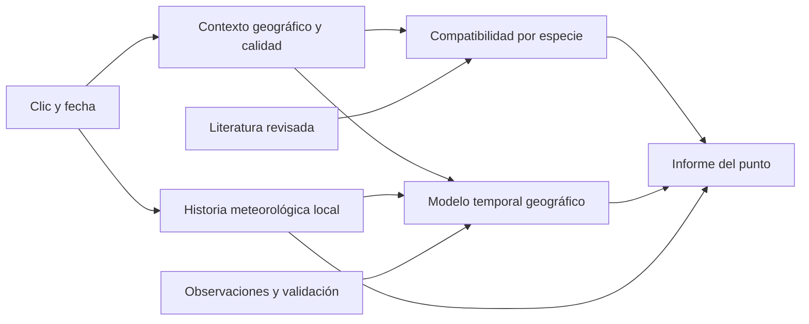

# Mapa de predicción — informe de fructificación al pulsar sobre el mapa

**Anexo de fundamento e investigación de la [especificación central](prediction-map-specification-es.md).**
El diseño vigente del producto, visor, arquitectura y fases se consulta allí.
Este informe conserva el análisis y sus propuestas históricas, no otro plan rector.
Decisiones del usuario del 12/09/2026: horizonte inicial de hasta una semana,
sin previsión meteorológica y viento solo si hay una serie utilizable. Las
referencias a quince días y posibles fuentes de pronóstico de este análisis
no son tareas de la entrega inicial. Panel inspirado en Sporas concretado en
§4 de la especificación central tras una nueva lectura autorizada en Safari.

Fecha: 11 de septiembre de 2026. Estado: análisis y propuesta, sin implementación.
Base de código comprobada: `fce06dd24507a17071755763cb24fb7da1a4ce85`.

**Nombre acordado: Mapa de predicción.** Designa el nuevo desarrollo complementario
basado en consultas por coordenadas. **Predictor** sigue designando la herramienta
actual de predicción por áreas. Son funciones distintas; el Mapa de predicción
no sustituye al Predictor.

Estado de ejecución y siguiente paso: [seguimiento del Mapa de predicción](mushroom-prediction-map-progress-es.md).

Lectura del informe histórico: la adquisición nacional de retención y pH ya
terminó y sus huecos están aceptados. Las propuestas de conseguir esos datos
en las secciones iniciales describen el momento previo a la descarga; no son
tareas pendientes. La revisión consolidada del seguimiento distingue migración,
enriquecimiento descriptivo de la aplicación actual y nuevo mapa en worker.

Ámbito aclarado por el usuario: **Catalunya como objetivo inicial y España como
ampliación deseada**. Francia y Andorra quedan fuera de la prioridad inicial,
aunque se conserva el inventario de los recortes ya disponibles.

## 1. Conclusión y alcance

Es viable crear una función nueva que complemente al Predictor actual. Ya tenemos
el mapa, consultas geográficas, históricos meteorológicos, estimación de agua en
el suelo, modelos temporales, gráficos y ejecución en workers. La parte nueva
es unirlos **para el entorno de un punto**, incorporar su hábitat y comprobar si
las predicciones funcionan en lugares que el entrenamiento no conocía.

La recomendación es distinguir dos preguntas en el informe:

1. **¿Este lugar encaja con la especie?** Árboles asociados, vegetación, suelo,
   relieve y otras condiciones relativamente estables.
2. **¿Estos días favorecen que fructifique?** Historia de lluvia, temperatura,
   humedad, agua disponible en el suelo y época del año.

Un pinar puede ser adecuado para un níscalo y estar demasiado seco esta semana.
Una semana húmeda no convierte un terreno sin su hospedador en un lugar adecuado.
Y un hábitat compatible no demuestra que la especie esté presente allí.

Podemos reutilizar mucho código y la arquitectura de los modelos. **No está
demostrado que podamos reutilizar sus porcentajes actuales como probabilidades
válidas para cualquier punto.** La propuesta incluye una prueba aislada antes de
presentar esos porcentajes como predicción validada. No sustituye V2–V6, no cambia
el contador de días secos y no modifica el precálculo operativo existente.

## 2. Qué se ha comprobado

- Código vigente: descubrimiento mediante Codebase Memory MCP y lectura de las
  implementaciones concretas indicadas más abajo.
- Datos del laboratorio en `docker-data/mushroom-data/`; no son una auditoría de
  los datos actuales de HA real. Conteos, huellas y alcance en el
  [inventario de evidencia](../reports/mushroom-map-point-inventory-2026-09-11.json).
- Tres consultas GIS de lectura mediante `reconstruct_observation`, ejecutadas
  en HA local. No se guardaron observaciones ni se lanzaron predicciones.
- Revisiones bibliográficas existentes: resúmenes y tablas de factores de las
  21 fichas de `literature/prediction/`, además del informe local sobre Sporas.
  Esto no equivale a una nueva revisión completa de todos los artículos originales.
- Consulta autorizada del visor de Sporas en Safari, incluido el informe de un
  setal existente. Sin modificar setales, preferencias de cuenta ni configuración.
- Documentación oficial de posibles fuentes adicionales, enlazada en la sección 7.

### La referencia visual de Sporas

El visor distingue una consulta sencilla del mapa y el informe de un setal.
Al abrir La Pera aparece un panel con terreno, varias especies y curvas de
15 días, seguido de lluvia, temperatura, humedad y viento. El panel muestra
769 m y pH 6,6. Cambiar el histórico meteorológico de 30 a 7 días modificó el
acumulado mostrado de 83 a 21 mm, manteniendo los porcentajes de las especies.
Por tanto, ese control de visualización no demuestra qué ventana recibió el
modelo. No se conoce su cálculo interno ni se ha validado su precisión.
Fuente: [visor de Sporas](https://sporas.io/visor), consulta en Safari el 11/09/2026.

Tomaría como referencia la organización del informe; las reglas ecológicas
saldrían de nuestra literatura y las probabilidades de una evaluación propia.
El [informe local previo de Sporas](literature/sporas_especies_informe_rainmapper.md)
sirve como antecedente, no como verdad de referencia para entrenar.

## 3. Información que ya tenemos

| Información | Evidencia actual | Reutilización y límite |
|---|---|---|
| Coordenadas y mapa | Visor MapLibre; `showTerrainPopup` y `buildIdwPointValues` en `rainmapper_core/viewers/maplibre-viewer/app.js` | Reutilizar interacción y panel. La consulta no debe crear una observación o un setal automáticamente. |
| Altitud | `sample_dem`, `mushroom_gis_lab.py:822`; DEM de Catalunya, Andorra y recortes de España/Francia | Consulta por coordenadas ya disponible. Tener un fichero de un país no significa cubrir todo ese país. |
| Pendiente y orientación | `derive_site_gis_dem` en el mismo módulo; muestreo de microáreas | Hay base reutilizable. Para puntos hace falta definir vecindario y cálculo, verificar orientación y bordes del DEM. |
| Vegetación y posibles hospedadores | `vector_layers`, `mushroom_gis_lab.py:109`, MVC50 de Catalunya | Hay vegetación real, estructura y vegetación potencial. Deben distinguirse: un árbol potencial no es un árbol observado. |
| Geología y tendencia del sustrato | Capa geológica ICGC 1:50.000 y campos de MVC50 | Permiten describir tendencia carbonatada/silícea; no equivalen a medir el pH del suelo. |
| Capacidad del suelo para retener agua | `mushroom_soilgrids.py`, caché SoilGrids y contexto de microáreas | Reutilizar muestreo y contrato de calidad. Es una propiedad del suelo, no su humedad medida hoy. |
| Lluvia diaria estimada | `build_daily_weather_idw_series`, `mushroom_weather_idw.py:254` | Ya acepta latitud, longitud y altitud. Contrato actual: radio 15 km, potencia 2, distancia mínima 0,1 km. Conservar controles de estaciones y ausencias. |
| Temperatura y humedad atmosférica | Mismo constructor IDW | Mínimas y máximas diarias, con corrección de temperatura por altitud. No representan una estación dentro del bosque. |
| Evapotranspiración, balance y estado hídrico | `mushroom_climatic_water_balance.py`, `mushroom_soil_water_state.py` | Reutilizar lluvia, pérdidas estimadas y almacenamiento. Mantener incertidumbre, inicialización y datos ausentes. |
| Viento | Disponible en la consulta meteorológica del visor | No figura entre los canales diarios del contrato de modelos revisado. Mostrarlo y usarlo para predecir son trabajos distintos. |
| Época del año | Variables temporales de modelos y meses de perfiles | Hay información aprendible y reglas configuradas; no son equivalentes. Véase sección 5. |
| Inferencia y gráficos | `build_runtime_features`, `predict_bundle_many`, Predictor y meteorología observada | Reutilizar adaptadores, ejecución por lotes y componentes visuales. Crear un contrato geográfico nuevo. |

### Cobertura comprobada, no supuesta

Ampliación de esta comprobación: [cobertura de Catalunya y fuentes para España](#11-ampliación-catalunya-españa-y-selección-por-especie).

Las dos capas vectoriales que consulta hoy el núcleo GIS son de Catalunya.
Las siguientes consultas usaron el código efectivo de HA local y sus capas:

| Coordenada de prueba | Vegetación/geología | Altitud obtenida |
|---|---|---|
| 42.0641, 1.9387, coordenada visible del ejemplo | MVC50: mosaico de carrascar con roble y posibles pinos, sustrato carbonatado; geología POmlg | 726,05 m, DEM local 5 m |
| 42.574, 2.098, control en Francia | Ambas devuelven `no_coverage_at_point` | 1.535,4 m, RGE ALTI 5 m |
| 39.47, −0.475, control fuera de Catalunya | Ambas devuelven `no_coverage_at_point` | Sin resultado válido: `query_error` |

La diferencia de altitud con el ejemplo de Sporas es 42,95 m. No se ha determinado
su causa: hay que contrastar fuentes, resolución y coordenada exacta antes de
atribuir un error a cualquiera de las aplicaciones. En el tercer control hubo
un error de consulta: no se debe confundir con una ausencia geográfica demostrada.

El traductor de códigos GIS contiene reglas generales y cinco asociaciones
exactas aceptadas en el JSON local. Falta revisar su cobertura sobre más unidades.
Una unidad no reconocida debe producir «vegetación sin clasificar», nunca
«especie incompatible». Conviene resolver límites de polígonos y mosaicos mediante
consultas espaciales indexadas, no simplemente asumir que la primera geometría
devuelta describe todo el entorno.

La caché SoilGrids declara 54 combinaciones de variable, profundidad y cuantil:
retención `wv0010`, `wv0033`, `wv1500`, seis profundidades y tres cuantiles.
El manifiesto declara 1.355 entradas válidas y 30 teselas de máscara; no se
rehasharon todos los rasters en esta investigación. **No incluye pH, textura o
carbono orgánico.** Las 66 microáreas tienen contexto de agua SoilGrids completo.
Hay también cartografía de suelos 1:25.000 descargada, pero no forma parte de las
capas vectoriales consultadas por este núcleo; habría que auditarla antes de usarla.

### Datos propios aprovechables

Hay 21 perfiles, 34 áreas, 66 microáreas y 470 observaciones locales.
De estas, 427 cumplen `valid` + `include` y abundancia distinta de `pending`.
Esto es un filtro inicial de registros: no certifica su independencia ni que
todas las filas tengan meteorología utilizable para todos los contratos.

Las 470 tienen coordenadas, pero ninguna informa precisión en `precision_m`.
Existen anotaciones de hospedador en 398, tipo de bosque en 378, suelo en 384 y
orientación en 380. Pueden servir para contrastar los mapas, previa revisión de
procedencia y exactitud. En una predicción sobre un sitio nuevo no podremos
introducir esos datos de campo como si se conocieran: la prueba deberá usar solo
información disponible al hacer clic.

Cuatro perfiles no tienen observaciones locales: Calocybe gambosa, Lepista nuda,
Marasmius oreades y Tuber melanosporum. Tener una ficha de especie o una versión
marcada como operativa no garantiza un modelo validado para ella.

## 4. Qué cambia realmente al pasar del área al punto

`area_contexts` y `materialize_area_series`, en
`rainmapper_core/mushroom_ml_area_weather_runtime.py:18` y `:59`, construyen el
contexto del área y agregan meteorología de sus microáreas. El adaptador de
inferencia actual recibe precisamente ese contexto y esas series
(`mushroom_ml_runtime_features.py:62`).

Para el nuevo módulo habría que obtener las series en el entorno consultado.
Podemos reutilizar IDW y los cálculos físicos, pero cambiar la escala de entrada
puede cambiar el comportamiento del modelo. Introducir un punto como un área
ficticia no resuelve esa diferencia ni valida el resultado.

También hay que conservar el significado de lo que predecimos. Los contratos
multiversión usan etiquetas de observaciones; el entrenamiento base antiguo
además agrega episodios de área (`aggregate_to_area_episodes`,
`mushroom_ml_trainer.py:155`). No hay que confundir ambos procedimientos.
La etiqueta favorable actual depende de la categoría de abundancia observada:
no es una etiqueta de presencia de la especie en cualquier terreno desconocido.

**Propuesta de objetivo:** estimar una visita favorable para una especie en un
entorno definido del punto y una fecha, explicando aparte la compatibilidad de
hábitat y la falta de evidencia sobre su presencia local. Antes del experimento
deben fijarse tamaño de entorno, criterio de visita favorable y tratamiento de
visitas sin hallazgos. La probabilidad de éxito real en bosques no visitados
requiere evaluar también esos bosques, no solo lugares donde ya se buscan setas.

No propondría un radio biológico universal sin probarlo. La altitud procede de
un píxel fino, el suelo de uno mucho mayor y el bosque puede ser un mosaico.
Se debe comparar punto y pequeños entornos alrededor de las observaciones,
registrar la escala elegida y no mostrar precisión de metros donde los datos no
la permiten. Solo se agrupan en caché lugares realmente equivalentes según ese
contrato; dos puntos próximos a lados distintos de un borde forestal pueden diferir.

### Variables que sí dependen de la ubicación

- Distancias y estaciones disponibles para IDW; por ello cambian lluvia,
  temperatura, humedad y su calidad.
- Altitud: predictor directo en V2 y corrección térmica en otros contratos.
  La corrección V2 usa 0,65 °C/100 m; es una aproximación, no un microclima medido.
- Latitud y fecha en la estimación de evapotranspiración; con lluvia y suelo
  influyen en los cálculos de balance y almacenamiento.
- Retención del suelo y contexto de microáreas en los perfiles físicos.
- En la función nueva: árboles, cubierta forestal, sustrato, pendiente,
  orientación y, si aportan valor demostrado, exposición solar y clima habitual.

Los contratos revisados de V2–V6 no introducen directamente pH y especies de
árboles como predictores. Añadirlos requiere entrenar y evaluar una candidata.
Tenerlos en GIS o en una ficha no implica que los modelos ya los estén usando.

## 5. Época de fructificación: qué está aprendido y qué no

| Familia | Situación comprobada | Consecuencia para el mapa |
|---|---|---|
| V2 | Variables cíclicas del mes y altitud, además de meteorología | Puede aprender asociaciones con el calendario dentro de sus datos. |
| V3 y base compartida de V4 | Mes y altitud directa marcados inactivos en `_SHARED_FIELDS`, `mushroom_ml_biology_v3.py:166` | No atribuirles un calendario aprendido explícito por esas columnas. El entorno sigue influyendo por meteorología y cálculos derivados. |
| V5 y V6 | Codificación cíclica del día del año; `mushroom_ml_raw_weather.py:138`; V6 reutiliza esta base | Hay una señal anual aprendible, no una garantía de haber aprendido bien todas las temporadas regionales. |
| Filtro del Predictor | `season_phase`, `mushroom_ml_predictor.py:483`, lee `main_months` y `secondary_months` de los perfiles | El veto «fuera de temporada» procede de meses configurados. No es una conclusión automática de V5/V6. |

Para la candidata propondría comparar calendario configurado, calendario
aprendido y calendario aprendido combinado con clima/altitud. Siempre en la
misma prueba y con datos de entrenamiento separados. Una distribución mensual
de hallazgos también refleja cuándo se sale al campo: no basta para aprender
la ausencia de floradas durante meses poco visitados.

La literatura puede ofrecer una referencia inicial por especie y región,
especialmente cuando faltan observaciones. No fijaría un mismo intervalo rígido
para costa y montaña ni convertiría un rango publicado en un veto universal.
El informe debería distinguir «época habitual según bibliografía» de
«estimación aprendida con nuestros datos». El Predictor actual conservaría su
comportamiento mientras se evalúa esta alternativa independiente.

## 6. Cómo aprovechar la literatura para todas las especies

Las revisiones locales respaldan que no basta un único perfil «seta de bosque».
La tabla resume prioridades para construir fichas geográficas; **no define
umbrales numéricos ni vetos automáticos**. Cada enlace lleva a la revisión local,
que a su vez identifica sus fuentes y limitaciones. El número es el de registros
locales que pasan el filtro inicial descrito en la sección 3.

| Especie/perfil | Registros | Prioridad ecológica que debe reflejar el nuevo módulo |
|---|---:|---|
| [Amanita caesarea](literature/prediction/amanita_caesarea_revision_bibliografica_rainmapper.md) | 74 | Frondosas compatibles, especialmente Quercus/Castanea; ambiente cálido, agua y exposición. |
| [Boletus aereus](literature/prediction/boletus_aereus_revision_bibliografica_rainmapper.md) | 77 | Hospedadores y bosque cálido; dinámica de calor y agua, cubierta y exposición. |
| [Boletus edulis](literature/prediction/boletus_edulis_revision_bibliografica_rainmapper.md) | 57 | Hospedador, estructura forestal, agua y temperaturas; distinguir presencia de micelio y fructificación. |
| [Boletus pinophilus](literature/prediction/boletus_pinophilus_revision_bibliografica_rainmapper.md) | 83 | Pinares prioritarios, continuidad forestal, relieve y meteorología; revisar exclusividades antes de vetar. |
| [Cantharellus cibarius s.l.](literature/prediction/cantharellus_cibarius_sensu_lato_revision_bibliografica_rainmapper.md) | 14 | Bosque compatible y humedad persistente; mantener explícito el alcance taxonómico del grupo. |
| [Cantharellus lutescens](literature/prediction/cantharellus_lutescens_revision_bibliografica_rainmapper.md) | 3 | Coníferas, musgo y humedad; escasez de datos propios para porcentajes nuevos. |
| [Craterellus cornucopioides](literature/prediction/craterellus_cornucopioides_revision_bibliografica_rainmapper.md) | 1 | Frondosas, sombra y humedad de la hojarasca. |
| [Hygrophorus latitabundus](literature/prediction/hygrophorus_latitabundus_revision_bibliografica_rainmapper.md) | 11 | Pinus, sustrato y estructura del bosque; agua y temperatura otoñales. |
| [Hygrophorus marzuolus](literature/prediction/hygrophorus_marzuolus_revision_bibliografica_rainmapper.md) | 25 | Pinus/Abies, frío, nieve y deshielo; añadir información nival requiere fuente nueva. |
| [Lactarius deliciosus](literature/prediction/lactarius_deliciosus_revision_bibliografica_rainmapper.md) | 52 | Pinus, estructura del rodal, agua y temperatura; no imponer un veto universal a suelos ácidos. |
| [L. salmonicolor / quieticolor](literature/prediction/lactarius_salmonicolor_quieticolor_revision_bibliografica_rainmapper.md) | 0 | La ficha agrupa ecologías distintas: Abies frente a Pinus. Separar subperfiles o declarar incertidumbre. |
| [Lactarius sanguifluus](literature/prediction/lactarius_sanguifluus_revision_bibliografica_rainmapper.md) | 3 | Pinus, tendencia del suelo y antecedentes locales; umbrales meteorológicos por validar. |
| [Lactarius vinosus](literature/prediction/lactarius_vinosus_revision_bibliografica_rainmapper.md) | 1 | Pinus, humedad del suelo y combinación de calor/sequedad. |
| [Macrolepiota procera](literature/prediction/macrolepiota_procera_revision_bibliografica_rainmapper.md) | 1 | Claros, bordes y pastos; no tratarla como dependiente de un hospedador micorrícico. |
| [Morchella elata complex](literature/prediction/morchella_elata_complex_revision_bibliografica_rainmapper.md) | 17 | Identidad, alteraciones, calentamiento/deshielo; relación con incendios solo para los grupos pertinentes. |
| [Russula virescens](literature/prediction/russula_virescens_revision_bibliografica_rainmapper.md) | 4 | Frondosas compatibles, agua y época; revisar identificación. |
| [Tricholoma terreum](literature/prediction/tricholoma_terreum_revision_bibliografica_rainmapper.md) | 4 | Pinus, sustrato y estación tardía; incertidumbre con pocos registros. |
| [Calocybe gambosa](literature/prediction/calocybe_gambosa_revision_bibliografica_rainmapper.md) | 0 | Pastos y corros, primavera y suelo; no exigir bosque. |
| [Lepista nuda](literature/prediction/lepista_nuda_revision_bibliografica_rainmapper.md) | 0 | Materia orgánica y hojarasca, ambiente de otoño/invierno. |
| [Marasmius oreades](literature/prediction/marasmius_oreades_revision_bibliografica_rainmapper.md) | 0 | Pastizales y corros persistentes; no exigir árboles. |
| [Tuber melanosporum](literature/prediction/tuber_melanosporum_revision_bibliografica_rainmapper.md) | 0 | Hospedador, suelo, agua estival y manejo; producción subterránea y maduración merecen un objetivo separado. |

Para convertir las revisiones en reglas utilizables hace falta una tabla
trazable: especie, factor, relación, fuente, región estudiada, confianza y
excepciones. Los óptimos de cultivo de micelio no se trasladan directamente a
umbrales de fructificación en el monte. Tampoco deben interpretarse las
afinidades numéricas de perfiles iniciales como probabilidades calibradas.

Recomiendo empezar con compatibilidad **favorable, desfavorable o desconocida**,
acompañada de motivos concretos. Reservar exclusiones para incompatibilidades
bien justificadas y datos geográficos fiables; un mapa que no identifica el
árbol no demuestra que no exista. Si después se obtiene un porcentaje conjunto,
debe entrenarse y validarse como tal: no multiplicar arbitrariamente un índice
de hábitat por la probabilidad actual.

## 7. Información adicional que conviene conseguir

| Prioridad | Falta o mejora | Fuente/camino y comprobación necesaria |
|---|---|---|
| Inicial | Hospedadores, bosque mixto y cubierta fuera de Catalunya | [MFE25 de MITECO](https://www.miteco.gob.es/es/biodiversidad/temas/inventarios-nacionales/mapa-forestal-espana/mfe_25.html) para España. Revisar clases, especies arbóreas, antigüedad provincial y recortes regionales antes de integrar. |
| Opcional, fuera del alcance inicial | Vegetación forestal francesa | [BD Forêt de IGN](https://www.data.gouv.fr/datasets/bd-foret-r): cobertura metropolitana, clases forestales y cartografía de distinta fecha por departamento. No garantiza identificar todos los hospedadores a escala del clic. |
| Inicial | pH estimado y caracterización del suelo | [SoilGrids de ISRIC](https://isric.org/explore/soilgrids) ofrece propiedades como pH, textura y carbono a 250 m, con profundidades e incertidumbre. Descargar solo propiedades/regiones necesarias; conservar unidades y profundidad. Contrastar cartografía local y datos de campo. |
| Inicial | Cobertura DEM y sustrato del ámbito acordado | Inventariar extensión válida real de los rasters existentes y ampliar recortes. Auditar la cartografía de suelos ya descargada. No anunciar cobertura nacional por el nombre del fichero. |
| Posterior | Densidad de arbolado y tipos generales de cubierta | [Copernicus, bosques y cubierta arbórea](https://land.copernicus.eu/en/products/high-resolution-layer-forests-and-tree-cover?tab=dominant_leaf_type). Su distinción frondosa/conífera complementa, pero no sustituye, conocer el árbol hospedador. |
| Posterior | Clima habitual del lugar | Construir resúmenes multianuales con años realmente disponibles o contrastar una climatología externa. Separar clima habitual de los últimos 30/90 días; no calcular normales fiables con una serie corta sin advertirlo. |
| Para 15 días con tiempo futuro | Pronóstico meteorológico por coordenadas | Candidata: [API de Open-Meteo](https://open-meteo.com/en/docs). La disponibilidad de horizontes, nieve, viento y otras variables depende del modelo. Son previsiones de rejilla, no observaciones del bosque. |
| Para evaluar previsiones | Archivo de lo que se pronosticó entonces | Usar ejecuciones identificadas por fecha de emisión: [Single Runs API](https://open-meteo.com/en/docs/single-runs-api). Su profundidad histórica es limitada y depende del modelo. No sustituirla por el tiempo que finalmente hizo. |
| Para porcentajes fiables | Visitas independientes, negativas y esfuerzo | Registrar especie buscada, resultado, fecha, entorno visitado y esfuerzo, también fuera de setales conocidos. Una especie no anotada no es una ausencia. |

Estas fuentes son candidatas documentadas, no integraciones ya instaladas. Antes
de descargar: concretar ámbito geográfico, licencia/atribución, acceso y cuotas,
resolución, fecha y espacio necesario. El ámbito concretado por el usuario es
Catalunya primero y España como ampliación deseada. La sección 11 detalla las
fuentes y comprobaciones necesarias para ese alcance.

Nieve, temperatura de suelo, radiación, cierre de copa, incendios o manejo
pueden ser relevantes para determinadas especies. No incorporaría todas esas
variables de golpe con los pocos ejemplos disponibles: cada bloque tendría que
demostrar utilidad. La lluvia IDW tampoco mide cuánto atraviesa las copas;
una corrección de interceptación necesitaría datos y validación propios.

## 8. Cómo podría funcionar

El panel propuesto tendría:

1. Lugar, altitud, vegetación, suelo y calidad de estas estimaciones. Un dato
   desconocido se muestra como desconocido; pH estimado se identifica como tal.
2. Lista de especies: compatibilidad del entorno, perspectiva temporal y motivo
   principal. Curvas comparables para las especies con modelo aplicable; las
   demás siguen visibles con «sin predicción validada» y su información ecológica.
3. Meteorología observada, reutilizando barras de lluvia y curvas existentes.
   Separación visual y textual si más adelante se añade meteorología prevista.
4. Detalle desplegable: fuente y fecha de capas, ventana exacta usada, corte
   común, calidad meteorológica y alcance de la evidencia del modelo.

El selector del gráfico podría permitir explorar más historia, pero esa ventana
de visualización debe distinguirse de la usada realmente para predecir.
No repetiríamos la confusión entre «última lluvia significativa» y toda la
lluvia que recibió el modelo.

### Horizonte y continuidad

La primera candidata debería limitarse a **siete días**, aprovechando lo resuelto
con `lag_event` h1–h7 y el mismo corte de datos para la semana. Se reutiliza la
continuidad semanal, con selección por evidencia global de especie como regla
propuesta para todos los puntos (sección 11). Se identifica cualquier fallback diario;
no se toma una familia distinta por comodidad sin dejar constancia.

Ofrecer 15 días no consiste en alargar la curva de h7. Requiere entrenar y evaluar
los horizontes nuevos y decidir si incorporan pronóstico meteorológico. Si lo
incorporan, la lluvia futura no puede entrar como si ya fuera observada.
El [archivo meteorológico histórico de Open-Meteo](https://open-meteo.com/en/docs/historical-forecast-api)
concatena tramos de previsiones; no sustituye automáticamente un archivo de la
previsión completa disponible en cada fecha de emisión para probar h1–h15.

### Arquitectura y coste en HA

Propuesta, no API existente: un servicio de contexto por coordenadas, un
constructor de entradas geográficas versionado y resultados separados de los
artefactos del Predictor de áreas. No registrar puntos temporales como áreas
ficticias ni modificar los modelos operativos para atender el clic.

Las capas estáticas se preparan e indexan fuera de HA. Según el
[reparto revisado](mushroom-map-compute-data-placement-es.md), el worker del
nuevo mapa debe tener copias locales de todas las capas necesarias y realizar
la consulta de terreno, contexto meteorológico e inferencia. HA sirve la
interfaz, coordina solicitudes y reutiliza resultados compactos. El worker
actual empaqueta GDAL CLI y el módulo GIS; faltan integrar las nuevas capas,
lectores y contratos y verificar preparación efectiva antes de habilitarlo.

Para las 21 fichas, siete días representan hasta 147 celdas de resultado;
15 días, 315. Son cardinalidades propuestas, no tamaños de payload medidos.
La historia meteorológica y el terreno se transportan una vez, referenciados por
las especies, nunca duplicados por modelo/día. Los perfiles físicos pueden
necesitar 365 días de inicialización aunque su ventana visible sea de 30 días.

La clave de caché debe incluir ubicación/entorno, versión de capas, generación
meteorológica, corte, modelos y contrato. Reutilizar búsquedas de estaciones y
series compartidas; agrupar especies en una sola inferencia por lote. Medir
tiempo, RAM, lecturas, tamaño serializado y aciertos de caché antes de fijar
límites. Rechazar solicitudes excesivas antes de materializar resultados.
No precalcular por fuerza bruta todos los píxeles del mapa. Al cambiar rápido de
punto, la interfaz debe descartar respuestas antiguas y permitir cancelar la
consulta, con estados de error/finalización explícitos.

## 9. Plan propuesto y prueba para decidir

### Paso 1: informe geográfico comprobable

Extraer y consultar el contexto sin guardar nada como observación. Validar en
bosques y pastos, límites de polígonos, lugares sin cobertura y las distintas
regiones. Contrastar cartografía con las anotaciones de campo que ya existen.
Preparar las fichas ecológicas trazables. Entregable: panel con datos reales y
compatibilidad explicada, sin porcentajes nuevos presentados como validados.

### Paso 2: candidata geográfica aislada

Reconstruir las entradas históricas para la ubicación/entorno de cada observación
con el mismo procedimiento que se usaría al hacer clic. Reutilizar la arquitectura
y los constructores de V2–V6 que correspondan, con identidad de experimento
separada. Comparar, sobre exactamente las mismas visitas de prueba:

- Referencia actual de área donde exista correspondencia, señalando su escala.
- Misma arquitectura con meteorología del punto/entorno.
- Añadir información geográfica compatible y señal estacional.
- Comparar la referencia estacional de literatura con la variante aprendida.

La prueba dirá cuánto aporta localizar la meteorología y cuánto aporta conocer
el bosque/suelo. Los pesos actuales pueden ser una referencia experimental;
reentrenar con entradas geográficas permite evaluar el cambio de significado.
La selección entre candidatas se hace solo con entrenamiento/validación; después
se prueba el selector completo en datos reservados, sin escoger retrospectivamente
el ganador que mejor respondió a cada visita de prueba.

### Paso 3: demostrar utilidad fuera de los sitios conocidos

Separar años/fechas y también lugares completos. No colocar visitas del mismo
setal o episodio de florada en ambos lados, ni contar sus siete horizontes como
siete hallazgos independientes. Ajustes, selección de variables y reglas se
deciden sin mirar el conjunto final de prueba. Evaluar por especie y región,
con soporte y dispersión, además del resultado agregado.

La explicación de resultados al usuario sería una tabla sencilla:

- De las salidas que recomendó, cuántas fueron favorables.
- Cuántas salidas favorables dejó pasar.
- Cuántas visitas quedaron sin recomendación por falta de datos.
- Si los porcentajes se corresponden con la frecuencia real de aciertos.
- En qué especies/lugares mejora o empeora y cuánto; cuántos casos sostienen
  cada comparación. Añadir Brier, calibración y discriminación en un anexo.

No basta mejorar una media reduciendo silenciosamente las especies o lugares
atendidos. Hay que acordar antes de la prueba el coste de una salida fallida,
la cobertura mínima deseada y cómo tratar resultados con pocas visitas.
Con cuatro especies sin observaciones y varias con una o tres no se puede
prometer una probabilidad individual fiable para todo el catálogo.

Solo si la candidata demuestra utilidad se propone integrar sus porcentajes en
el módulo nuevo. Una ampliación posterior a 15 días necesita su propia prueba
con pronósticos archivados. Cualquier implementación y release seguirán el
circuito local y las autorizaciones del proyecto; esta investigación no los inicia.

## 10. Límites de este análisis y siguiente decisión

No se ha medido todavía la precisión de una predicción puntual, ni la latencia
del futuro servicio, ni la cobertura completa de cada capa por barrido espacial.
Tampoco se han auditado de nuevo todos los artículos originales o todas las
calidades taxonómicas de los registros. Las tres consultas prueban esos puntos,
no todos los bosques ni todos los contenedores/datasets del despliegue.

La decisión propuesta es avanzar primero hacia un informe geográfico con
compatibilidad ecológica y una prueba independiente de predicción a siete días.
Conservar lo que funciona del Predictor actual y exigir resultados medidos antes
de presentar un porcentaje nuevo sobre un bosque desconocido.

Durante esta investigación no se modificaron código ejecutable, observaciones,
modelos, destinos de worker ni configuración de Safari/Sporas. No se ejecutaron
entrenamientos, precálculos, builds o publicaciones. La comprobación final es
documental y no acredita una nueva release.

## 11. Ampliación: Catalunya, España y selección por especie

### Qué significa usar siempre el fallback de especie

Sí: la propuesta para el predictor geográfico es **seleccionar con la evidencia
global de la especie en todos los puntos**, incluso dentro de un área conocida.
En este módulo sería la regla principal, por lo que en la interfaz la llamaría
«selección por evidencia de la especie». El Predictor actual conservaría su
selección entre evidencia de área y especie.

El código distingue `species_selections` y `species_area_selections`.
`operational_reliability_selections_from_catalog`, en
`rainmapper_core/mushroom_predictor_runtime.py:1055`, utiliza la fila de especie
cuando no hay una fila de área, y marca `species_fallback` si hay ganador.
La construcción de ese catálogo compara ambas evidencias en
`rainmapper_core/mushroom_ml_reliability_audit.py`, bloque `species_area_selections`.
El fallback es, por tanto, **una forma de elegir un modelo**, no una probabilidad
constante que se copia a todos los lugares.

Aplicado al módulo nuevo:

- Se elige una familia por especie con evidencia global, manteniendo la
  continuidad h1–h7 donde resulte elegible.
- Esa familia recibe las condiciones del punto: cambiar de bosque o de
  meteorología puede cambiar la predicción. No se hereda la del área más cercana.
- Se conservan los controles de aplicabilidad y datos; si falta una familia
  válida no se fuerza un porcentaje. La ausencia de familia semanal completa y
  el fallback diario son una decisión distinta del ámbito especie/área.
- La evidencia global reúne nuestros lugares observados; no representa por sí
  sola toda Catalunya ni toda España. Se debe medir cómo funciona en lugares
  distintos antes de atribuirle esa capacidad.

Esto simplifica la selección, pero no elimina la prueba de trasladar entradas
agregadas de área a entradas de punto. Reutilizar el selector global y comprobar
esa transferencia son pasos compatibles, no alternativas enfrentadas.

### Sí: una función de mapa con informe al hacer clic

El objetivo de producto es un mapa interactivo, reutilizando el visor MapLibre,
con consulta de cualquier punto dentro del ámbito atendido y panel de terreno,
especies, evolución semanal y meteorología. No exige tener guardado un setal.
Se puede dar acceso propio a esta función para que complemente al Predictor.

Las capas de bosque o terreno pueden activarse para entender el entorno. Una
superficie coloreada con probabilidades para todos los píxeles sería otra
función, con un coste distinto; no es necesaria para obtener el informe al clic.
Las etapas anteriores son la forma de construir y validar ese producto, no
una propuesta de quedarse únicamente con un catálogo de datos.

### Cobertura local precisada

Se leyeron las cabeceras de los cuatro DEM con `gdalinfo -json` y las capas
vectoriales con `ogrinfo -json -so`, sin estadísticas raster ni barridos completos.
Además, se ejecutaron ocho consultas de lectura en HA local. Evidencia completa:
[metadatos y controles territoriales](../reports/mushroom-map-point-coverage-2026-09-11.json).

| Capa instalada y usada por el núcleo GIS | Alcance comprobado | Qué falta |
|---|---|---|
| DEM ICGC topográfico 5 m, 2009–2018 | Raster de 56.344 × 55.812 píxeles; 5.127.260.482 bytes. Producto territorial de Catalunya, no un recorte de setales. | Auditar máscara válida, costa y bordes. No es necesario descargar un DEM de 0,5 m para comenzar. |
| MVC50, fichero de noviembre de 2019 | 116.468 polígonos; ámbito catalán. | Actualidad de vegetación, mosaicos y traducción a hospedadores. No describe toda España. |
| Geología ICGC 1:50.000, fichero v3r0 de diciembre de 2024 | 61.437 polígonos en la capa de unidades; ámbito catalán. | Traducir unidades a propiedades útiles sin confundir roca y pH. Comprobar actualización frente al producto oficial. |
| DEM IGN MDT25 hoja 0592 | Solo 1.163 × 780 píxeles de 25 m: unos 29 × 19,5 km. | Faltan las demás hojas españolas; esta descarga no proporciona cobertura nacional. |
| DEM Andorra | Recorte 5 m de 7.040 × 5.540 píxeles. | No es una fuente general para España. |
| DEM francés | Recorte 5 m de 6.579 × 8.368 píxeles, aproximadamente 1,84–2,24 E y 42,41–42,79 N en su envolvente. | Tampoco es cobertura francesa completa; no condiciona el alcance inicial solicitado. |

Las envolventes rectangulares no prueban que todos sus píxeles tengan dato.
La documentación oficial identifica el
[DEM territorial de Catalunya 5 m 2009–2018](https://www.icgc.cat/ca/Geoinformacio-i-mapes/Geoinformacio-en-linia-Geoserveis/WMS-i-WCS-Elevacions/WMS-Elevacions-territorial)
y la [geología continua de Catalunya](https://www.icgc.cat/ca/Eines-i-visors/Visors/Visualitzadors-Geoindex/Geoindex-Geologia-territorial).
GEOVEG documenta la finalización del levantamiento del
[Mapa de Vegetación de Catalunya](https://www.ub.edu/geoveg/cast/cartovegetacio.php).

Los controles elegidos, independientes de las observaciones del usuario, fueron:

| Control territorial | Latitud, longitud | Altitud | Vegetación | Geología |
|---|---|---:|---|---|
| Aran | 42,70; 0,80 | 971,39 m | Disponible | Disponible |
| Cerdanya | 42,37; 1,93 | 1.698,59 m | Disponible | Disponible |
| Cap de Creus | 42,32; 3,30 | 65,26 m | Disponible | Disponible |
| Catalunya central | 42,06; 1,94 | 654,99 m | Disponible | Disponible |
| Lleida | 41,62; 0,65 | 156,54 m | Disponible | Disponible |
| Barcelona | 41,40; 2,15 | 64,57 m | Disponible | Disponible |
| Els Ports | 40,83; 0,32 | 1.134,26 m | Disponible | Disponible |
| Delta del Ebro | 40,75; 0,75 | 0,55 m | Disponible | Disponible |

«Disponible» significa que el código devuelve una unidad cartográfica, incluso
si es urbana, agrícola o de pastos; no significa hábitat favorable. Los ocho
casos confirman operatividad repartida por Catalunya, no un 100 % de cobertura
verificada. Concretamente, la frase anterior «varía según la zona» se refería
principalmente a **capas catalanas frente a recortes muy limitados fuera de ellas**,
y también a la resolución y antigüedad de cada fuente.

La lectura de metadatos revela un detalle técnico a resolver antes de ampliar:
`_sample_dem_path` reconoce el NoData `-9999`, pero los ficheros IGN y Francia
declaran `-32767` y `-99999`. Un servicio nuevo debe leer el NoData de cada raster
y diferenciarlo de una altitud válida o un error de consulta. No se ha modificado
ese código en esta investigación ni se afirma que los ocho controles estén afectados.

### Fuentes concretas para llegar a España

| Necesidad | Catalunya inicial | Ampliación española propuesta |
|---|---|---|
| Altitud, pendiente y orientación | Reutilizar DEM 5 m instalado. | [IGN/CNIG MDT25](https://centrodedescargas.cnig.es/CentroDescargas/mdt25-segunda-cobertura), por hojas, con índice de cobertura y caché. Usar MDT05/MDT02 donde la evaluación justifique más detalle. |
| Bosque y árboles | MVC50 y contraste con MFE25; actualizar ocupación del suelo. | [MFE25 de MITECO](https://www.miteco.gob.es/es/biodiversidad/temas/inventarios-nacionales/mapa-forestal-espana/mfe_25.html), producto nacional realizado en 2007–2024, con información forestal, matorral y herbazales. Revisar sus paquetes provinciales e interpretación de especies arbóreas. |
| Cambios de cubierta, urbanización, cultivos y claros | [Mapa de cubiertas del suelo ICGC](https://www.icgc.cat/ca/Geoinformacio-i-mapes/Mapes/Mapa-de-cobertes-del-sol-de-Catalunya), actualizado respecto a MVC50. | SIOSE/SIOSE AR, presentes en el [catálogo CNIG](https://centrodedescargas.cnig.es/CentroDescargas/modelos-digitales-elevaciones), como complemento a investigar. No reemplazan la identificación de hospedadores. |
| Geología | Reutilizar ICGC 1:50.000. | [IGME GEODE](https://info.igme.es/cartografiadigital/geologica/Geode.aspx?language=en), continuo 1:50.000 peninsular y 1:25.000 insular según su servicio. El catálogo incluye zonas de Baleares y Canarias. |
| pH y otras propiedades edáficas | Añadir propiedades SoilGrids y contrastar suelo local. | Misma fuente global, comprobando máscaras válidas, incertidumbre y profundidad; ampliar también la caché actual de retención. |

MFE25 es ya presentado como producto nacional: no hay que interpretar la
integración con SIGPAC todavía desigual como ausencia automática de cartografía
forestal. Se comprobarán paquetes, años y campos por provincia antes de descargar.
El detalle forestal de esta fuente puede complementar MVC50 también en Catalunya.

GEODE publica [un servicio REST con capacidad de consulta](https://mapas.igme.es/gis/rest/services/Cartografia_Geologica/IGME_Geode_50/MapServer?f=pjson),
con polígonos de geología y respuestas JSON/GeoJSON. En la investigación inicial
quedó pendiente confirmar la adquisición nacional, porque la página vectorial
conserva una referencia a solicitud y tarifas. La adquisición posterior verifica
la distribución REST publicada en datos.gob.es y las condiciones generales de
reutilización del IGME; se documenta en la sección 12. Esa vía no es una solicitud
del producto vectorial de pago. No se han encargado datos ni contactado a terceros.
No deducir propiedades del suelo del color de una imagen WMS.

Para Catalunya no aparece una carencia territorial de base que obligue a empezar
desde cero. Priorizaría mejorar árboles/cubiertas, añadir pH estimado y validar
el muestreo. Para España existe una ruta cartográfica oficial viable, pero aún
hay que adquirir/integrar los datos. Península, Baleares, Canarias y ciudades
autónomas deben constar como ámbitos verificables por separado: no trasladar
sin prueba calendarios o reglas ecológicas peninsulares a todos ellos.

Por último, **cobertura cartográfica no equivale a cobertura de predicción**.
Antes de anunciar España, hay que comprobar estaciones y continuidad histórica
en cada región, y si el modelo de especie reconoce esas condiciones climáticas.
El radio IDW actual de 15 km no garantiza tener estaciones válidas en todos los
puntos. Un lugar puede tener informe de terreno y necesitar mejores datos para
mostrar predicción temporal. La primera entrega priorizaría Catalunya, dejando
preparada la incorporación de fuentes y regiones españolas sin rehacer el mapa.

## 12. Adquisición de las fuentes autorizadas

El usuario autoriza descargar altitud, vegetación/árboles, cubiertas ICGC y
geología española. Pide conservarlas fuera de `mushroom-GIS`, con un README
junto a cada fuente/descarga. Se usa **`mushroom-map-GIS/`**, excluida de Git y
del contexto Docker.

El estado, los paquetes concretos, comprobaciones, incidencias y enlaces a los
README se mantienen en [descargas GIS del predictor geográfico](mushroom-map-gis-downloads-es.md)
y en su [inventario](../reports/mushroom-map-gis-downloads-2026-09-11.json).
Esta adquisición no integra todavía los datos ni implementa el nuevo predictor.

## 13. Situación tras recibir las 17 comunidades

Actualización del 11/09/2026, posterior al inventario inicial de capas instaladas.
Las carencias de adquisición indicadas en las secciones 7 y 11 deben leerse junto
al cierre de descargas de la sección 12. Las huellas de observaciones, perfiles,
áreas y manifiesto SoilGrids del inventario inicial se han vuelto a contrastar:
coinciden. Las nuevas fuentes siguen separadas del sistema operativo.

| Necesidad | Situación | Trabajo restante |
|---|---|---|
| Altitud y relieve | DEM catalán existente y 1.524 TIFF IGN MDT25 descargados y abiertos. | Índice espacial, consulta de pendiente/orientación y comprobación territorial de NoData. |
| Bosque y árboles | Los 17 paquetes MFE están recibidos y comprobados: 1.994.853 polígonos. | Normalizar campos, fechas y CRS; traducir árboles a hospedadores de cada especie y resolver mosaicos. |
| Cubierta del terreno | ICGC 2024 descargado para Catalunya; MFE aporta usos y formaciones regionales. | Contrastar fuentes; una cubierta española más detallada/reciente queda como mejora, no como requisito para probar Catalunya. |
| Geología | GEODE descargado e ICGC copiado a la carpeta del mapa; 16 controles locales catalanes y tres exteriores verificados. | Conectar elección de fuente y preparar índice GEODE local; traducir unidades sin equiparar roca y pH medido. |
| Propiedades del suelo | Actualización posterior: descarga nacional de 54 capas de retención y nueve de pH terminada; huecos auditados y aceptados. El lector operativo sigue limitado a retención. | Implementar lector/índice compartido, réplica en worker y migración compatible; después integrar pH descriptivo. No repetir descarga o auditoría. |
| Meteorología | Histórico y constructor IDW reutilizables según el análisis de código. | Auditar estaciones válidas y continuidad de datos en puntos distribuidos, sobre todo fuera de Catalunya. No atribuir cobertura nacional por tener mapas nacionales. |
| Ecología y temporada | 21 revisiones bibliográficas locales y perfiles/modelos existentes. | Convertir literatura en reglas trazables y contrastar temporada configurada frente a señal aprendida por región. |
| Predicción por punto | Propuesta sin implementar ni evaluar. | Preparar entradas por coordenadas y evaluar en lugares separados del entrenamiento antes de dar por válidos sus porcentajes. |

La base cartográfica permite proponer una primera prueba del informe de terreno
en Catalunya. Tras cerrar SoilGrids, quedan integración de lectores/índices y
cobertura meteorológica; no hace falta descargar indiscriminadamente más mapas.
Corresponde preparar consultas rápidas en worker y comprobar puntos reales.
Ampliar a 15 días con meteorología prevista requeriría, además, previsiones y
un archivo adecuado para evaluarlas. Se mantiene como ampliación posterior.
