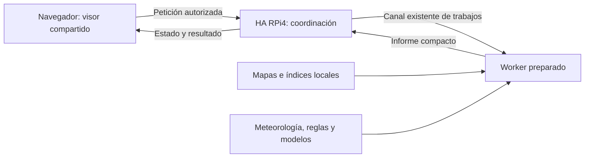

# Mapa de predicción — especificación central

Fecha: 11/09/2026. **Referencia principal del diseño del Mapa de predicción.**
Actualización técnica: 12/09/2026, inicio autorizado por el usuario.
**Actualización operativa 14/09:** volumen y configuración de lectores actuales
instalados en HA local y el worker existente; ambos reconstruidos y paridad de
cálculo comprobada, manteniendo coordinadores y datos. RPi4 usará worker en
principio, sin fallback local. El alcance sigue siendo nacional: los 14,54 GB
actuales no completan GEODE ni MFE fuera de Catalunya, cuya integración sigue
pendiente. Revisión visual a fondo y árboles vecinos aplazados al TODO.
[Configuración, evidencia y límites](prediction-map-local-worker-setup-es.md).

Los párrafos del 13/09 siguientes describen la integración inicial:
Estado actualizado el 13/09: **motor Python existente conectado en preview**, con
entradas del punto, evidencia sellada por especie y siete días calculados.
Lista de compatibles ordenada por probabilidad del día elegido, sin cálculo al
final («Sin probabilidad calculada»). Cero y abstención se conservan distintos.
Contrato/broker/UI admiten modo `prediction` sin especies de ejemplo. Motor común
preparado para HA/worker; sin construir imágenes, activar remoto o desplegar HA.

**Implementado localmente el 14/09, política `territorial_and_seasonal_windows_v6`: dos niveles.**
El primero determina especies posibles por suelo+pH, hospedadores/hábitat y
altitud, sin depender del mes. El predictor evalúa después fecha, fenología y
condiciones meteorológicas. **Decisión posterior vigente: las especies fuera de
la temporada de la ficha no aparecen en la lista ni invocan modelos para ese día.**
La clasificación territorial interna permanece independiente de los meses;
`daily_season_phases` aplica el segundo nivel. Las filas visibles muestran
«Temporada principal» o «Temporada secundaria». Conservar fenología en
las fichas y el motor; no duplicar humedad/temperatura ni corregir porcentajes
con pesos arbitrarios. Las descartadas no llegan a inferencia y, sin candidatas,
no se preparan entradas de predicción. Compatibles sin modelo permanecen al final.

ICGC ya revisado: 1.055 unidades, 1.046 códigos con materiales en 192 reglas;
GEODE después. Reglas suelo/pH locales en aereus, edulis, pinophilus y cibarius;
aereus conserva máximo 6,8 y su excepción silícea con intervalo solapado. Caliza
con pH admitido se marca condicionada; composición sin resolver, desconocida.
No veto universal por caliza ni descalcificación deducida de pH estimado.
[Reglas y procedencia](prediction-map-substrate-species-review-es.md#reglas-locales-conjuntas-v5).

`status` ecológico es territorial; `daily_statuses` conserva una proyección
idéntica para todos los días, validada por contrato y navegador. La selección
visible y de inferencia requiere además fase principal/secundaria del día.
La función original del Predictor se comparte desde `mushroom_phenology.py`. El lector geográfico prepara el
contexto hídrico del modelo después del filtro, respetando `species_ids`; el
ejecutor no invoca el proceso del motor sin candidatas. El runtime sale antes
de abrir modelos/meteorología si no hay candidatas y evita preparar meteorología
si ninguna tiene evidencia de modelo. El predictor recibe la fenología original.
El desplegable meteorológico sigue siendo independiente. Las admisiones
condicionadas muestran motivo, y un desplegable recoge exclusiones y desconocidos.
La cabecera «Terreno» muestra primero los tipos de suelo disponibles en los
mappings y después árboles/hábitats, conservando mezclas y etiquetas localizadas.
No deriva suelo desde pH; el detalle de procedencia sigue en el desplegable.
Las descartadas/desconocidas muestran el nombre en línea propia y cada motivo
debajo, con separación entre especies y ajuste al ancho móvil.

**Selección confirmada tras comparar Olvan:** el Predictor calcula por área;
el mapa usa evidencia/selección por especie y las entradas propias del punto,
también dentro de áreas conocidas. No incorporar evidencia territorial al mapa
ni exigir igualdad de porcentajes con el área. Se descarta la propuesta surgida
durante el diagnóstico; se conserva el comportamiento implementado.

**Última decisión Rovelló:** mostrar cada ficha existente por separado, con su
propia probabilidad si tiene modelo aplicable. Nombres diferenciados en metadatos
locales; mantener salmonicolor/quieticolor unido. **Reemplaza toda propuesta de
grupo o dataset derivado de Rovelló en los apartados históricos de este documento**.
No combinar observaciones, porcentajes ni prestar el modelo de deliciosus.

Corregidas consultas MFE que abortaban por un anillo inválido de un candidato
(FID 237242): reparación acotada en memoria, geometría válida y área conservada;
fuente e índice intactos. Recuperados árboles en los tres puntos Fogars/Arbúcies.
Los huecos verdaderos siguen desconocidos. Hábitat admite fichas no ectomicorrícicas;
no sustituye los hospedadores requeridos por las ectomicorrícicas.

[Estado operativo](../active-context.md) e
[informe de motor, corrección forestal y pruebas](../reports/prediction-map-engine-integration-2026-09-13.json).
Los estados de prototipo/simulaciones que siguen conservan su contexto histórico;
no describen la preview actual. Validación científica de nuevos puntos, visualizaciones
restantes y aceptación integrada HA–worker siguen pendientes.

**Decisión pH aplicada el 13/09:** preview con OpenLandMap local: media 0–30 cm
como filtro provisional de especies; límites Q16–Q84 solo informativos. SoilGrids
se conserva para comparación y agua. Falta de media: píxel válido más cercano
hasta 1 km configurable, indicando distancia; sin vecino, desconocido. Cabecera
«pH estimado» sin profundidad; detalle Terreno con tres valores por fuente,
profundidades e incertidumbre. Sustituye cualquier regla anterior de comparación
por intervalos en esta preview, sin alterar hospedadores, rangos locales ni abstención
por falta de contexto. [Política y comprobaciones](prediction-map-species-ph-proposal-es.md#12-aplicación-local-openlandmap-y-comparación-visible-13092026).

## 1. Autoridad y organización de la especificación

Este documento reúne el objetivo, alcance, componentes, decisiones, fases y
condiciones de aceptación del producto. Los documentos enlazados desarrollan
detalles técnicos o conservan evidencia; no constituyen diseños alternativos.
Para entender el mapa se empieza aquí, sin necesidad de reconstruir la conversación.

Una decisión de diseño nueva se incorpora primero aquí y se sincroniza con los
anexos afectados. El seguimiento registra ejecución y pendientes, sin redefinir
el alcance. Los informes de adquisición y viabilidad conservan su contexto
histórico: sus propuestas antiguas no reabren decisiones cerradas. Si aparece
una contradicción, se corrige el anexo conforme a esta especificación y a las
instrucciones posteriores del usuario; no se cambia silenciosamente el producto.

**Estados usados:** «acordado» identifica decisiones del usuario; «propuesto»
identifica soluciones o presupuestos aún por validar; «pendiente» identifica
trabajo que no está resuelto. Tener un diseño no significa tener código operativo.

## 2. Objetivo y alcance

**Mapa de predicción** es una función nueva que permite consultar un punto del
mapa y comprender su terreno, compatibilidad con especies de setas y condiciones
meteorológicas; tras evaluación, ofrecerá predicción temporal geográfica.
**Predictor** sigue siendo la herramienta actual por áreas. El mapa la complementa.

El informe debe distinguir:

- **Terreno:** qué describen las fuentes sobre vegetación, árboles, suelo,
  geología, altitud, pendiente y orientación, con resolución y ausencias.
- **Compatibilidad ecológica:** por qué el entorno encaja o no con una especie,
  según reglas trazables. Compatibilidad no demuestra presencia de la especie.
- **Condiciones temporales y predicción:** qué aporta la meteorología y, cuando
  exista evidencia suficiente, qué estima un modelo aplicable a ese lugar.

Ámbito acordado: Catalunya primero y ampliación a España. Los datos nacionales
preparados no prueban cobertura meteorológica ni validez de modelos en todo el
territorio. Se conservan los recortes exteriores actuales por compatibilidad;
Francia y Andorra no son la prioridad inicial del mapa.

Interacción inicial acordada: **activar modo predicción con el botón de la
derecha y tocar un punto para ver la predicción por especies de esa zona**.
Horizonte inicial acordado el 12/09/2026: **hasta siete días**, con corte de datos
identificado. **Sin previsión meteorológica futura por ahora.** Viento opcional
solo si existe una serie utilizable; su ausencia no bloquea el panel.
Una superficie coloreada continua requiere especificar resolución, lotes/teselas,
coste y significado científico; queda como ampliación pendiente, no como
resultado automático de un único clic. Quince días requiere contrato y evaluación
propios. No se precalcularán todos los puntos de España.

## 3. Un visor compartido y dos rutas iniciales

**Acordado: el mapa meteorológico actual conserva exactamente su comportamiento,
controles e interacciones.** Las funciones nuevas se habilitan únicamente en la
ruta nueva. Una diferencia funcional en la ruta actual es una regresión que debe
corregirse. Activar allí la predicción exige otra decisión expresa del usuario.

| Entrada | Funcionamiento previsto |
|---|---|
| Actual: `/protected/maplibre/index.html` | Visor meteorológico con su comportamiento conservado; módulo predictivo deshabilitado. |
| Nueva: `/protected/prediction-map/index.html` | El mismo visor meteorológico y una capacidad predictiva opcional, según permisos y selección del usuario. El prototipo utiliza resultados simulados identificados. |

Una plantilla y un núcleo compartidos para MapLibre, navegación, estilos, sesión,
idioma y funciones meteorológicas. No copiar `app.js`, mantener dos visores
completos ni introducir una actualización incidental de MapLibre. El módulo
predictivo añade sus fuentes/capas, panel y eventos mediante activación explícita.

Separar tres controles: la ruta ofrece la capacidad, el permiso autoriza al
usuario y el interruptor la activa. Una URL o preferencia guardada no autoriza.
HA valida permisos al solicitar, consultar estado y entregar resultados,
incluidos los cacheados. No transferir credenciales del worker al navegador.

**Acceso inicial acordado:** durante las pruebas, solo administradores. Preparar
un permiso individual para habilitar después a otros usuarios; mientras dure
esta fase, ese permiso no abre el acceso a un no administrador. Aplicar la
restricción en la ruta nueva, sus controles y todas las operaciones de la API,
incluidos resultados cacheados. Nombre técnico: `can_use_prediction_map`.
El prototipo reserva esa capacidad; su edición/persistencia individual en usuarios
reales sigue pendiente. La plantilla de acceso y los recursos estáticos permiten
mostrar el login, como en el visor actual; datos y API requieren administrador.

**Control acordado el 12/09/2026:** botón en la zona derecha del visor donde
están las opciones de la aplicación, **inmediatamente debajo de IDW**.
Cambia al **modo predicción** dentro del
mismo mapa; no abre otro visor ni obliga a pasar primero por un formulario.
El botón está disponible únicamente en la ruta nueva y con permiso. El nombre
visible propuesto es «Predicción»; el icono se concretará al prototipar.
Debe indicar claramente si el modo está activo y
permitir volver al modo meteorológico sin perder posición ni zoom.

**Preferencia visual del usuario:** diana con un dardo, sustituyendo la propuesta
previa de seta. Prototipar un SVG monocromo con el mismo tamaño, trazo y contraste
de los botones actuales; dardo diagonal claramente reconocible incluso a tamaño
pequeño. El heatmap actual ya usa círculos concéntricos
(`rainmapper_core/viewers/maplibre-viewer/index.html:96`): el dardo debe distinguir
ambos controles sin depender solo del color. Texto de ayuda y nombre accesible
«Modo predicción». Resaltado del botón al activarlo, siguiendo el estilo de
selección existente. La dirección visual está propuesta por el usuario;
el dibujo final se comprobará en el prototipo.
El SVG propio evita depender del dibujo variable de un emoji o de otra librería.

Orden comprobado en `rainmapper_core/viewers/maplibre-viewer/index.html:102`:
IDW precede al control de norte. En la ruta nueva, insertar predicción entre
ambos; no reordenar los demás controles ni cambiar la ruta actual. Si IDW no
está visible por sus permisos/configuración, mantener esa posición lógica antes
de norte sin hueco y sin condicionar el permiso predictivo a la disponibilidad
de IDW. Verificar tamaño/contraste y posición en escritorio y móvil.

Con la función deshabilitada inicialmente no cargar el módulo ni sus datos.
Al apagarla, retirar eventos/capas/panel, detener sondeo y desvincular solicitudes;
respuestas tardías no la reactivan. Encender/apagar no duplica eventos ni altera
meteorología. **Decisión revisada:** también en modo predicción, el clic sobre
una estación abre su popup meteorológico habitual y pasar el puntero por encima
conserva el popup de hover actual. Esas interacciones no solicitan predicción ni
abren el modal de cálculo. El clic sobre el mapa fuera de una estación inicia
el circuito predictivo. La estación tiene prioridad sobre el manejador de clic
general, evitando que un mismo evento abra ambos recorridos. Conservar las
condiciones actuales de hover según dispositivo; no inventar hover táctil.
La ruta meteorológica actual no cambia. Los detalles de gestos y su implementación
se validan en el prototipo.
Toda UI nueva de setas tendrá textos
en inglés, español y catalán conforme a las reglas del proyecto.

En el futuro se podrá habilitar la capacidad en la ruta actual y mantener la
nueva como alias, con autorización posterior. Compartir código permite esa
evolución sin reescribir el mapa ni sustituir el Predictor por áreas.
Detalle: [visor y permisos](mushroom-map-compute-data-placement-es.md#visor-maplibre-y-entrega-de-resultados-al-navegador).

## 4. Experiencia de consulta e informe

Flujo principal acordado:

1. Abrir la ruta nueva, con el mismo mapa base y funciones meteorológicas.
2. Pulsar el botón situado a la derecha para entrar en modo predicción.
3. Tocar o hacer clic en un punto del mapa fuera de una estación. Sobre una
   estación, conservar su popup meteorológico; hover también se conserva.
4. Mostrar inmediatamente un **modal en pantalla con «Calculando predicción…»**
   mientras se tramita y calcula la consulta.
5. Al recibir el resultado del worker, cerrar el modal y mostrar en el popup
   anclado al punto la **predicción desglosada por especies para esa zona**.
6. Tocar otro punto para actualizar el resultado o desactivar el modo para
   recuperar las interacciones meteorológicas habituales de esa ruta.

**Espera acordada:** el modal hace visible la actividad desde el clic predictivo
fuera de estaciones, sin esperar
a que el worker reclame el trabajo. Indicador de actividad sin porcentaje ni
tiempo restante inventados. Si la solicitud está en cola, un estado secundario
lo indica; no presentar la espera de asignación como cálculo ya ejecutándose.

Propuesta de control: botón «Cancelar» accesible mientras el modal está abierto;
evitar clics sobre el mapa subyacente que dupliquen solicitudes. Cancelar cierra
el modal, detiene el sondeo y desvincula la petición, conservando modo y posición
para elegir otro punto. No matar procesos del worker; un resultado tardío no
abre el popup. Error, falta de worker o expiración terminan la espera y muestran
un mensaje explícito con opción de cerrar/reintentar, nunca un indicador perpetuo.
Un resultado cacheado cierra el modal al estar disponible, sin retraso artificial.
Foco y anuncio accesibles; textos traducidos según el catálogo del proyecto.

El modal es transitorio durante la espera; el **resultado permanece en el popup
geográfico**, no en un modal ni en un panel lateral. No recargar el visor.

El resultado por especies es el contenido principal de este modo; terreno,
compatibilidad y meteorología lo contextualizan. Seleccionar antes una especie
o fecha no es un requisito del recorrido básico. Los valores iniciales y los
eventuales filtros/controles se concretarán sin añadir ese paso obligatorio.
El visor mantiene posición y zoom y actualiza el informe sin recargar la página
ni crear un área, microárea u observación ficticia.

«Zona» designa el entorno consultado desde el punto. Su representación debe
respetar el ámbito real de las fuentes y del modelo; no fija un radio ni promete
la misma predicción dentro de un círculo. La escala útil queda por concretar.

| Parte del informe propuesto | Contenido |
|---|---|
| Lugar y terreno | Coordenada, relieve, cubierta/árboles, geología y suelo; pH estimado con profundidad, incertidumbre y procedencia. |
| Predicción por especies, contenido principal | Resultado temporal de las especies de la zona y compatibilidad explicada; si no hay modelo aplicable, mostrarlo sin inventar porcentajes. |
| Meteorología | Historia observada y calidad espacial/temporal. Distinguir período visible, ventana usada por el cálculo y corte del resultado. |
| Detalle | Fuentes, ediciones, resolución, reglas y evidencia del modelo; información técnica extensa fuera de la respuesta operativa. |

Estados semánticos a representar: espera de asignación, cálculo, resultado,
resultado parcial, ausencia de datos, worker no disponible, error y cancelación.
Son requisitos de presentación, no nombres de campos de una API existente.
Un resultado cacheado muestra antigüedad/corte; «sin cobertura» no significa
probabilidad cero. La respuesta de un clic antiguo nunca reemplaza el actual.

Referencia de contenido elegida por el usuario el 12/09/2026: informe similar al
de Sporas, presentado en **popup anclado al punto tocado, con el estilo actual
de Rainmapper**, según su aclaración posterior. No usar un panel lateral fijo.
Dimensiones, controles y textos finales se concretarán en el prototipo.
El prototipo puede usar respuestas simuladas identificadas; no presentarlas como
predicciones reales. Capas estáticas adicionales de terreno son una posibilidad
posterior, servidas como productos visuales preparados, no los rásteres nacionales.

### 4.1. Referencia inspeccionada y adaptación acordada

El 12/09/2026 se revisaron la captura aportada por el usuario y el texto de su
pestaña de [Sporas](https://sporas.io/visor) abierta en Safari, con el informe
La Pera visible. No se pulsaron acciones ni se modificaron setales o cuenta.
La captura muestra la disposición lateral; la lectura confirma también humedad
y viento, fuera del recorte inferior. La inspección acredita presentación,
no algoritmo, origen de datos ni precisión de sus predicciones.

La referencia contiene cabecera del lugar, terreno, gráfico multiespecie y
lista con valores y máximos, seguidos de gráficos meteorológicos. **Se adopta
como referencia de organización, con nuestro horizonte de hasta una semana.**
No incorporar sus quince días ni sus controles de pronóstico meteorológico.
Viento se muestra solo cuando tengamos datos utilizables; si no, se omite.

Esta adaptación utiliza el mismo visor MapLibre meteorológico y sus funciones
compartidas, con el módulo predictivo en la ruta nueva. No rediseñar el mapa
base ni modificar el comportamiento del mapa actual. Integrar GIS/DEM/SoilGrids
significa conectar esas fuentes al servicio de terreno del worker, no crear
otro motor de mapas ni entregar los archivos científicos al navegador.

### 4.2. Popup por especies anclado al punto

**Acordado:** presentar el resultado en un popup que señala la coordenada tocada
mediante la flecha habitual, como el ejemplo de Rainmapper aportado por el usuario.
Sustituye la propuesta anterior de panel lateral derecho y ficha inferior móvil.
Sporas orienta el contenido; el contenedor y estilo siguen los popups de nuestro
visor MapLibre. No reservar una franja fija a la derecha ni desplazar el mapa.

Base comprobada: `openStationPopup` (`app.js:2652`) y `showTerrainPopup`
(`app.js:3337`) usan `maplibregl.Popup`, anclan la coordenada y actualizan contenido;
`style.css:1456` define el aspecto actual. Ambos archivos pertenecen a
`rainmapper_core/viewers/maplibre-viewer/`. Reutilizar ese mecanismo y aspecto
sin cambiar handlers ni estilos globales del mapa actual. Las adaptaciones del
contenido predictivo se acotan a su módulo y clases específicas.

Propuesta de adaptación: ancho/alto limitados al espacio visible, cierre
accesible y desplazamiento interno cuando haga falta. Conservar el anclaje al
pan/zoom y resolver bordes de pantalla sin perder la relación con el punto ni
obligar a centrar el mapa. En móvil sigue siendo un popup anclado; tamaño y
secciones plegables se validan con pantalla pequeña. El botón de modo permanece
accesible.

Mostrar resumen y predicción por especies; gráficos, meteorología y explicación
pueden desplegarse dentro del popup para no cubrir el mapa con todo el informe.
**Cabecera acordada e implementada el 12/09:** conservar el título «Predicción
por especies · 7 días»; debajo, municipio y coordenadas a la izquierda y resumen
de altitud y pH superficial a la derecha. Desde el ajuste del 13/09, las
etiquetas de árboles ocupan una fila completa debajo de ambas columnas. Referencia visual:
la localización de un punto libre en las capturas de Sporas aportadas por el
usuario. «La Pera» corresponde al nombre de su setal, según aclara el usuario;
no atribuir un nombre de setal a una coordenada libre. En móvil el resumen pasa
debajo de la ubicación. Se mantiene íntegro el desplegable de Terreno/geología.

La altitud usa la lectura DEM y el pH muestra únicamente la mediana estimada
de 0–5 cm, identificada como tal y con «≈»; sin esa profundidad disponible se
muestra «—», sin sustituirla por otra ni promediar profundidades. Las etiquetas
usan `land_context.trees` (`status`, `items` con `label`, nombre científico y
código original). Desde el 13/09 está conectado el MFE de Catalunya en la vista
previa. Se muestran nombres comunes del catálogo por coincidencia exacta de
nombre científico; sin correspondencia se conserva el nombre de la capa.
Esto presenta arbolado descrito por el MFE, sin activar mappings de compatibilidad
ni inferir ausencia de árboles aislados. Fuera del conjunto configurado indica
que no hay datos. Prueba de navegador con fila de ancho completo, texto literal,
estados sin datos, móvil y regresión meteorológica; capturas revisadas en
`prediction-map-browser-GThhYa` del directorio temporal de pruebas.


Propuesta de ciclo: un único popup predictivo, el siguiente punto reemplaza el
anterior tras pasar por el modal de espera. Mientras se calcula el nuevo punto,
el resultado anterior no debe presentarse como correspondiente al nuevo.
Cerrar el popup desvincula la consulta visible y detiene su sondeo, sin salir
del modo predicción. El botón de modo sí lo desactiva. Una respuesta tardía no
reabre un popup cerrado. Todo ello se aplica únicamente a la ruta nueva.

Orden propuesto:

1. **Lugar:** nombre conocido cuando exista, coordenadas, fecha y cierre.
   Para un punto sin nombre, mostrar coordenadas; no inventar municipio.
2. **Terreno compacto:** altitud, pH estimado con profundidad y etiquetas de
   cubierta/árboles. Calidad, fuente, geología y relieve ampliado en detalle;
   vegetación cartografiada/potencial no se presenta como observación de campo.
3. **Predicción por especies:** gráfico común de hasta siete días y lista
   vinculada por color/nombre. Cada fila muestra el valor de la fecha seleccionada,
   el máximo entre los días disponibles y su fecha, junto con aplicabilidad.
   Seleccionar una fecha actualiza las filas desde la respuesta recibida,
   sin lanzar otra inferencia.
4. **Meteorología histórica:** lluvia, temperatura y humedad; viento únicamente
   si hay una serie utilizable. Sin tramo futuro ni botones de pronóstico.
5. **Explicación:** compatibilidad, cobertura, corte y fuentes, con detalle de
   cada especie sin exigir una consulta separada para obtener la lista inicial.

Propuesta de historia visible: 30 días y opciones 7/15/30/60, limitadas a la
disponibilidad real. Estos períodos son retrospectivos; no amplían la semana
predictiva. Cambiar la historia visible no modifica la ventana del modelo ni
sus porcentajes. Si falta un tramo, obtener solo ese tramo por consulta acotada,
sin recalcular predicción. Mostrar huecos y período efectivo.

No llamar «hoy» al primer valor si su fecha no es la actual. El máximo semanal
es el mayor valor diario disponible, no una probabilidad acumulada de encontrar
setas esa semana. No suavizar curvas inventando máximos intermedios ni unir
huecos como si hubiese predicciones. Sin modelo/datos se muestra ese estado,
nunca 0 % por defecto. Orden de especies, número inicial de curvas y expansión
del resto siguen pendientes; no esconder ausencias bajo «probabilidad menor».

Fotografías opcionales, con material propio de procedencia comprobada o marcador
neutro. No se ha comprobado un inventario completo de fotos para este panel.
Consultar un punto no crea un setal: las acciones de guardar/eliminar setales
del panel de referencia no se incorporan implícitamente.

### 4.3. Qué tenemos y qué falta conectar

Contraste del 12/09/2026 con código local y anexos de adquisición. Una pieza
reutilizable no es un panel geográfico integrado ni demuestra cobertura nacional
en producción. No se ejecutó inferencia ni se repitieron auditorías de datos.

| Elemento | Base comprobada en Rainmapper | Trabajo o límite |
|---|---|---|
| Lugar y coordenadas | La consulta parte de una coordenada. `rainmapper_core/geocoding.py:93` resuelve metadatos de estaciones mediante Google. | No acredita nombres para cualquier punto. Usar nombre conocido/coordenadas sin añadir geocodificación externa implícita. |
| Altitud | Lector e índice de puntos en `rainmapper_core/mushroom_map_terrain.py`, ya conectados a la vista previa. | Integrar el servicio en worker; no confundir el prototipo local con despliegue. |
| pH | Las nueve capas se leen por ventanas y se muestran por profundidad en el popup de la vista previa. | Pendiente integración operativa; no modifica el modelo ni el contexto hídrico antiguo. Los rangos del catálogo no son pH del punto. |
| Árboles, vegetación y geología | Capas actuales en `rainmapper_core/mushroom_gis_lab.py:109`; MFE25, ICGC y GEODE adquiridos según anexos. | Normalizar diccionarios/prioridades y resolver etiquetas locales; distinguir potencial, cartografiado y observado. |
| Predicción por especies | `rainmapper_core/mushroom_predictor_service.py:1307`, `week_window`, trabaja por área; contrato semanal h1–h7. | Constructor/evaluación geográficos, respuesta multiespecie y gráfico. No trasladar automáticamente porcentajes del área al punto. |
| Máximo y fecha | Derivables de la serie diaria válida recibida; propuesta de presentación. | Definir empates y días ausentes. Sin otra inferencia ni extrapolación. |
| Lluvia histórica | `mushroom_map_weather.py` reutiliza el IDW vigente; serie versionada conectada a la vista previa, gráficos y suma disponible. | Pendiente servicio del worker. Corte, ausencias y prueba local en §8. |
| Temperatura y humedad | Extremos IDW diarios conectados al popup; temperatura corregida por altitud. | No hay media diaria observada en este contrato. Sin altitud, la temperatura queda ausente. |
| Viento opcional | Serie diaria de la estación más cercana con viento utilizable dentro de 15 km, identificada en el popup; datos comprobados en Ripoll y Font-Romeu. | No es IDW del punto ni demuestra cobertura general. Si falta, se omite el gráfico; no se mezclan estaciones día a día. Ver §8. |
| Previsión meteorológica | La UI revisada lee entradas observadas del resultado elegido (`mushroom_predictor_weather_ui.py:34`). | Fuera del alcance inicial por decisión del usuario. No buscar proveedor ni incorporar pronóstico para completar este panel. |
| Fotografías | No se ha comprobado una colección completa para este uso. | Verificar material propio; la falta de fotos no bloquea nombres y resultados. |

Los gráficos actuales son HTML/SVG alimentados por resultados del Predictor;
no son un módulo MapLibre listo para insertar. Reutilizar presentación y
tratamiento de huecos donde encajen, mediante un adaptador al contrato geográfico,
sin duplicar toda la lógica ni cambiar el visor meteorológico actual.

### Lectura descriptiva de arbolado conectada (13/09/2026)

`mushroom_map_forest.ForestReader` usa un índice SQLite/RTree persistente y el
Shapefile original en solo lectura. `scripts/prepare-prediction-map-forest.py`
lo prepara explícitamente una vez: lee offsets SHX y cabeceras de polígonos,
no genera el índice por clic. Es el mismo módulo importado por el adaptador
residente del coordinador/worker; configuración opcional `forest_index` y
`forest_catalogs` (CLI `--forest-index`, `--forest-catalogs`). No hay procesos
adicionales por consulta ni búsquedas bibliográficas en ejecución.

Conjunto conectado y probado: `mfe25/source/mfe_catalunia/MFE_51.shp`, CRS leído
de la capa (EPSG:25830), campos `Poligon`, `FormArbol`, `Especie1..3`, `n_sp1..3`.
Índice activo: `mfe25/prepared/catalunya-point-index-v2-2026-09-13.sqlite`,
23.818.240 bytes, 238.096 registros originales. Las rutas de origen se guardan
relativas al índice para trasladar el volumen; conservar tamaños/mtime de los
ficheros al copiar. El lector valida esos metadatos, sin hashes completos.
**Catálogo editable corregido el 13/09:** la configuración inicial de la vista
previa apuntaba a `mushroom-data/mushroom_reference_catalogs.json`; por eso no
veía la entrada Enebro añadida por el usuario en
`docker-data/mushroom-data/mushroom_reference_catalogs.json`. Ahora
`--forest-catalogs` apunta a este último. Sin copiar ni sobrescribir catálogos.
El lector recarga únicamente el vocabulario pequeño cuando cambian tamaño/mtime
(límite 1 MiB), conserva los resultados geográficos en caché y vuelve a resolver
sus nombres al responder. La coincidencia científica ignora mayúsculas y espacios
exteriores. Un guardado incompleto muestra temporalmente los nombres científicos
y se recupera en la siguiente consulta válida, sin esconder el arbolado.
Esto actualiza etiquetas descriptivas; no activa reglas ecológicas ni modifica
la versión del motor. Un popup ya abierto se actualiza al volver a consultar.
Siete pruebas dirigidas completadas tras el cambio, incluidas alta/edición/baja
y recuperación. Comprobación HTTP real en 42.46291, 1.82695: «Pino negro» y
«Enebro», polígono MFE 2100670.

Otros esquemas/regiones MFE y etiquetas en otros idiomas quedan pendientes de
ampliación; esta entrega no acredita cobertura forestal de toda España.

Tres geometrías originales superan 2 MiB. Solo ellas se subdividen en el auxiliar
usando la rutina existente, sin simplificación; los cortes artificiales se unen
localmente antes de comprobar el punto. Una tiene una auto-intersección:
`MakeValid` se aplicó únicamente a su copia durante la preparación, con control
de área (diferencia observada aproximadamente 0,000019 m²), registrado en
`repaired_fids`. Los originales permanecen intactos. Los intentos previos de
índice se conservan y no se usan; un índice sin metadatos finales se rechaza.

Por consulta: máximo 64 candidatos incluyendo piezas, 2 MiB por geometría y
8 MiB sumados, comprobados antes de materializar; caché de 64 puntos y caché
SQLite de 2 MiB. No se eleva el límite para aceptar polígonos grandes. Las tres
especies por polígono son descriptivas, sin interpretar `O1..3` como porcentajes,
ni deducir ausencia física de otros hospedadores. Los nombres comunes actuales
se leen del catálogo configurado; el código GIS y nombre científico se conservan.

Verificación: cinco pruebas dirigidas de geometría/huecos/bordes, caché,
cambios de fuente, límites previos a GDAL y equivalencia de piezas sin leer el
original grande. 18 comprobaciones de contrato/broker completadas (la que abre
loopback requirió ejecutarse fuera del sandbox). Navegador validado con la fila
completa y los popups meteorológicos existentes. Cuatro controles reales
coinciden con `Contains` de las geometrías originales: ambos puntos de Olvan,
Ripoll y un punto francés sin cobertura. En M1, lector forestal aislado: 28–32 ms
para esos puntos de Catalunya, 0,044 ms repetido, pico RSS 92.323.840 bytes; no
se vació caché del sistema y no incluye inferencia ni transporte remoto.
Resultados y respuesta HTTP real de la vista previa en
[el informe](../reports/prediction-map-forest-2026-09-13.json).

### Revisión y ampliación del catálogo local de hosts (13/09/2026)

**Aceptación posterior del usuario:** el arbolado funciona y se acepta de momento
con zonas sin información. No se requiere ampliar su cobertura para continuar.
Un hueco cartográfico expresa información desconocida, no ausencia de árboles
ni incompatibilidad de una especie de seta. Continúa el bloque de compatibilidad
ecológica y perfiles/pH previo a la integración del motor real.

**Autoridad de trabajo confirmada por el usuario:**
`docker-data/mushroom-data/mushroom_reference_catalogs.json`. Se ha aplicado
la ampliación autorizada en ese catálogo editable. Su futura promoción al
repositorio y a HA real queda pendiente; no se ha sustituido desde el seed.

El [inventario inicial](../reports/prediction-map-local-host-catalog-2026-09-13.json)
comparó las 31 entradas locales con 100 nombres/códigos de los tres campos de
arbolado de los 238.096 registros DBF de Catalunya: 17 coincidían y 83 faltaban.
La ampliación ya resuelve los 100 casos: **114 entradas locales**, tras añadir
69 nombres específicos (incluidos híbridos), ocho géneros y seis categorías de
mezcla/otros. Estas últimas son grupos cartográficos, no especies ficticias.
Este resultado acredita la cobertura del vocabulario observado en Catalunya,
no la exhaustividad nacional del catálogo ni la presencia de todos los árboles
en cada polígono.

La [tabla oficial de especies del MITECO](https://www.miteco.gob.es/es/biodiversidad/temas/inventarios-nacionales/mapa-forestal-espana/especies_arboreas.html)
consultada contiene 183 códigos, incluidos los 100 inventariados y Morus nigra
(599), ausente del diccionario XLSX anterior. Se conservan las variantes GIS:
Quercus humilis/pubescens comparte una entrada; la grafía Robinia pseudacacia
del diccionario es alias de Robinia pseudoacacia. Para Platanus x hispanica se
admite la variante GIS sin «x»; el [nombre del híbrido está documentado por Kew](https://www.kew.org/plants/london-plane).
La equivalencia humilis/pubescens también figura en la
[ficha del roure d'Ancosa de la Diputació de Barcelona](https://patrimonicultural.diba.cat/element/roure-dancosa).
Betula alba (código 273) conserva el concepto de la fuente MFE, separado de
Betula pendula; su revisión taxonómica actual, y la interpretación autor/híbrido
de Salix fragilis, siguen pendientes. No se fuerzan esas equivalencias.

**Revisión de las entradas existentes solicitada por el usuario:** se han
completado alias científicos en doce entradas, preservando IDs, nombres y
resto de campos anteriores. Juniperus communis conserva Enebro/Ginebre/Common
Juniper; su nombre científico ya permitía resolverlo y ahora también figura
como alias. Juniperus spp. tenía nombres vacíos: se completan ES/CA/EN.
Fraxinus excelsior y Quercus humilis requerían entradas nuevas, no solo alias.
Los nombres comunes de las altas están disponibles en ES/CA/EN para edición;
son etiquetas de nomenclatura, no una validación de afinidades micológicas.
Se reutilizan padres de género existentes, incluidos los géneros añadidos;
no se inventan familias o padres ausentes. El popup del lector actual utiliza
la primera etiqueta española; la selección de idioma del catálogo en este
lector sigue pendiente.

El lector compartido `mushroom_map_forest.py` **ya admite `gis_aliases`**.
Primero busca el nombre científico exacto, ignorando mayúsculas y espacios
exteriores; después un alias explícito inequívoco. Si varias entradas comparten
el alias, conserva el nombre de la capa. No utiliza coincidencias parciales
ni convierte un género en una especie concreta para etiquetarlo. «Reflejar los
sinónimos en el popup» significa mostrar el nombre común de la entrada correcta,
no listar sus sinónimos. El código y nombre científico GIS originales permanecen
en el resultado. Un cambio de catálogo refresca las etiquetas de la siguiente
consulta sin recargar geometrías ni invalidar la caché geográfica.

Validación de esta entrega:

- Diez pruebas del lector superadas, incluidos alias, colisiones, prioridad
  científica, grupos sin nombre científico y actualización de puntos cacheados.
- Los 100 nombres GIS resuelven a las etiquetas esperadas con el lector real.
- Validador local: cero errores, 93 advertencias frente a diez anteriores.
  Las 83 nuevas corresponden exclusivamente a IDs todavía sin referencias en
  perfiles de setas o mappings GIS; el lector de etiquetas ya los utiliza.
- HTTP de la vista previa: Lles de Cerdanya devuelve Roble pubescente / Pino Rojo /
  Fresno de hoja ancha; Ger, Pino negro / Enebro; Olvan, Encina / quejigo /
  Roble pubescente. Las probabilidades siguen simuladas.
- Catálogo anterior respaldado en `docker-data/mushroom-data/backups/`; cambios
  existentes exclusivamente aditivos, otros grupos de catálogo conservados.

El [informe de ampliación](../reports/prediction-map-host-catalog-completion-2026-09-13.json)
registra las 83 altas, los cambios de las doce entradas existentes, la ruta de
backup, las 100 correspondencias y las comprobaciones HTTP. No se modificaron
perfiles, afinidades, observaciones, seed del catálogo ni HA real. La ampliación
es vocabulario cartográfico; incorporar un árbol no acredita una asociación con
una seta. Siguen pendientes mappings/compatibilidad ecológica, revisión de
perfiles y pH e integración de predicción real, en ese orden.

### 4.4. Aceptación del popup

Probar modal inmediato al clic, espera en cola/cálculo, cancelación, fallo de red,
worker no disponible, expiración y resultado cacheado. Verificar cierre del modal
antes de abrir el popup, ausencia de solicitudes duplicadas y descarte de resultados
tardíos tras cancelar. Validar foco/teclado y móvil, sin efectos en la ruta actual.

Probar anclaje/flecha al punto, pan/zoom, bordes de pantalla, móvil, límites de
tamaño, desplegables y scroll interno sin interceptar indebidamente el mapa.
Comprobar estilos acotados y comportamiento intacto de los popups meteorológicos.
Probar clic y hover sobre estación: popups meteorológicos habituales incluso con
modo predicción activo, cero solicitudes predictivas y ningún modal de cálculo.
Comprobar prioridad del evento sobre el clic general y que el hover no dispara
inferencia. Fuera de estaciones, un clic abre una sola consulta predictiva.
Repetir con modo apagado y ruta actual para comprobar comportamiento conservado.
Durante pruebas, comprobar administrador permitido y no administrador denegado
tanto en UI como en acceso directo a API/caché, incluso con permiso individual
preparado para una fase posterior.
Probar gráfico/lista sincronizados, fechas inequívocas,
cambio de punto sin respuestas cruzadas, cierre/modo accesibles y navegación
conservada. Fixtures identificadas con especies válidas, sin modelo, sin datos
y curvas parciales. No presentar la captura de Sporas como resultado propio.

Transportar historia y terreno una vez, fechas comunes y valores por especie
con aplicabilidad/procedencia; no duplicar historia por curva o día. Mantener
presupuesto de respuesta. Cambio de fecha sin inferencia adicional y cambio
de historia sin recalcular predicción; ningún control de previsión futura.
Validar viento presente/ausente y ausencia de curvas inventadas. Los esquemas
JSON definitivos siguen pendientes.

### 4.5. Municipio de la ubicación

Solicitud del usuario del 12/09/2026: añadir al encabezado del popup el municipio
al que pertenece el punto, conservando las coordenadas. Municipio es el término
administrativo completo; una población es un núcleo habitado y su proximidad
no demuestra pertenencia municipal.

Decisión posterior del usuario: usar una capa municipal descargada, evitando
dependencia de Google para esta función. La clave Google existe en HA local
(presencia comprobada, sin mostrarla ni ejecutar llamadas), pero no es la vía
elegida para el municipio del mapa.

Implementación propuesta: consultar el polígono municipal que contiene la
coordenada, mediante capa administrativa local e índice espacial en el worker.
Devolver únicamente nombre, identificador y procedencia junto al informe común,
sin repetirlo por especie o día. La UI muestra el nombre cuando está resuelto;
en ausencia de cobertura o coincidencia inequívoca conserva las coordenadas.
No inferirlo del texto del mapa ni de la estación/población más cercana.

Fuente oficial comprobada y descargada: el
[directorio del IGN](https://www.ign.es/web/ign/portal/ide-area-nodo-ide-ign)
publica servicios de Unidades Administrativas WFS, WMS y teselas vectoriales.
Se ha preparado la edición del feed de 10/08/2026 en
`mushroom-map-GIS/ign-municipios/prepared/municipalities-2026-08-10.gpkg`:
78.630.912 bytes, 8.220 recintos de cuarto orden e índice R-tree. Cobertura
nacional: península, Baleares, Canarias, Ceuta y Melilla. Los recintos incluyen
comunidades compartidas: la cifra no equivale al número de ayuntamientos.
Fuentes y preparación en el README local `ign-municipios/source/README.md`;
[evidencia resumida versionable](../reports/prediction-map-municipalities-2026-09-12.json).
El geocodificador de estaciones existente no acredita pertenencia exacta;
[CartoCiudad reverseGeocode](https://www.cartociudad.es/web/portal/directorio-de-servicios/geoprocesamiento)
devuelve la dirección más próxima en un radio de 350 m, por lo que no se adopta
como sustituto de la consulta municipal en bosque o cerca de límites.

Es un enriquecimiento descriptivo independiente de entrenamiento/predicción.
**Aclaración posterior del usuario: es opcional y nunca condiciona la posibilidad
de predecir.** En la Cerdanya francesa puede faltar el nombre y presentarse las
coordenadas; disponer de terreno, meteorología y modelo aplicable se comprueba por
separado. No habilitar ni rechazar inferencia por el resultado municipal. La capa
francesa queda aplazada; no se ha descargado por esta tarea.

Implementado un lector aislado en `rainmapper_core/mushroom_map_municipalities.py`:
SQLite de solo lectura busca candidatos R-tree y GDAL/GEOS comprueba el punto
contra la geometría. Conserva un lector residente, una consulta activa y 128
resultados en caché por coordenadas exactas; nunca redondea a una celda. Máximo
64 candidatos y 2 MiB por geometría antes de cargarla; exceso devuelve estado
sin nombre. No hace hashes, descargas ni conversiones por consulta. Límites
compartidos, solapamientos o falta de cobertura conservan las coordenadas.

La vista previa ya incorpora `location` opcional con `status`, `name`,
`national_code`, `source` y `edition`. El popup muestra el nombre como texto
cuando está disponible. El adaptador temporal mantiene un único proceso Python
con GDAL para todas las consultas; no crea uno por clic. Está conectado solo en
la vista previa, sin instalación en HA ni worker. El endpoint demo del backend
sigue sin acceso GIS, y las curvas continúan siendo ejemplos simulados.

Cinco pruebas geométricas sintéticas y el recorrido de navegador pasan, incluidos
enclaves, límites, solapamientos, ausencia, caché acotada y nombres tratados como
texto. Controles puntuales reales resuelven Ripoll (captura), Madrid, Barcelona,
Santa Cruz de Tenerife, Palma, Ceuta y Melilla. No son auditoría nacional de
precisión ni prueba de fronteras reales. La memoria máxima del proceso local
Python/GDAL fue 101.629.952 bytes; primera consulta a Ripoll 5,531 ms y repetida
0,010 ms. No son medidas de RPi4 ni de caché de disco fría. Los bindings GDAL
están disponibles en el Python de Homebrew usado en esta prueba, no en `.venv`;
empaquetado e integración operativa siguen pendientes.

## 5. Componentes y reparto del cálculo



| Componente | Responsabilidad y límites |
|---|---|
| Visor MapLibre | Dibujar meteorología, selección y resultado. No cargar bases científicas nacionales ni ejecutar inferencia. |
| HA en RPi4 | Servir la vista, autenticar/autorizar, limitar y asignar solicitudes, validar resultados y conservar autoridad sobre datos/promoción. |
| Worker de consultas | Resolver terreno, meteorología e inferencia a demanda desde dependencias locales preparadas. Sin API pública directa para el navegador. |
| Preparación y workers de entrenamiento | Normalizar/indexar fuentes, preparar contextos, reconstruir entradas, entrenar y precalcular fuera de HA. |
| Lectores compartidos | Mismo código y contratos de SoilGrids, DEM y vectores, sobre la copia local de la máquina ejecutora. |
| Constructor de entradas y evaluación | Misma semántica geográfica en entrenamiento y consulta, con versiones y procedencia reproducibles. |
| Distribución y cachés | Instalar generaciones una vez, reutilizar contextos y resultados, separar datos públicos de privados y limitar memoria/disco. |

**Decisión revisada por el usuario:** el nuevo grupo **Predicción** de los
parámetros permite elegir **Local (servidor del mapa)** o **Worker**. Local es
el Mac en la vista previa y el coordinador en una instalación HA; nunca el
navegador. Mantener local inicialmente para comparar rendimiento. El cambio
se conserva con los ajustes del dispositivo autenticado, afecta a consultas nuevas y no a los ajustes
del mapa meteorológico original. No cambiar automáticamente de ejecutor cuando
falla el elegido. El servidor autoriza y anuncia cada opción según su preparación.

Plan técnico de esta entrega: mismo informe y lectores residentes para ambos
ejecutores, contratos pequeños, cola efímera acotada, consulta de estado y
cancelación. El worker recoge consultas mediante conexión saliente autenticada
al coordinador ya configurado; no modificar sus URLs. Separar este canal de los
trabajos de entrenamiento/precálculo para no transportar snapshots por cada clic.
Registrar ejecutor, tiempo de cálculo y tiempo total observado en el navegador.
Probar paridad local/worker, permisos, límites, errores y regresión de pestañas y
estaciones en entornos aislados antes de instalarlo. Conectar el informe de
terreno/meteorología no activa inferencia: curvas todavía simuladas.

HA puede ejecutar consultas locales pequeñas cuando esa opción esté preparada
y seleccionada explícitamente, además de ediciones con sus mapas locales. El worker de consultas
debe anunciar ámbito, generaciones y capacidades compatibles antes de recibir
solicitudes. Tener el Predictor actual disponible no demuestra esa preparación.

El canal de control conserva comunicación saliente del worker al coordinador.
No cambiar URLs persistidas. El navegador recibe aceptación/caché o identificador
de solicitud; consulta un estado pequeño mientras espera. Propuesta inicial:
sondeo aproximadamente cada segundo con retroceso y pausa de pestaña oculta.
No reutilizar la recarga HTML del Predictor para esperar en el mapa.

Peticiones idempotentes, cola y suscriptores acotados, cancelación y descarte de
respuestas obsoletas. No crear trabajos por movimiento, zoom o tesela visual.
Terreno e historia se envían una vez, referenciados por especie/día. Contrato
geográfico separado del Predictor por áreas. El contrato inicial del prototipo
se concreta abajo; cola, estado, cancelación remota y resultado científico
definitivo siguen pendientes.
Detalle: [reparto, distribución y protocolo propuesto](mushroom-map-compute-data-placement-es.md).

### Ejecución seleccionable: entrega técnica del 12/09/2026

Grupo **Predicción**, junto a General/Heatmap/IDW/Fuentes/Relieve, añadido por la
extensión del visor nuevo. Selector **Servidor local / Worker**, inicialmente
local. **Persistencia revisada:** mismo `/auth/device-settings` y campo
`settings.prediction_execution` de `devices.json` que los demás parámetros.
Asociación al dispositivo autenticado del usuario, no preferencia global entre
sus dispositivos. Guardado al cerrar el panel con cambios, usando el ciclo
existente. El visor meteorológico no envía este campo; el servidor lo conserva
al guardar sus otros parámetros. La extensión lee el valor antiguo de
`localStorage` solo si todavía no existe en el dispositivo; no escribe allí.
Cambiar la elección cancela una petición pendiente y se aplica al próximo
clic. El resultado identifica ejecutor, tiempo de consulta del navegador y
tiempo de cálculo. Son consultas del informe con especies de ejemplo; no una
medición de inferencia predictiva real.

Implementado `PointExecutor` en `mushroom_map_execution.py`: lectores geográfico
y meteorológico residentes, mismos scripts/contratos y configuración de rutas
para local y worker. `mushroom_map_queries.py` mantiene hasta ocho consultas y
ocho workers en memoria, con caducidad de 120 s. Recicla resultados entregados
cuando necesita espacio; un reinicio pierde esas consultas, sin tocar datos
permanentes. Una consulta activa por ejecutor, propietarios separados, IDs
idempotentes mientras se conservan, claim privado, cancelación con descarte de
respuesta tardía y límite de resultado de 256 KiB. No hay fallback automático.

`POST /api/mushrooms/prediction-map/queries` acepta `execution: local|worker` y
devuelve 202 con `query_id`. GET de esa consulta devuelve estado pequeño o el
informe terminado; POST a `/cancel` cancela la entrega. API exclusiva de admin.
El worker usa `/api/mushrooms/workers/map-queries`, protocolo `map_report_v1`,
por su listener autenticado existente. Recoge/entrega informes, sin snapshots,
jobs científicos, descargas ni modificación de URLs. El bucle es opcional y no
reclama informes mientras detecta trabajos activos del servicio existente.

**Activación operativa realizada el 14/09 en HA local/worker existente:** variable
`RAINMAPPER_PREDICTION_MAP_CONFIG` apuntando a un JSON administrativo. Sin ella
no se inicia el lector local ni el bucle geográfico del worker; el coordinador
puede recibir un worker preparado y anunciarlo. En la vista previa temporal,
local sigue conectado y worker devuelve indisponibilidad explícita: no es una
conexión al worker instalado. Los tests del transporte usan un servidor aislado.

Claves del JSON: `terrain_index`, `soil_root`, `dem_root`, `regional_root`,
`weather_data`, `weather_stations`; opcionales `municipalities`,
`municipalities_edition`, `geography_python`, `weather_python`. Rutas relativas
al directorio del JSON para facilitar mover el volumen. No se aceptan rutas ni
URLs enviadas desde el navegador. En worker multicoordinador, usar el objeto
`coordinators` con configuración separada por ID existente para impedir mezclar
meteorología privada. Sin ese objeto, una configuración simple solo se acepta
cuando existe un único coordinador.

Empaquetado fuente actualizado para incluir módulos/scripts y `python3-gdal`;
en esas imágenes usar `geography_python: /usr/bin/python3` y el Python principal
para meteorología. No se han construido ni instalado imágenes en esta entrega.
Debe comprobarse el volumen, permisos de lectura, bindings y mismo código
efectivo en HA local/worker antes de medir el circuito instalado o publicar.

Pruebas: selector/persistencia, pestañas anteriores, popup local y remoto
asíncrono, cancelación, ausencia de control para no administradores y ruta
meteorológica original; broker con límites, permisos por propietario, expiración,
resultado incoherente y paridad local/worker mediante HTTP aislado. Consulta real
de `PointExecutor` a Ripoll comprobada en el Mac: municipio, terreno y meteorología
disponibles. No equivale a validar el worker Docker ni la RPi4.

### 5.1. Primera entrega técnica local: visor y contrato de demostración

**En lenguaje sencillo:** ya hay una entrada nueva que abre el mismo mapa. Al
activar la diana bajo IDW y tocar terreno libre, aparece el aviso de cálculo y
después una ficha con flecha al punto. Esta entrega permite comprobar cómo se
usa el mapa mientras se preparan los lectores y el servicio geográfico. Las
curvas son ejemplos fijos, expresamente rotulados como datos simulados; no
proceden de las estaciones, de SoilGrids ni de un modelo.

**Separación comprobable del visor actual:** se sirve su misma plantilla y se
añade un script únicamente a la respuesta HTML de la ruta nueva. No se copian
ni modifican `maplibre-viewer/app.js`, `index.html`, `style.css` o
`translations.json`. Los estilos de la ficha nueva están limitados a clases
`pm-*`. MapLibre mantiene su versión 4.7.1.

| Pieza implementada | Fuente canónica y función |
|---|---|
| Contrato ligero | `rainmapper_core/mushroom_prediction_map.py`: autorización, validación acotada y ejemplos de respuesta; sin lectores GIS, persistencia o creación de trabajos. |
| Entrada HTTP | `rainmapper-app/app/mushroom_prediction_map_ui.py`, despachada por `web_server.py`: composición de la vista, configuración y API administrativa. La URL sin barra redirige al `index.html` nuevo. |
| Adaptador del visor | `rainmapper_core/viewers/prediction-map/prediction-bootstrap.js`: reutiliza mapa, sesión, idioma y propietario del popup del visor existente. Comprueba capacidad e inserta la diana. |
| Modo opcional | `prediction-mode.js` y `prediction-mode.css`, en ese mismo directorio: se cargan al activar el botón; modal, consulta, gráfico/lista y popup adaptable con scroll interno. |
| Textos | Entradas `ui.prediction_map_*` del catálogo `mushroom-data/mushroom_labels.json`, en inglés, español y catalán. |

El adaptador usa explícitamente los enlaces de sesión/mapa/popup del script
clásico actual. Esa pequeña frontera debe probarse si esos enlaces cambian en
el futuro; no obliga a modificar hoy el núcleo meteorológico. La ruta original
no carga el adaptador ni realiza consultas a esta API.

**API inicial**, bajo `/api/mushrooms/prediction-map`, exclusivamente para
administradores y con respuestas `no-store`:

| Operación | Comportamiento implementado |
|---|---|
| `GET /capabilities` | Informa `can_use_prediction_map: true`, `admin_only: true`, modo `simulation` y `worker_ready: false`. No anuncia un worker preparado. |
| `POST /demo` | Valida la petición y entrega el ejemplo compacto. Es la única operación que usa este prototipo visual. |
| `POST /queries` | Valida la petición y responde `503 geographic_worker_not_ready`. No crea trabajos ni calcula un punto en HA. |

Contrato inicial `prediction_map_point_v1`, todavía sin productores científicos:

```json
{
  "contract": "prediction_map_point_v1",
  "request_id": "identificador_unico",
  "point": {"lat": 42.0, "lon": 1.9},
  "start_date": "2026-09-12",
  "horizon_days": 7,
  "history_days": 30,
  "species_ids": []
}
```

`species_ids` es opcional; vacío pide la lista inicial. La demostración acepta
solo `demo_a`, `demo_b` y `demo_c`; no son identificadores de especies reales.
Se rechazan campos desconocidos, coordenadas no finitas/fuera de rango,
identificadores inválidos o repetidos, fechas inválidas, más de 32 especies,
horizontes fuera de 1–7 e historias distintas de 7/15/30/60. Petición limitada a
32 KiB antes de leer un cuerpo sobredimensionado declarado. Resultado limitado
a 256 KiB. El productor demo construye solo tres filas y hasta siete fechas.
El productor real deberá acotar su cardinalidad antes de materializar o encolar.

La respuesta tiene fechas comunes, coordenada e identificador de solicitud,
filas por especie con estado y probabilidades diarias, terreno/historia comunes
y procedencia. El ejemplo incluye una serie completa, otra con un día `null`
y otra `no_model`; no convierte ausencias a cero ni une huecos del gráfico.
Declara `data_mode: simulation`, una fixture versionada y
`scientifically_validated: false`. Terreno y meteorología están `not_connected`:
sus desplegables lo explican, sin inventar pH, meteorología ni previsión.

La UI pide siete fechas desde la fecha local del navegador **solo para la
demostración**. El corte meteorológico y la fecha de arranque del modelo real
se definirán en el contrato científico; no se deducirán del reloj del cliente.
Cambiar la fecha visible recorre los valores recibidos, sin otra petición.
El máximo es el mayor valor diario disponible; si empata, se muestra su primera
fecha. Orden provisional fijo de tres ejemplos; selección/orden de especies
reales pendiente de disponibilidad y aplicabilidad.

Cancelar o apagar el modo aborta la espera y descarta respuestas tardías. Un
error termina el indicador y permite cerrar para elegir otro punto. Hay un
timeout cliente de 15 segundos para la demostración, que no fija el plazo de
los futuros trabajos del worker. No se simulan trabajos, cola o sondeo remotos.
El servidor no añade retrasos; las pruebas introducen latencia para verificar
que el modal aparece inmediatamente y que cancelar funciona.

La plantilla está disponible para mostrar el acceso; los GeoJSON de la ruta
nueva y todas las operaciones predictivas requieren administrador en servidor.
El listener del worker no expone las rutas nuevas. Cambiar un permiso en el
navegador no concede acceso. El alta/edición del permiso individual, la cola
geográfica y su control de revocación durante trabajos quedan para la conexión
real. No hay enlace añadido al menú general de HA ni despliegue del prototipo.

## 6. Cartografía, copias locales y lectores

### Fuentes y residencia

La adquisición y auditoría SoilGrids están terminadas y los huecos aceptados.
No repetir descargas ni auditorías sin motivo nuevo. La evidencia de adquisición
se conserva en anexos; no se ha comprobado aquí la instalación en máquinas remotas.

| Familia | Uso previsto y condición |
|---|---|
| DEM actual e IGN MDT25 | Altitud, pendiente y orientación. No sustituir implícitamente la resolución/fuente del Predictor actual. |
| MFE25 e ICGC cubiertas | Vegetación, cubierta y árboles; normalizar esquemas y diccionarios antes de integrarlos. |
| ICGC geología y GEODE | Geología local; prioridad ICGC donde cubra en Catalunya y política explícita para el resto. Sin rellenar huecos con el polígono más cercano. |
| SoilGrids | 54 combinaciones de retención y nueve de pH superficial. Mantener profundidades, cuantiles, unidades, ausencias y procedencia. |

Preparación disponible en `mushroom-map-GIS/`, separada del runtime y excluida de
Git/Docker: clonar el repositorio no instala esos datos. Las copias operativas
deben prepararse y distribuirse antes de habilitar cada worker. Un worker que
atienda España necesita localmente todas las capas que su función pueda requerir
en ese ámbito. Si entrenamiento y consultas usan máquinas distintas, cada una
necesita su copia; en la misma máquina se comparten archivos físicos.

**Acordado expresamente el 12/09/2026: volumen persistente.** La imagen del
worker lleva código, lectores y dependencias; los GIS, DEM, SoilGrids, municipios
y sus índices operativos preparados residen en un volumen persistente separado.
Actualizar o recrear el contenedor conserva ese volumen. Código y datos tienen
versiones independientes; una actualización de imagen no obliga a transferir ni
reconstruir la cartografía. La ruta concreta del montaje se fijará al implementar
la distribución, conservando los volúmenes y asociaciones actuales.

La primera instalación incluye recibir el paquete cartográfico preparado desde
la máquina de preparación o un repositorio de datos autorizado. HA no reconstruye
mapas/índices ni genera un paquete nacional para cada worker o trabajo. Un worker
sin la generación requerida no se anuncia listo: se completa la instalación
fuera de la consulta y sin fallback de cálculo pesado en la RPi4. Esta decisión
no implica que las nuevas capas ya estén instaladas en el worker existente.

**Portabilidad exigida por el usuario:** la exportación para otro equipo debe
ser un paquete de instalación completo, no únicamente un TAR de la imagen.
Debe incluir imagen para la arquitectura de destino, cartografía normalizada e
índices listos, manifiesto de generaciones/compatibilidad y el instalador del
volumen/montaje. No depender de rutas absolutas del Mac de preparación. Los
volúmenes están separados del ciclo de vida de los contenedores y requieren
su propia [copia y restauración](https://docs.docker.com/engine/storage/volumes/#back-up-restore-or-migrate-data-volumes).

El importador debe comprobar espacio e integridad una vez, preparar una generación
sin sobrescribir la activa, montar el volumen y verificar apertura/consultas
antes de anunciar capacidad. Si ya hay datos compatibles, reutilizarlos. Una
actualización solo de código puede omitir el paquete de datos si el destino
ya posee todas las generaciones exigidas; no basta para un equipo vacío.
Para ARM64/AMD64 se necesitan ejecutables compatibles; los índices/datos deben
tener formato portable y validarse en ambas arquitecturas antes de prometerlo.

La cartografía pública se exporta separada de asociaciones, credenciales,
observaciones, modelos y resultados privados de coordinadores. Estos últimos
siguen su circuito específico, no se incluyen implícitamente en el paquete GIS.
Importar datos no cambia ninguna URL persistida del coordinador. Una instalación
nueva requiere su configuración/alta habitual, sin asociarse por defecto a HA
local o a otro destino. La prueba de portabilidad usará un destino limpio aislado,
sin acceso al origen cartográfico ni a HA para obtener/reconstruir mapas;
comprobará consulta, reinicio y actualización conservando volumen y generaciones.
La ejecución real de trabajos seguirá necesitando su coordinador autorizado.
Esta exportación/importación está especificada, todavía sin implementar.

**Evolución prevista por el usuario:** el worker actual se ejecuta en su M1 y
podría trasladarse a AWS, otro servicio o un servidor doméstico nuevo, según
coste. Las alternativas siguen abiertas. Diseñar instalación reproducible en
Linux, compatible con la arquitectura de destino y sin dependencias del Mac.
El almacenamiento de distribución conserva paquetes/generaciones; el volumen
del worker conserva la copia operativa para leer localmente. No leer cada
ventana ráster desde el repositorio remoto durante una consulta. Mantener el
canal saliente del worker al coordinador, sin abrir una API pública del worker.
Proveedor, instancia, conectividad y coste se decidirán después de medir memoria,
CPU, disco, concurrencia y transferencias. No hay contratación ni despliegue
cloud autorizado por esta previsión; HA conserva su papel de coordinador.
Antes de elegir, comparar costes con carga medida y escenarios de horas de
servicio: máquina, almacenamiento persistente, copias y transferencias en nube;
compra/amortización, electricidad, copias y mantenimiento en casa. Separar uso
interactivo disponible de forma continuada de entrenamiento por lotes. Todavía
no hay una estimación económica ni una recomendación de hardware/instancia.

Referencia aportada por el usuario el 12/09: observa procesos 6–7 veces más
rápidos en su M1 que en la RPi4; concreta el runner meteorológico en ~1 minuto
frente a ~6–7 minutos. Es una observación de uso, no un benchmark controlado
de esta revisión. No se han repetido runners ni trabajos para medirla.
El runner meteorológico es candidato adicional a ejecución externa, como línea
posterior: habría que preservar históricos, exclusión de ejecuciones concurrentes,
generaciones/cortes y entrega/activación segura de mapas en el coordinador.
La migración GIS y el mapa predictivo no trasladan automáticamente ese runner.

HA conserva lo necesario para ediciones pequeñas; no requiere toda España por
ser coordinador. Originales, evidencias extensas y duplicados de descarga no se
distribuyen por cada trabajo. Mapas públicos idénticos pueden deduplicarse;
observaciones, contextos privados, modelos y resultados se aíslan por coordinador.

Generaciones inmutables e instalación por objetos ausentes, verificados una vez
al transferir, con activación atómica. El clic no descarga cartografía ni recorre
manifiestos nacionales. Origen/transporte concreto de instalación pendiente;
no se configura un destino nuevo por esta especificación.

### Cobertura francesa comprobada para el visor

Revisión acotada solicitada el 12/09/2026: puntos representativos de Font-Romeu,
Quérigut y sus tres microáreas en el catálogo local vivo. Se leyeron archivos
actuales en el Mac, sin descargas, hashes completos ni repetición de la auditoría
SoilGrids nacional. [Resultados y rutas](../reports/prediction-map-france-local-layers-2026-09-12.json).

| Capa | Resultado local y uso actual |
|---|---|
| DEM francés RGE ALTI 5 m | GeoTIFF existente en `mushroom-GIS/dem-france-rge-alti-5m/extracted/`, 83.072.534 bytes. Cinco puntos con altitud válida. `mushroom_gis_lab.sample_dem()` incluye esta fuente en su cadena; las tres microáreas conservan `dem_status=ok`, altitudes, pendiente y orientación en el catálogo. Es un recorte del corredor, no de toda Francia. |
| SoilGrids: retención de agua | 54 capas legibles con valores no NoData en los cinco puntos. Las tres microáreas conservan contexto `complete` y seis profundidades; los rásteres se leen de la caché antigua sin alterarla. |
| SoilGrids: pH | Nueve capas nuevas con valores positivos en los cinco puntos, procedentes de los bloques ya descargados en `soilgrids-shared`. La ampliación posterior las conecta a Terreno en la vista previa; no al modelo. No hay que volver a descargarlas para estos puntos. |
| Vegetación/bosque | Las capas operativas no devuelven polígonos en los cinco puntos. No hay BD Forêt francesa en las raíces GIS revisadas; los tres contextos ecológicos persistidos tienen vacíos los IDs de árboles, bosque y hábitat. Su preparación y mapping siguen pendientes. |
| Geología | La capa operativa ICGC devuelve cero coincidencias. No hay una capa geológica francesa preparada en las raíces revisadas; GEODE/ICGC nuevos no deben asumirse cobertura francesa. |
| Municipio | Opcional, aplazado para Francia; no bloquea el cálculo. |

Esta revisión confirma muestras puntuales y estados persistidos, no cobertura
exhaustiva de todos los polígonos ni disponibilidad en HA real/worker. Las copias
de datos y el código efectivo de cada ejecutor se comprobarán al integrar el
servicio. Tener DEM/SoilGrids no demuestra que el nuevo mapa ya prediga allí:
faltan la conexión del informe y la evaluación de aplicabilidad del modelo.
Priorizar vegetación/árboles y definir el tratamiento de atributos ausentes según
el modelo; no inventar especies arbóreas, litología ni porcentajes para rellenarlos.

Decisión posterior: **dejar pendiente la vegetación y ecología francesas y
continuar con el mapa**. No descargar ni completar ahora BD Forêt/mappings.
La geología francesa sigue pendiente por separado. Estas carencias no bloquean
el desarrollo del visor; el cálculo futuro deberá declarar aplicabilidad y datos
ausentes sin completar valores inventados.

### Entrega local: altitud y pH en Terreno

Conectar en la vista previa lecturas reales de altitud y pH, separadas de las
curvas simuladas. El popup conserva municipio/coordenadas, presenta altitud en
metros y pH por profundidad (0–5, 5–15 y 15–30 cm), mediana e intervalo Q0.05–Q0.95
cuando exista, resolución y fuente. Ausencia de una capa no oculta las otras.
No convertir esos datos descriptivos en probabilidades ni alterar modelos.

Preparar un índice candidato SQLite a partir de los inventarios ya existentes,
sin nuevas descargas ni hashes completos. DEM: cabeceras nacionales ya registradas
y fuentes regionales operativas para Catalunya/Andorra/Francia; preferencia por
fuentes regionales en sus píxeles válidos. pH: nueve capas y ventanas de las
teselas del plan SoilGrids existente, sin cambiar sus TIFF. El índice registra
metadatos, procedencia y rutas relativas a raíces suministradas al lector.

Un lector residente abre solo candidatos y ventanas 1×1; caché GDAL de 16 MiB,
máximo 16 datasets abiertos, SQLite de 4 MiB, sin caché adicional de resultados
rásteres. Comprueba tamaño/mtime de los archivos consultados, nunca su hash.
Esta primera implementación cubre puntos y pH; agregación de polígonos, contexto
hídrico y migración de consumidores SoilGrids siguen pendientes según el anexo.
Probar unidades, CRS/ventanas, ceros/NoData, límites, archivos alterados, selección
regional y regresión del popup. Medir índice, proceso y primera/repetida consulta
en el Mac; no extrapolarlo a la RPi4. Sin instalación ni trabajos en HA/worker.

**Implementado y probado en la vista previa el 12/09/2026.**
`scripts/prepare-prediction-map-terrain.py` crea una generación nueva sin sustituir
índices anteriores. Se construyó `terrain-index/preview-2026-09-12.sqlite`, bajo
`mushroom-map-GIS/`: **712.704 bytes**, 1.527 DEM (1.524 nacionales y tres regionales),
54 archivos pH y 1.017 referencias capa/tesela. Reutiliza tamaños/huellas y
cabeceras nacionales registradas; lee cabeceras pH/regionales y comprueba offsets,
sin estadísticas de píxeles, hashes completos ni reescritura de rásteres.

El lector `rainmapper_core/mushroom_map_terrain.py` usa ese índice. El adaptador
`scripts/prediction-map-local-geography.py` reúne municipio opcional y terreno en
un proceso residente de la vista previa; los componentes fallan por separado.
El DEM usa fuente regional válida antes de MDT25. pH cero permanece ausente,
las unidades se convierten dividiendo por diez y los intervalos no se rellenan
cuando faltan cuantiles. Se respetan las fronteras de píxel del ráster norte-arriba.
La UI muestra tres profundidades, fuente/resolución y aclara que el pH es estimado.

Validación: **siete pruebas del lector**, 13 de contrato/traducciones y navegador
escritorio/móvil correctos, incluyendo tabla pH con scroll, ausencias y mapa
meteorológico original. Comprobados Ripoll, Font-Romeu, Andorra, Madrid y exterior.
Medida puntual en Mac: inicialización 268,028 ms, primera consulta Ripoll 130,864 ms,
repetida 1,928 ms; máximo del proceso **103.415.808 bytes RSS**, incluyendo Python/GDAL.
No se vació la caché del sistema. Terreno serializado: 431–487 bytes en esa muestra.
[Evidencia](../reports/prediction-map-terrain-preview-2026-09-12.json).

Continúan pendientes bindings/empaquetado en HA/worker, distribución de datos,
retención y agregación de polígonos compatibles con contextos antiguos
e inferencia geográfica. Meteorología observada conectada después: ver §8. La portada del visor
identifica ahora específicamente **predicción simulada** porque municipio/terreno
ya proceden de datos reales. El endpoint demo de HA sigue sin lectura GIS; esta
conexión pertenece al servidor temporal de vista previa.

### Acceso eficiente

Diseño SoilGrids propuesto: índice SQLite por generación, referencias de tesela
a archivo/banda/ventana y compatibilidad con referencias antiguas. Normalizar
metadatos sin duplicar TIFF. Lectura residente con bindings GDAL, ventanas por
punto y bloques acotados por polígono; un propietario y presupuesto compartido
para evitar multiplicación de cachés entre procesos/carriles.

No hacer hashes completos ni ejecutar un proceso CLI por capa en cada consulta.
No cargar cubos nacionales o polígonos completos de 63 capas en memoria. Limitar
datasets abiertos, buffers, cola y caché; pedir solo propiedades necesarias.
Para DEM y vectores, lectores e índices adecuados a su formato, todavía por
integrar. El adaptador entre subprocesos y lector residente está pendiente.

Conservar semántica del lector antiguo de retención, contextos y procedencia.
No convertir su exclusión de ciertos ceros en una declaración científica global
de NoData. pH tiene política propia. Cambiar la generación de pH no debe invalidar
retención. Dos puntos en la misma celda SoilGrids pueden tener distinto bosque;
la caché geográfica debe respetar la resolución de cada fuente.
Detalle normativo técnico: [lector, compatibilidad y presupuestos](mushroom-prediction-map-soilgrids-reader-design-es.md).

## 7. Relación con la aplicación y el Predictor actuales

Tres fases distintas, sin mezclar su aceptación:

1. **Migración técnica compatible:** cambiar almacenamiento/acceso conservando
   valores y contextos del Predictor, fórmulas, variables, contador de días secos
   y selección operativa. Mantener caché antigua y referencias durante la transición.
2. **Enriquecimiento descriptivo propuesto:** reutilizar el servicio de terreno
   para pH, cubierta, geología y relieve en Setales/observaciones. Conservar datos
   de campo aparte; definir agregación y persistencia sin atribuir a toda una
   microárea el píxel del centroide. Los rangos de pH del catálogo no son lecturas
   geográficas SoilGrids.
3. **Uso científico nuevo:** incorporar atributos a modelos/reglas solo mediante
   contratos versionados y evaluación propia. Mostrar pH no significa que el
   Predictor lo use ni autoriza alterar porcentajes.

Al crear/cambiar áreas, mantener guardado barato; no disparar SoilGrids para todas
sus microáreas. En microáreas, reutilizar contexto vigente; un cambio geométrico
requiere contexto correspondiente, nunca presentar el antiguo como actualizado.
Edición acotada puede usar copia local HA; operaciones extensas o fuera de su
instalación necesitan preparación remota explícita, sin descargar al guardar.

Antes de reconstrucción/entrenamiento, trasladar preparación pesada al worker:
HA fija geometrías/revisiones y generación; worker devuelve deltas derivados;
HA acepta solo filas aún vigentes y después congela el snapshot final. Conservar
ediciones concurrentes. Precálculo reutiliza contextos, sin GIS por especie/día.
Altitud de fotos/observaciones y previsualización usan consultas pequeñas;
importación, correspondencias GIS y evaluaciones por lotes se ejecutan fuera de HA.
Detalle: [matriz de todos los consumidores](mushroom-map-compute-data-placement-es.md#matriz-de-consumidores-y-reparto-previsto).

## 8. Meteorología, ecología y validación predictiva

**Prioridad confirmada por el usuario el 12/09, posterior a los adaptadores:**
primero completar el contexto geográfico y justificar la compatibilidad
ecológica; después integrar el motor y la selección semanal; finalmente validar
y mostrar predicción real. La conexión técnica puede avanzar en paralelo,
pero no se publicará como válida una predicción geográfica sin resolver su
aplicabilidad ecológica. Sustituye el orden anterior que dejaba vegetación y
compatibilidad para después de activar porcentajes. Francia continúa aplazada
en vegetación/ecología y sus carencias se declararán; no se exige completar
toda España o Francia para validar una primera zona.

### Decisiones vigentes sobre fichas — 13/09, posteriores a la revisión

El usuario decide usar **ventanas amplias** de meses, hospedadores/hábitats,
pH y altitud min/max para actualizar las fichas locales. Meses y asociaciones:
unión de alternativas; extremos numéricos: menor mínimo y mayor máximo
utilizables. Conservar fuente y carácter operativo revisable, sin requerir
resolver todas las diferencias regionales antes de avanzar. Los datos ausentes
o ceros provisionales no se convierten en extremos inventados.

- Añadir **pH mínimo/máximo tanto a JSON como a Especies → Ecología → Suelos**,
  con persistencia e importación/exportación. Valores de suelo utilizables;
  los óptimos de cultivo micelial no equivalen a límites del suelo. Sin cifras,
  mantener vacío y sin exclusión por pH.
- **Orientación no será requisito para ninguna especie** en esta fase. Conservar
  los campos existentes; revisar su uso y las ventanas si los resultados lo requieren.
- **No separar salmonicolor/quieticolor**: conservar una ficha e ID, con ventanas
  amplias para ambos. No crear subperfiles ni dividir sus observaciones/modelos.
- Las fichas individuales de Rovelló conservan sus ventanas, IDs y observaciones.
  **Decisión posterior vigente:** filas por especie y cálculo propio. La propuesta
  anterior de entrenar un conjunto derivado queda reemplazada. El modelo actual
  de deliciosus no sirve como modelo de sanguifluus, vinosus o salmonicolor/quieticolor.
  La evidencia bibliográfica y la propuesta antigua se conservan marcadas como
  históricas en la revisión de especies §8.2.

### Procedencia y revisión de las reglas de compatibilidad

Las reglas **no están cerradas ni implementadas**. Partir de las revisiones
bibliográficas por especie en `docs/mushrooms/literature/prediction/`, sus
referencias originales y la fuente normalizada
`docs/mushrooms/literature/marc-estevez-v0-source-normalized.json`. Los perfiles
de `mushroom_profiles.json` ayudan a localizar relaciones con hospedadores,
bosques, hábitats, suelos y litologías, pero no son prueba independiente.

**Revisión cruzada de fichas y biblioteca — entrega documental del 13/09:**
la [revisión de las 21 fichas locales](prediction-map-species-literature-review-es.md)
contiene valores actuales, propuestas por especie, tratamiento de pH,
discrepancias entre fuentes y orden de aplicación. Tras terminar el primer
borrador se hizo una segunda pasada y se corrigió el documento; el
[anexo de evidencia](../reports/prediction-map-species-literature-review-2026-09-13.json)
conserva el estado revisado y las comprobaciones. Se verificó el almacén efectivo
de HA local; no se sustituyeron las fichas por semillas del repositorio.
**Propuestas documentadas, todavía sin aplicar a perfiles ni al motor.**
La revisión no acredita todos los límites biológicos ni todas las referencias
externas; identifica expresamente qué quedó pendiente y qué originales se
contrastaron. La entrega bibliográfica inicial no fijó intervalos numéricos
de pH; la decisión posterior autoriza preparar ventanas operativas amplias
con cifras de suelo utilizables, según el bloque vigente anterior.

Alcance solicitado por el usuario:
comparar las fichas que mantiene la UI con toda la literatura local pertinente
de `docs/mushrooms/literature/`, y contrastar los documentos entre sí para cada
especie. Incluir la síntesis `sporas_especies_informe_rainmapper.md`, las fuentes
de Marc Estevez, las revisiones de `prediction/` y las fichas/artículos de
`fruiting-phenology/`. El inventario de IDs de esta sección no sustituye la
revisión enlazada. El usuario señala que parte de esta literatura
no estaba disponible al crear los perfiles; comprobar procedencia y revisiones
sin dar por reconstruida su historia a partir de esa observación.

La revisión y sus ampliaciones deben conservar por especie y campo: valor actual de la ficha,
afirmación de cada fuente, página/sección, coincidencia o discrepancia,
explicación contextual, cambio propuesto y evidencia pendiente. Clasificar cada
caso como consistente, complementario, contradictorio, sin respaldo localizado
o no comparable. «Sin respaldo localizado» no equivale a demostrar que el dato
sea falso. Cubrir hospedadores, bosque/hábitat, suelo/litología/pH, altitud y
orientación, fenología y retardos tras lluvia, parámetros meteorológicos y pesos.

Antes de comparar, identificar la instancia y el fichero efectivo que alimenta
la UI, su revisión y la vista V0/Enriched. Conservar una referencia reproducible
de esos perfiles y distinguir datos guardados de valores derivados o aprendidos
que presente la pantalla. Una copia del repositorio no acredita por sí sola los
valores de la instancia que está usando el usuario. No sobrescribir ni sincronizar
perfiles entre entornos para resolver diferencias de origen.

Normalizar taxones/sinónimos y complejos de especies, unidades, territorio,
hábitat, periodo y variable estudiada antes de declarar una contradicción.
Distinguir presencia, fructificación y rendimiento; preferencia, tolerancia y
requisito; rango observado y límite universal. La aceptación operativa de
hospedadores por grupo acordada para el mapa no elimina una diferencia
taxonómica al evaluar lo que demuestra un artículo.

Una síntesis de Sporas o una revisión local sirve para localizar afirmaciones,
pero su fecha o número de repeticiones no le da precedencia automática sobre
otras fuentes. Seguir las referencias originales cuando sean necesarias y
accesibles; distinguir artículo revisado, preprint y material divulgativo, y
no contar dos resúmenes del mismo estudio como evidencias independientes.
Registrar conflictos no resueltos sin promediar límites ni inventar pesos.
Comprobar también el inventario documental: el README raíz aún declara ausente
el PDF de Kauserud 2012, mientras el README de `fruiting-phenology/` lo declara
descargado y existe una ruta local con ese nombre. Verificar el contenido antes
de corregir su estado; no repetir descargas por un índice desactualizado.

Orden de trabajo actualizado: revisar y aplicar por campo las propuestas
documentadas sobre las fichas locales, con persistencia de valores desconocidos
y pH mantenible; conectar después las traducciones del terreno con las relaciones
revisadas y validar la compatibilidad. Integrar a continuación el motor compartido
primero en servidor local/HA y comparar con worker cuando funcione la predicción
completa. Los huecos de arbolado aceptados no bloquean este orden. La revisión
produce propuestas trazables de conservar, corregir, ampliar o dejar pendiente
cada valor; no modifica automáticamente perfiles ni parámetros del motor. Los cambios
resultantes deberán conservar procedencia y pasar pruebas de persistencia e
impacto en el Predictor. Esta tarea sucede durante preparación de reglas,
nunca durante una consulta del mapa.

**Separación obligatoria entre preparación y consulta:** la revisión de
bibliografía ocurre al preparar o revisar explícitamente una versión de reglas,
nunca durante una predicción. El ejecutor HA/worker utilizará una tabla local,
compacta y versionada de reglas revisadas, reutilizable entre consultas. No abrir
PDF, recorrer Markdown, consultar webs ni invocar un LLM para interpretar fuentes
en cada clic. Las referencias bibliográficas se conservarán por ID para
trazabilidad, sin incluir los documentos completos en cada respuesta.

Fijar la versión de reglas durante toda la consulta semanal. Actualizaciones
explícitas y verificadas; nada de reinterpretar o cambiar reglas en caliente
según la respuesta de una web. HA y worker deberán disponer de la misma versión
para comparar resultados. Medir cardinalidad/tamaño antes de implementar su
carga y caché limitada. Si falta la tabla o una relación revisada, declarar
compatibilidad desconocida; no buscar ni inventar una regla durante la consulta.
El lector residente implementado el 13/09 compila los tres JSON locales;
los mappings nuevos de hábitat/suelo/litología siguen pendientes (véase abajo).

**Mantenimiento y visibilidad — propuesta para concretar con el usuario:**
aprovechar los perfiles de especies como lugar de mantenimiento, conservando
la información y fuentes existentes. La UI actual ya permite editar relaciones
de hospedadores, bosque, suelo, litología y hábitat, mostrar procedencia y editar
metadatos generales de revisión (`mushroom_profiles_ui.py`,
`render_profile_affinity_rows`, `render_ecology_affinity_tabs`). No crear un
segundo catálogo ecológico independiente que obligue a duplicar correcciones.

La tabla de ejecución sería una versión derivada de las relaciones revisadas
y de su correspondencia con la cartografía. Proponer en la ficha existente una
indicación por relación de su uso en el mapa: pendiente, revisada/activa o
desactivada, con fuente y motivo. No inferir esta aprobación del estado general
del perfil ni de `v0_active`, ni convertir afinidades provisionales en reglas.
Falta definir y validar estos campos y cómo se guardan; no están implementados.

Hacer consultable qué versión usa el mapa y qué relaciones efectivas aporta
cada especie, incluidas las pendientes que aún no intervienen. Mantener editable
la fuente en Especies; el artefacto derivado no se editaría por separado.
Una modificación del perfil no cambiará a mitad de consulta las reglas de una
semana ya iniciada. La revisión para el mapa no activa pesos antiguos ni modifica
automáticamente el Predictor actual. El usuario ha planteado la necesidad de
mantenimiento y reutilización; el detalle de interfaz continúa siendo propuesta.

Comprobación local del 12/09: 21 perfiles en
`docker-data/mushroom-data/mushroom_profiles.json`; el perfil inspeccionado
incluye `needs_review`, fuente de calidad mixta y advertencia de afinidades
numéricas provisionales. No transformar esos números en probabilidades,
multiplicadores del modelo o incompatibilidades. La fuente normalizada tampoco
declara pesos ni umbrales meteorológicos operativos.

Para cada relación candidata registrar especie/alcance taxonómico, atributo,
fuente concreta y pasaje/página, ámbito territorial, fuerza de la afirmación y
estado de revisión. Distinguir requisito respaldado de preferencia/tolerancia;
no convertir una preferencia o una lista no exhaustiva en un veto. Contrastar
las referencias originales cuando el resumen no permita justificar la regla.
Las observaciones propias sirven para detectar contradicciones y validar;
ausencia de registros no prueba incompatibilidad y no se inventarán pesos.

La cartografía es una fuente distinta: describe cubierta, árboles o sustrato,
no la probabilidad ni la presencia de hongos. Las correspondencias GIS deben
conservar producto, campo, código original y revisión. En los ficheros locales
`mushroom-data/` y `docker-data/mushroom-data/` revisados el 12/09 hay cinco
correspondencias exactas aceptadas, todas `mvc50`. Este recuento no describe
necesariamente la instancia de las capturas del usuario, que muestra 67 filas,
21 mapeadas y 46 pendientes. La UI combina mappings guardados y candidatos de
reconstrucción (`mushroom_gis_mappings_ui.mapping_rows`); no equiparar sus filas
al número de registros exactos ni deducir de las capturas qué fichero usa esa
instancia. No se han sincronizado ni sobrescrito datos entre entornos.
Los mappings locales no cubren automáticamente ICGC cubiertas 2024, MFE25 ni
códigos geológicos. No aplicar
la leyenda de una fuente a otra. Faltas de cobertura, falta de traducción y
compatibilidad desconocida son estados separados de incompatibilidad demostrada.

### Reutilización de especies, catálogos y mappings: revisión del 12/09

El usuario señala que la factibilidad ecológica debe resolverse ahora, antes
de validar predicción puntual. La base de mantenimiento será la existente:
Especies describe las relaciones de cada especie; Reference catalogs define
los IDs y sus relaciones; GIS mappings traduce cada producto cartográfico.
La tabla de ejecución propuesta arriba será derivada de esas fuentes.

Inventario histórico del 12/09, previo a la actualización local del 13/09,
en `docker-data/mushroom-data/mushroom_profiles.json`
y `mushroom_reference_catalogs.json`, sin leer ni modificar observaciones:

| Información del perfil | Especies con datos / 21 | Relaciones | Reutilización y trabajo pendiente |
| --- | ---: | ---: | --- |
| `host_affinities` | 21 | 86 | 21 IDs distintos, todos existentes; conservar taxón, relación y fuente. Revisar necesidad frente a preferencia. |
| `forest_type_affinities` | 21 | 84 | 18 IDs válidos; traducir la leyenda del producto GIS a estos IDs sin asumir que un bosque genérico identifica todos sus árboles. |
| `soil_affinities` | 21 | 55 | 15 IDs válidos; distinguir reacción, textura, humedad y otras propiedades; no colapsarlas en una sola categoría. |
| `lithology_affinities` | 11 | 47 | 12 IDs válidos; ninguna de estas 47 filas tiene `source_ids`. Localizar evidencia antes de activarlas como restricciones. |
| `habitat_feature_affinities` | 21 | 58 | 18 IDs válidos; identificar qué rasgos son realmente observables con las capas disponibles. |
| Altitud mínima y máxima | 21 | — | Reutilizar los campos de `topography`; su presencia no acredita límites absolutos ni ámbito territorial. |
| Meses principales | 21 | — | Reutilizar `phenology`; conservar la lógica del motor, sin añadir un segundo veto estacional universal. |
| Rango numérico de pH propio de especie | 0 | — | No hay campos de pH en los perfiles inspeccionados ni controles específicos en su formulario. Propuesta opcional abajo. |

Los 330 registros de afinidad apuntan a IDs existentes: esto acredita integridad
referencial, **no validación ecológica**. Los 21 perfiles tienen
`metadata.review_status=needs_review` y `requires_human_validation=true`.
50 relaciones llevan `v0_placeholder=true`; 9 de suelo tienen `v0_active=false`.
Hay 180 afinidades numéricas a cero. La referencia de perfiles define el cero
como neutral/no informativo (`mushroom-profiles-reference-es.md`, §4), y
`mushroom_profile_v0._simplify_affinities` descarta los pesos no fiables en v0.
No convertir ceros en ausencia, afinidades en porcentajes ni `source_ids` en
aprobación automática de una regla. Mantener todos los datos originales.

**Cadena de traducción prevista:**

1. Consultar el polígono/píxel del punto y conservar producto, edición, campo,
   código bruto y cobertura. Los números/códigos de MFE, ICGC o GEODE no se
   interpretarán por su parecido ni se mezclarán entre leyendas.
2. Resolver mappings revisados a IDs del catálogo. Reutilizar la estructura
   `exact_value_mappings`, la validación de referencias y las pantallas
   existentes. El adaptador del mapa debe exigir aceptación explícita;
   `apply_exact_layer_mappings` es la referencia actual, pero admite por defecto
   registros sin estado y solo separa expresamente `pending_review`/`ignored`.
   No trasladar esa aceptación implícita a reglas ecológicas nuevas.
3. Comparar IDs con las relaciones revisadas de la especie, respetando el
   alcance de la evidencia. La jerarquía de hospedadores tiene 20 enlaces
   `parent_id`, sin ciclos ni padres ausentes en la copia inspeccionada.
   **Decisión del usuario del 12/09:** aceptar compatibilidad también cuando
   el GIS solo identifica el grupo genérico del hospedador específico. Así,
   `host_pinus_sylvestris` satisface una relación con `host_pinus_spp`, y un
   punto identificado como `host_pinus_spp` se acepta para una relación con
   `host_pinus_sylvestris`. Aplicar el mismo criterio a otros hospedadores
   mediante la jerarquía explícita del catálogo. Conservar el ID GIS original
   y señalar la coincidencia por grupo; no inventar la identificación del árbol.
   Esta aceptación operativa no presupone que todas las capas tengan la misma
   precisión taxonómica. No equiparar automáticamente dos taxones específicos
   distintos por compartir un antepasado: la ampliación cubre la identificación
   genérica frente a la específica de su rama.
4. Conservar la diferencia entre dato directo e inferencia del catálogo:
   `dominant_host_ids` de un bosque no demuestra que todos esos hospedadores
   estén en el punto; `parent_soil_tendency_ids` de una litología no es una
   medición del suelo. Evitar contar varias veces la misma evidencia.
5. Devolver compatibilidad respaldada (incluida la aceptación por grupo acordada),
   incompatibilidad respaldada o información
   insuficiente, explicando atributo, fuente y limitación. Una lista de afinidades
   no exhaustiva, un código sin mapping o una capa ausente no demuestran ausencia
   física de la especie. **Decisión posterior del 13/09:** la lista predictiva sí
   se abstiene de incluir una especie sin hospedador compatible identificado;
   sin hospedadores identificados en el punto no incluye ninguna en esta fase.
   La compatibilidad tampoco acredita presencia efectiva del hongo.

Los estados de compatibilidad/incompatibilidad/información insuficiente quedan
aceptados inicialmente por el usuario el 12/09; se revisarán con los resultados
de validación de la predicción, conservando trazabilidad de los cambios.

**pH: lo existente y la ampliación aceptada.** El catálogo `soil_types` ya
tiene `ph_min`/`ph_max` en 8 de sus 18 entradas, editables y guardables desde
Reference catalogs (`mushroom_catalogs_ui.py`, formulario de suelo;
`web_server.catalog_entry_from_form`). Por ejemplo, `soil_acidic` contiene
3,5–6,5. Son valores del catálogo actual, no límites científicamente validados
en esta revisión. Sus intervalos se solapan; no convertirlos automáticamente
en clases exclusivas. Derivar de ellos un mínimo/máximo de especie sería una
aproximación del catálogo, que debe distinguirse de cifras bibliográficas de suelo.
Tampoco inferir textura o litología solo a partir del pH.

Aceptado por el usuario el 12/09: añadir en **Especies → Ecología → Suelos** un rango de pH opcional
propio de la especie, con límites inferior/superior y, solo si hay evidencia,
intervalo preferido. Acompañarlo de fuente, revisión, ámbito y significado
(preferencia o restricción respaldada), método de pH y profundidad cuando se
conozcan. No rellenarlo con valores inventados ni hacerlo obligatorio para las
21 especies. La decisión del 13/09 prioriza min/max amplios y operativos, revisables después;
no exige cerrar una validación científica exhaustiva antes de editar la ficha.
Sin cifras de suelo utilizables, mantener desconocida la compatibilidad por pH,
aunque otras dimensiones puedan aportar información.
El lector actual devuelve pH en agua, profundidades, mediana y límites de
SoilGrids (`mushroom_map_terrain.TerrainReader._ph`); definir la comparación
con esa incertidumbre antes de permitir descartes por un único valor central.
**Implementado y comprobado en HA local, 13/09:** `ecology.ph_min` y
`ecology.ph_max`, opcionales, con controles V0/Enriched, traducciones y validación
al guardar/importar. Inicialmente las 21 fichas incorporaron los campos a `null`;
la aplicación provisional posterior se documenta a continuación. El motor y su proyección V0 no
consumen todavía estos límites nuevos. Ventanas y procedencia aplicadas:
[revisión, §1.1](prediction-map-species-literature-review-es.md#11-aplicación-local-de-ventanas-y-campos-ph--13092026).
Se añadieron 25 relaciones de plantas y 12 de bosque; catálogo local ampliado
con Eucalyptus genérico sin alterar las 114 entradas anteriores. Guardado y
relectura probados, backups conservados; sin promoción a seed o HA real.

**Aplicación numérica posterior aceptada por el usuario:**
[rangos provisionales de pH](prediction-map-species-ph-proposal-es.md).
Los 21 rangos están aplicados en fichas locales, incluidos los diez amplios antes
propuestos solo como contexto. Todos filtran provisionalmente; se revisarán con
setales conocidos. Se conserva abstención ante pH ausente/solapado y la limitación
de método/profundidad. Las cifras y su procedencia permanecen en datos editables,
sin reglas por especie en Python. [Backup, huellas y validación](../reports/prediction-map-species-ph-application-2026-09-13.json).
La propuesta JSON anterior es un snapshot histórico; no expresa la decisión vigente.

### Terreno y mappings locales revisados — actualización del 13/09/2026

**Decisión posterior expresa del usuario:** la presentación agrupa bajo **Terreno**
altitud, pH y etiquetas de árboles y hábitats. Internamente se preservan las
categorías para aplicar las fichas. Un prado o bosque de ribera revisado permite
candidatas de las fichas no ectomicorrícicas que lo acepten, aunque falten árboles.
Las especies que necesitan pino/roble/etc. siguen exigiendo un host compatible.
Sin hábitat ni hosts identificados: `terrain_context_missing`, abstención, no 0 %.
Esta decisión reemplaza la abstención global sin hosts del bloque histórico siguiente.

El catálogo local define vocabulario, nombres y relaciones; los mappings locales
contienen correspondencias por producto/edición/campo/código. No hay listas
científicas en Python. Se han revisado las 41 cubiertas y 1.055 códigos geológicos
locales: cuatro cubiertas y 783 unidades tienen traducción utilizable. Las otras
37 cubiertas y 272 unidades quedan sin inferencia forzada. No deducir pinos de
aciculifolios genéricos, bosque quemado de cualquier zona quemada, ni sustituir
un metamorfismo por la roca de su protolito.

Las mezclas admiten varios materiales: unión de componentes identificados y
unión sin duplicados de tendencias de suelo revisadas. Ejemplos locales:
`CAAc` → caliza/marga/arenisca → posibles calizo/arenoso;
`Orp` → caliza/cuarcita/arenisca/pizarra → posibles calizo/arenoso/silíceo.
La clasificación puede ser parcial cuando un componente carece de equivalente.
No asignar proporciones, pH numérico, humedad o drenaje desde esas tendencias;
no producen vetos. Los datos SoilGrids conservan su incertidumbre y profundidad.

`exact_value_mapping_groups` es un bloque opcional de `mushroom_gis_mappings.json`:
misma fuente, edición, campo y targets; `raw_values` enumera códigos exactos,
`review_status=accepted` y `review_ref` conserva procedencia. Los cinco mappings
MVC50 originales permanecen. 77 combinaciones/787 códigos ocupan 76.656 bytes
incluyendo el resto previo del archivo; 355.327 bytes entre los tres JSON.
El índice residente apunta a reglas compartidas, sin copiar targets por código.
Límites comprobados antes de indexar: 512 reglas, 2.048 referencias, 32 targets
por dimensión y 2 MiB/JSON. La revisión detallada queda fuera del runtime.
Las filas antiguas sin edición no pueden activarse por datos de fuente incompletos.

`broad_species_windows_v2` conserva la jerarquía de hosts, ventanas/pH y preferencias.
Añade contexto traducido una sola vez por respuesta, no por día/especie.
ForestReader devuelve `catalog_revision`; EcologyReader exige la misma huella
si usa IDs MFE, o se abstiene con `unavailable/host_catalog_mismatch`. La siguiente
consulta se recupera con instantáneas coherentes, conservando caché geométrica.
Los mappings se recargan por stat al editar JSON; sin reconstruir imágenes.

Validación: 74 pruebas Python dirigidas (incluye cinco contra los JSON locales),
Chrome escritorio/móvil, Terreno sin árboles y suelos múltiples, estaciones y
ruta meteorológica; cuatro puntos reales y HTTP de preview. Olvan/La Pera nueve
candidatas, Ger cuatro y Avià cero (cultivos herbáceos, no prado). Sin probabilidades.
[Informe, backup y huellas](../reports/prediction-map-mappings-2026-09-13.json).
Consumidores/editor GIS legacy aún no expanden grupos; este bloque se mantiene
en JSON local. Promoción e integración general pendientes. Siguiente: Rovelló y
motor compartido; comparación cuando funcione el cálculo completo.

### Filtro previo — estado histórico anterior a Terreno, 13/09/2026

**Decisión inicial, reemplazada en parte por el bloque anterior:** si en el punto no hay ningún hospedador cartografiado que
pueda resolverse al catálogo, no presentar predicciones de ninguna especie en
esta fase. Motivo: «Falta información de hospedadores». Si hay arbolado, pero
ninguno es compatible con una especie que lo requiere, esa especie tampoco se
incluye. Es abstención por información insuficiente, no un 0 % ni una afirmación
de que físicamente no pueda existir allí.

La jerarquía se aplica así, para todos los géneros, conservando los IDs originales:

| Hospedador indicado en la ficha | Hospedador en cartografía | Admite la relación |
|---|---|---|
| Pino negro | Pino negro | Sí |
| Pino negro | Pinos (`Pinus` genérico) | Sí |
| Pino negro | Pino rojo/silvestre | No |
| Pinos (`Pinus` genérico) | Pino negro o pino rojo/silvestre | Sí |
| Pino negro o abeto | Encinas | No |

No equiparar dos especies distintas por compartir género, ni géneros distintos
por compartir familia. Si la ficha enumera varias alternativas positivas, basta
una coincidencia. Para afinar a pino negro, la ficha debe indicar ese hospedador:
una relación adicional con «pinos» admitiría cualquier pino por esa alternativa.
Las relaciones concretas se mantienen en las fichas, no en excepciones Python.

Implementación: `mushroom_map_forest.ForestReader` devuelve `host_id` desde nombre
científico/alias inequívoco del catálogo local; `mushroom_map_ecology.EcologyReader`
evalúa las 21 fichas con una instantánea para los siete días. Meses principales
y secundarios, altitud inclusiva y hospedador compatible; sin veto por orientación.
Para especies no ectomicorrícicas se necesita un hábitat compatible procedente de
mapping exacto revisado, además de la condición inicial de hospedadores del punto.
No inferir prado, abetal o pinar por el texto de una etiqueta general.

El pH opcional compara el intervalo superficial 0–5 cm con min/max: contenido
admite esa dimensión, disjunto queda fuera, solapamiento parcial/dato incompleto
queda desconocido. Ambos límites vacíos no excluyen; actualmente las 21 fichas
los tienen vacíos. Suelo/litología aportan preferencias reconocidas, no nuevos
vetos. Solo se aplican mappings exactos aceptados con fuente, edición, campo y
código coincidentes. Los cinco mappings exactos locales anteriores no cubren los
nuevos productos ICGC: completar esas correspondencias sigue pendiente; en
particular, todavía no se confirma hábitat para las especies que lo necesitan.

La vista previa recibe `ecology` y muestra solo candidatas compatibles para el
día seleccionado, con **«Predicción pendiente»**, sin curvas ni porcentajes de
muestra. Un fallo del lector tampoco recupera curvas simuladas. El contrato de
prototipo conserva técnicamente sus ejemplos en `species` para compatibilidad;
la rama con `ecology` no los representa ni los asigna a especies reales. El motor
y la agrupación Rovelló estaban pendientes en ese incremento. Véase el estado
actual al inicio: motor conectado y agrupación reemplazada por filas separadas.

Tres JSON locales explícitos (`profiles`, `ecology_catalogs`, `gis_mappings`),
recarga por metadatos; huellas solo de esos ficheros pequeños cuando cambian.
Máximo 32 fichas, 2 MiB por JSON y 512 mappings exactos. Sin abrir bibliografía,
escanear capas ni iniciar un proceso por especie o capa en cada clic. El mismo
adaptador está preparado en `PointExecutor` para HA/worker; este incremento se
ha activado únicamente en la vista previa local, sin reconstruir contenedores.

Validación: 14 pruebas del filtro, 10 del lector forestal con GDAL, 6 de consultas
y 12 del mapa; navegador real con ausencia de hospedadores, filtrado diario,
móvil y conservación de clic/hover de estaciones y ruta meteorológica. Punto
Avià `42.06511, 1.81822`: cero candidatas, también por HTTP de la preview.
Olvan y Ger devuelven candidatas según sus fichas locales. Lecturas residentes
M1: primera 582 ms, siguientes 33–73 ms y repetida 2,3 ms; respuestas geográficas
7,6–9,9 kB. Son lecturas y filtro, **no tiempos de predicción**. Evidencia:
[informe de compatibilidad](../reports/prediction-map-ecology-2026-09-13.json).
No se modificaron datos locales, observaciones, perfiles/catálogos del repo, URLs ni HA real.

**Orden técnico de aquel incremento (superado por el estado inicial):** ventanas, fichas locales, pH mantenible y filtro
por hospedadores/meses/altitud conectados a la vista previa. Completar los
mappings de hábitat/suelo/litología pendientes; implementar la agrupación
derivada Rovelló ya acordada y conectar el motor compartido. Comparar ejecutores después
de disponer de la predicción completa.
No es necesario rellenar todo el conocimiento de las 21 especies para ensayar
una primera zona, pero los casos pendientes deben quedar visibles como tales.

Pruebas dirigidas previstas: IDs inexistentes, ciclos, jerarquía en ambos
sentidos, códigos iguales de productos distintos, mappings pendientes,
ausencia de capas, preferencias frente a requisitos, ceros/placeholders,
rangos pH ausentes/invertidos/solapados y comparación con incertidumbre.
Comprobar guardado y relectura sin perder procedencia ni campos nuevos:
`profile_affinities_from_form` reconstruye actualmente las filas con un conjunto
limitado de campos; añadir metadatos al JSON sin adaptar ese guardado podría
perderlos. Probar exportación/importación, perfiles antiguos sin campos nuevos,
misma versión de reglas toda la semana y paridad HA/worker. El Predictor actual
debe mantener resultados con las mismas entradas y artefactos. Esta revisión
solo cambia documentación; no activa reglas, modifica perfiles ni ejecuta jobs.

**Primer avance implementado el 12/09: cubierta y geología descriptivas.**
`rainmapper_core/mushroom_map_land.py` consulta los GeoPackage ICGC locales
`cobertes_sol` y `_04_unitats_geologiques_50000` mediante sus R-tree y comprobación
geométrica exacta, transformando WGS84 a EPSG:25831. Conserva código, descripción
oficial, campo, edición y ID de polígono. No infiere árboles concretos ni aplica
todavía mappings ecológicos: `mapping_status=not_evaluated`.

El adaptador residente `scripts/prediction-map-local-geography.py` entrega
`land_context.vegetation` y `land_context.geology`. Acepta rutas opcionales
`--land-cover`/`--geology`, equivalentes a `land_cover`/`geology` en la configuración
del ejecutor común HA/worker. La vista previa usa ambos; el popup los presenta
en Terreno, con textos oficiales escapados y avisos de falta de cobertura,
límites/solapamientos o lectura no disponible. La predicción continúa simulada.
Código incluido en el empaquetado del worker; imágenes no reconstruidas ni
instaladas. Se mantiene el resto de la configuración de la vista previa.

Límites del lector: 64 candidatos por capa, 2 MiB por geometría y 8 MiB sumados,
comprobados antes de cargar geometrías; 64 resultados pequeños en caché por
capa y 2 MiB de caché SQLite por conexión. Consultas serializadas, archivos
solo lectura, comprobación por metadatos de archivo y sin hashes completos.
Si cambia un archivo, se declara no disponible hasta reabrir el lector.
Se conservan los índices originales; esta entrega no crea derivados grandes.

**Limitación descubierta y corregida el 12/09 tras la prueba del usuario:**
el polígono de red viaria `id=1475533`, categoría 351 (`Xarxa viària`),
tiene una geometría de 14.069.397 bytes y un rectángulo que alcanza varios
controles. La primera entrega devolvía `resource_limit` en Ripoll y Selva.
No se ha omitido esa geometría ni elevado el límite del lector. Una comprobación
de longitudes identificó cuatro originales mayores de 2 MiB; se han dividido
en 256 piezas mediante intersección exacta, sin simplificación, conservando
IDs y comprobando la suma de áreas. Archivo auxiliar:
`mushroom-map-GIS/icgc-cobertes-2024/prepared/oversized-parts-2026-09-12.gpkg`,
22.163.456 bytes; geometría más grande de una pieza: 130.671 bytes.

Preparador explícito: `scripts/prepare-prediction-map-land.py --source ...
--output ... --kind vegetation`. Se ejecuta una vez en desarrollo/worker, nunca
en HA ni durante una consulta. El lector opcional `LandParts` en
`mushroom_map_land_parts.py` verifica formato, marca de finalización, recuentos,
CRS e identidad del original por tamaño/mtime; no calcula hashes completos.
El auxiliar y el original se deben trasladar juntos conservando esos metadatos.
Un auxiliar incompatible o incompleto no se acepta. No sobrescribir archivos
existentes al preparar una edición nueva.

La consulta sustituye solo los cuatro candidatos originales grandes por las
piezas cercanas del índice auxiliar y sigue leyendo los demás del original.
Agrupa y une las piezas cercanas de un mismo ID antes de clasificar el punto:
un corte artificial no se convierte en límite ni solapamiento cartográfico.
Se mantienen los límites de 64 candidatos, 2 MiB individuales y 8 MiB sumados;
el auxiliar añade una conexión SQLite con 2 MiB de caché. No hay geometrías
originales grandes en memoria por clic. Configuración opcional
`land_cover_parts` / CLI `--land-cover-parts`; equivalente `geology_parts`
preparado para otra fuente, no activado. Vista previa conectada al auxiliar,
sin descargas, cambios del original ni reconstrucción de imágenes.

Validación de la corrección: 24 pruebas de lectores y 18 de contrato/broker;
12 controles comparados con geometrías originales en una comprobación offline,
incluidos puntos interiores a cada uno de los cuatro originales grandes.
Coinciden estado e ID de origen en todos; 11 controles cubiertos y uno francés
sin cobertura. Las pruebas sintéticas comprueban además cortes artificiales,
huecos, solapamientos, límites reales, identidad y preparación incompleta.
Ripoll y Selva ahora devuelven cubierta disponible también mediante HTTP en
la vista previa que usa el navegador. Ningún cambio en el código visual del
visor desde su última prueba de navegador.

Proceso de consulta sin el comparador de originales: pico RSS 103.219.200 bytes
en Mac, máximo 135,622 ms en estos 12 controles; no es una medida RPi4 ni en
caché fría. Informe de corrección, tamaños, paridad y tiempos:
[subdivisión de cubiertas](../reports/prediction-map-land-parts-2026-09-12.json).
Los resultados de recursos del primer informe siguiente son históricos y no
representan la consulta corregida.

Control de Pallars (42,6; 1,1): cubierta `221`, `Boscos densos d'aciculifolis`,
y geología `EÇOrgl`, con descripciones oficiales. Font-Romeu: ambas capas sin
cobertura, conforme al ámbito de estas fuentes. No son conclusiones nacionales.
Cuatro consultas en Mac: 0,126–24,255 ms iniciales, 0,011–0,038 ms con caché,
212–457 bytes por respuesta de estas dos capas; pico de RSS del proceso GDAL
88.948.736 bytes, incluyendo bibliotecas. Caché del sistema no vaciada; no
representa una medida RPi4 ni de la predicción completa. Evidencia:
[controles y recursos](../reports/prediction-map-land-context-2026-09-12.json).

Validación de esta entrega: 22 pruebas de lectores (6 nuevas de geometría,
límites, caché y CRS; 11 de terreno y 5 municipales), 18 de contrato/broker y
prueba de navegador con el visor compartido, popup, texto literal, móvil,
estaciones, cancelación y ruta original. Consulta HTTP de la vista previa
confirmada con cubierta/geología reales en Pallars. `git diff --check` correcto.
No se ha validado aún MFE25, traducción a hospedadores, fallback GEODE,
compatibilidad ecológica ni inferencia por especies.

**Arbolado: siguiente bloque tras confirmar el usuario la lectura de cubierta.**
El texto ICGC `Boscos densos de caducifolis, planifolis` es la categoría de
cubierta; no identifica por sí solo pinos, encinas o hayas. El usuario pide ese
nivel de información en el popup. Comprobación puntual del MFE local el 12/09:
`mfe25/source/mfe_catalunia/MFE_51.shp` dispone de `n_sp1/Especie1`,
`n_sp2/Especie2`, `n_sp3/Especie3`, formación arbolada y fracción de cabida cubierta.
Su diccionario Excel incluye una hoja `ESPECIES`; no faltan necesariamente los
datos, falta su integración al lector y al catálogo.

En el control (42,17826; 2,20633), el polígono MFE `Poligon=2168718` devuelve
`Fagus sylvatica` (71), `Pinus sylvestris` (21) y
`Quercus humilis (Q. Pubescens)` (243). Es una comprobación puntual independiente
de las coordenadas no visibles de la captura del usuario. Presentar el arbolado
cartografiado en un bloque propio, con nombres comunes del catálogo cuando
estén resueltos y nombre original conservado. Conservar también la cubierta
general y la procedencia de cada fuente. No interpretar una mezcla de bosque
como identificación de todos sus árboles ni completar especies ausentes.
No se ha integrado todavía MFE ni normalizado su esquema regional. La consulta
puntual de diagnóstico no sustituye al lector acotado que compartirán HA/worker.

**Control indicado por el usuario (42,06397; 1,93668), 12/09:** espera pinos y
encinas. Consulta exacta al MFE catalán: un único polígono válido contiene el
punto, `Poligon=2188313` (FID 228759), formación `Encinares (Quercus ilex)`.
Sus tres campos de arbolado son 45 / `Quercus ilex`, 44 / `Quercus faginea`
y 243 / `Quercus humilis (Q. Pubescens)`. No figura Pinus entre los tres
taxones registrados; esto no demuestra que no existan pinos sobre el terreno.
No rellenar pinos para hacer coincidir el resultado con la expectativa.
El catálogo local tiene `host_quercus_ilex` y `host_quercus_faginea` (quejigo).
`Quercus humilis` no aparece como nombre científico de una entrada específica
en la copia inspeccionada; su resolución a grupo exige el mapping explícito
previsto, conservando el nombre original del MFE.

En ese mismo punto, ICGC 2024 devuelve categoría 222, `Boscos densos de
caducifolis, planifolis`, polígono 420262. Conservar las dos descripciones con
su fuente y registrar esta diferencia al resolver prioridades/compatibilidad;
no se ha comprobado la causa temporal o cartográfica de la discrepancia.

Confirmación posterior del usuario sobre ese punto: predominan las encinas y
hay algún pino aislado. Es conocimiento local aportado en la conversación,
no un dato del MFE ni un registro nuevo en observaciones. Mantenerlo como
caso de validación: el arbolado cartografiado acierta la formación dominante,
pero su lista no es exhaustiva. La ausencia de Pinus en esos campos no debe
convertirse por sí sola en veto a especies asociadas a pinos dispersos.

Antes de activar filtros ecológicos, consolidar la matriz
de relaciones y revisar sus contradicciones/limitaciones. Reutilizar después el
motor predictivo existente sin alterar sus variables o fórmulas por estas reglas.

Entrega implementada tras aceptar el usuario el terreno: **meteorología observada
del punto en la vista previa**. Reutiliza `build_daily_weather_idw_series` y sus
contratos vigentes: radio de 15 km, lluvia con ceros/duplicados según la política
actual, extremos de temperatura corregidos por altitud y extremos de humedad.
No representar la semisuma de extremos como una media diaria observada.

Consultar el histórico particionado local en solo lectura, fijando una generación
para catálogo y registros de cada consulta. Filtrar estaciones y fechas antes de
construir objetos Python; nunca recurrir a CSV ni regenerar históricos. Máximo
256 estaciones cercanas y 61 días leídos: 60 días completos hasta ayer y un día
previo para conservar la detección de lluvia repetida en el borde de la ventana.
Catálogo actual comprobado: 2.247 estaciones, 95.211 bytes en Parquet; no es un
recuento de estaciones que necesariamente aporten datos al punto.

Entregar fechas comunes, cinco series y contadores de estaciones por canal,
fuentes y generación. El popup permite 7/15/30/60 días (30 iniciales) sin consultar
otra vez ni recalcular predicción. Lluvia en barras, temperatura/humedad en curvas
de mínimos y máximos, huecos visibles y tabla diaria accesible. Los acumulados
con días ausentes se identifican como suma disponible, nunca como total completo.

Viento opcional: serie de una estación cercana con lecturas válidas, indicando
su nombre y distancia; no inventar un canal IDW de viento ni mezclar estaciones
silenciosamente día a día. Si ninguna tiene datos, omitirlo. No hay previsión
meteorológica. El histórico observado no convierte las curvas simuladas de setas
en predicciones reales.

La vista previa usa un proceso meteorológico residente con Python `.venv`
(PyArrow/pandas) junto al lector geográfico residente de Homebrew (GDAL). Es una
adaptación local por dependencias disponibles, no un proceso por consulta/capa
ni un cambio al despliegue del worker. Límite de respuestas meteorológicas 32 KiB,
lecturas seriadas y caché de hasta cuatro resultados, invalidada por generación,
estaciones deshabilitadas o cambios detectados en archivos usados. Probar
compatibilidad numérica, fecha de corte, huecos, altitud ausente, viento opcional,
cambio de generación y regresión de ambas rutas, y medir memoria/tiempos locales.

**Implementación y validación local del 12/09/2026:** lector
`rainmapper_core/mushroom_map_weather.py`, adaptador residente
`scripts/prediction-map-local-weather.py` y presentación aislada
`rainmapper_core/viewers/prediction-map/prediction-weather.js`. Ocho pruebas del
lector, 11 del IDW existente y 13 de contrato/traducciones correctas. Navegador
escritorio/móvil: períodos sin nueva petición, huecos en curvas/tabla, viento
opcional, texto escapado, cancelación, clic/hover meteorológico y ruta original.
No se escribe en históricos ni se crean leases; si desaparece/cambia un archivo
consultado, la lectura falla explícitamente y no mezcla generaciones.

Medición Mac, histórico hasta el 11/09: Ripoll, 13 estaciones candidatas,
773 filas leídas (incluyendo día previo), respuesta 8.229 bytes, primera lectura
122,244 ms; Font-Romeu, nueve candidatas, 442 filas, 7.888 bytes y 18,859 ms.
Ambos puntos tienen 60 días en los cinco canales y una estación de viento
identificada. Pico RSS del proceso meteorológico: **122.634.240 bytes**, incluyendo
Python/PyArrow/pandas. Caché repetida inferior a 0,1 ms antes de copiar la respuesta;
no incluye transporte, gráficos, terreno ni latencia artificial del prototipo.
No se vació la caché del sistema ni se midió RPi4. No se crea caché en disco.
[Evidencia y límites](../reports/prediction-map-weather-preview-2026-09-12.json).

Siguiente entrega: concretar y conectar el servicio de consultas geográficas del
worker y el informe real de compatibilidad/entradas. La inferencia por especies
sigue pendiente de validación; esta entrega no activa predicciones científicas.

La meteorología del modelo debe tener historia suficiente, corte y generación
identificados; no se deduce automáticamente del GeoJSON meteorológico visible.
El detalle de suelo no aumenta la precisión de una estimación de lluvia basada
en estaciones lejanas. Selección/interpolación de estaciones, escala útil y
criterios de cobertura están pendientes de concretar y evaluar.

Reglas ecológicas basadas en literatura trazable, con incertidumbre y distinción
entre temporada configurada y estacionalidad aprendida. No inventar umbrales,
pesos ni convertir pH directamente en categoría única de suelo. Preparar primero
un informe geográfico comprobable; compatibilidad y probabilidad son resultados
distintos.

Horizonte acordado de hasta siete días; candidata propuesta: reutilizar arquitectura y continuidad semanal
donde sean compatibles, evaluando selección por evidencia global de especie y
entradas construidas geográficamente. Los porcentajes actuales por área no están
validados para cualquier coordenada. Experimentos y artefactos permanecen separados
de los modelos operativos.

Validar en lugares y fechas reservados, sin repartir el mismo setal/episodio entre
entrenamiento y prueba ni contar horizontes como visitas independientes. Comparar
referencia actual, meteorología localizada y atributos de terreno sobre las mismas
visitas; medir cobertura, calibración y utilidad por especie/región. Ausencia de
anotación no equivale a visita negativa. Criterios cuantitativos de aceptación
científica pendientes de fijar antes del experimento.
Fundamento y propuesta experimental: [informe de viabilidad](mushroom-map-point-prediction-feasibility-es.md).

### 8.1. Adaptación al motor existente: entradas antes de inferencia

Revisión de código del 12/09 tras retomar: `PredictorService.execute` valida el
área contra observaciones conocidas. No admite sustituir ese ID por coordenadas.
El punto de reutilización inferior es `compare_prepared`, que recibe contexto,
series y referencias de modelos y llama a `build_runtime_features` y a la
inferencia compartida. Se conservarán esos constructores, fórmulas y modelos;
el adaptador del mapa preparará entradas efímeras, sin escribir setales ficticios.
La selección y validez territorial siguen pendientes: disponer de una fila
numérica no demuestra que un modelo sea aplicable al punto.

| Entrada | Fuente y trabajo concreto |
|---|---|
| Coordenadas y altitud | DEM local del punto; ya leído. Contexto efímero con procedencia de píxel, sin atribuirle la media de un área. |
| Historia meteorológica del modelo | `_weather_requirements` usa los requisitos del perfil instalado. Existen ventanas de 90 y 365 días; los 60 días del popup no bastan. Preparar una lectura acotada por consulta, con corte propio del horizonte y reutilización entre especies. No ampliar el payload visual a un año. |
| Retención y estado hídrico, si el perfil los requiere | Completar índice/lector para las 54 capas ya descargadas. Reutilizar `available_water_capacity_mm`, `build_soil_water_state` y `materialize_area_series`; conservar sus requisitos de cobertura y convergencia. |
| pH, vegetación, geología y ecología | Información geográfica descriptiva/compatibilidad por conectar. El pH no entra por sí solo en las variables actuales. No introducir variables ni reglas nuevas sin contrato y evaluación. |
| Selección de modelos | Referencias instaladas y evidencia por especie; falta validar su transferencia fuera de áreas conocidas. No copiar probabilidades ni la selección de un área vecina. |

Primer incremento técnico: índice candidato nuevo con DEM, pH y retención;
consultas de una celda SoilGrids con ventanas 1×1 y los mismos límites de GDAL y
descriptores. No hay descarga ni auditoría nacional nueva. El índice antiguo y
los contextos persistidos se conservan. El contexto puntual tendrá contrato y
soporte espacial propios: una celda nativa de 250 m, nunca una microárea medida.
La estructura de profundidades se adaptará al cálculo hídrico existente.
Su filtro de aptitud conserva el de `aggregate_geometry` (las tres retenciones
de cada cuantil deben estar en `(0, 1000]`); esto no declara NoData todos los
ceros del ráster ni modifica la caché antigua.

Validación del incremento: celda dentro de un bloque y bordes exactos, ausencias,
valores no aptos, archivos cambiados y límite de descriptores. Comparar un
polígono contenido en una celda con el agregador antiguo y pasar ambos contextos
al mismo cálculo de capacidad de agua. Medir lecturas puntuales representativas,
RSS del proceso, tamaño del índice y respuesta; no inferir rendimiento en RPi4
ni comparar ejecutores hasta tener predicción completa.

Segundo incremento: `PointWeatherReader.prepare_model_inputs` prepara contexto
efímero y series con `materialize_area_series`, usando un único punto en lugar
de una lista de microáreas persistidas. Recibe la ventana y fecha de corte del
modelo; admite hasta 365 días más un día de borde para duplicados. Mantiene
el máximo de 256 estaciones y rechaza filas por encima de
`estaciones × (días + 1)`, con lotes Arrow de 1.024. Esta carga queda en el
ejecutor, compartida entre especies de la consulta, sin caché adicional ni
serialización hacia el navegador. Los 60 días y 32 KiB del popup permanecen.
El usuario confirma que **60 días visibles son suficientes**, aunque el motor
necesite más historia. Los períodos del popup siguen siendo 7/15/30/60 días;
las ventanas científicas mayores permanecen internas en HA o worker.
El límite de un año atiende a las entradas existentes, no amplía sus contratos.
Verificar paridad con un contexto de una sola microárea, corte, huecos y
requisitos físicos; medir RSS antes de conectar inferencia real.

**Incrementos implementados y comprobados, 12/09:**
`TerrainReader.soil_water_context` y `PointWeatherReader.prepare_model_inputs`.
El candidato `mushroom-map-GIS/terrain-index/point-inputs-2026-09-12.sqlite`
ocupa **2.162.688 bytes**: 1.527 DEM, 54 archivos de pH y 1.839 de retención,
con 7.119 referencias tesela/capa. Se prepara mediante
`scripts/prepare-prediction-map-terrain.py --include-water`, con las raíces
locales existentes y un nombre de salida nuevo. No sustituye el índice de la
vista previa ni activa nuevas consultas en ella.

Once pruebas de terreno, once de meteorología puntual, ocho del estado hídrico
existente y cinco de los constructores de variables: **35 pruebas correctas**.
La comparación del agregador utiliza un polígono sintético interior a una celda,
valores decodificados de referencia y la función antigua sin cambiarla. Comprueba
profundidades y capacidades de 30/60/100 cm; no valida la migración de las 66
microáreas reales. Una lectura parcial puntual informa `partial` y no permite
calcular capacidad; no se presenta como contexto completo operativo.

Dos consultas reales de preparación, con corte 11/09: Ripoll y Font-Romeu,
ambas con retención completa y estado hídrico que supera el control de entradas
y convergencia existente, tanto a 90 como a 365 días. No significa calibración
ni validación de probabilidades geográficas. Terreno más retención: 188 y 61 ms;
preparación meteorológica/física: 26–97 ms según punto/ventana. Pico RSS observado
del proceso geográfico: 110 MB; del meteorológico: 138 MB, incluyendo bibliotecas.
Son procesos separados en el Mac; no son medidas RPi4 ni del cálculo predictivo
completo. Cada contexto hídrico puntual ocupa 2.765 bytes. Series del modelo
medidas aparte: hasta 65.119 bytes, internas, sin enviarlas al popup.
[Evidencia y límites de la medición](../reports/prediction-map-point-inputs-2026-09-12.json).

**Siguiente integración:** conectar estos adaptadores al ejecutor residente del
mapa y a los constructores/inferencia compartidos; resolver selección y
aplicabilidad de modelos por punto antes de sustituir las especies simuladas.
El canal actual sigue entregando el informe demo con geografía real; todavía
no llama a `prepare_model_inputs`. Vegetación/geología y compatibilidad ecológica
siguen pendientes. No es necesario migrar todos los lectores de microáreas para
continuar esta integración; conservar esa migración como aceptación separada.

### 8.2. Continuidad semanal y coherencia con el Predictor

**Decisión confirmada por el usuario el 12/09:** reutilizar la selección semanal
del Predictor actual. Dentro de un área conocida se calculará la **predicción
específica del punto**, con sus entradas geográficas y meteorológicas. Ante la
alternativa explícita, el usuario descarta mostrar simplemente el resultado del
área. Por tanto, la igualdad exigible es la del motor, los contratos y las reglas
de selección; los porcentajes pueden diferir cuando difieren las entradas.

La continuidad se aplica por **especie y ubicación consultada**, no imponiendo
una única versión a todas las especies. Una familia incluye versión, contrato
temporal, perfil y estimador. Reutilizar la política existente
`weekly_lag_event_v2`:

1. Resolver los siete días juntos, aunque se presente una parte de la semana.
   Usar las cadenas de candidatos y evidencia selladas; no crear otro ranking,
   elegir por porcentaje más alto ni hacer una selección nueva al cambiar la
   fecha visible del popup.
2. Mantener una familia `lag_event` común a h1–h7. Para emisión `I`, el día `n`
   corresponde a `I + n − 1` y usa como último día meteorológico `I − 1`.
   Mantener constantes versión, perfil y estimador; el horizonte varía de uno
   a siete conforme al contrato entrenado. No retargetear `fixed h7` como hN.
3. Entre familias fiables comunes, maximizar primero los días que superan la
   aplicabilidad y después respetar el orden de evidencia agregada existente.
   Evaluar la aplicabilidad con las entradas del punto. Esto puede elegir una
   familia diferente de la del área, sin cambiar la regla de selección.
4. Una vez elegida la familia, un veto en un día produce abstención ese día;
   no cambiar a otra familia para rellenarlo ni publicar la probabilidad vetada.
5. Conservar la excepción del Predictor: si no existe familia fiable `lag_event`
   común, mantener la selección diaria sellada con `daily_fallback` y motivo
   `no_reliable_lag_family_covering_week`. No presentarla como semana de familia
   y corte comunes, ni convertir esta excepción en abstención de toda la semana.
   Las abstenciones ya selladas se conservan.

La opción `predictor_weekly_model_selection` controla actualmente esta política
en el precálculo del Predictor. El mapa debe aplicar la política semanal aquí
acordada; al comparar resultados, verificar la política efectiva del artefacto
del Predictor. No dar por supuesto que cualquier precálculo antiguo la usa ni
cambiar opciones de HA como consecuencia de esta decisión.

**Puntos de reutilización comprobados en el código:**
`mushroom_predictor_precompute.weekly_aggregate_resolution_index` prepara las
familias comunes y su evidencia;
`mushroom_ml_multiversion_comparison.prioritize_weekly_resolutions_by_applicability`
fija la familia por cobertura;
`build_reliability_selected_operational_comparison` aplica la cadena y sus vetos.
`PredictorService.execute` ya utiliza las dos últimas operaciones para la
consulta semanal. El mapa debe llamarlas junto a los constructores e inferencia
compartidos, sin copiar sus fórmulas ni condiciones en otro módulo o lenguaje.

**Pruebas de aceptación de la integración:**

- Con idénticas entradas, referencias de modelos, evidencia, fecha de emisión,
  corte y política, comprobar igualdad de selección, probabilidades, abstenciones
  y razones entre ambos caminos. Un punto dentro de un área no garantiza por sí
  solo esa igualdad: el Predictor agrega sus microáreas y el mapa usa el punto.
- Comprobar familia constante y horizontes/corte correctos en los siete días,
  incluidos cambios de mes/año, con las mismas funciones del Predictor.
- Cubrir familias con distinta evidencia/cobertura, veto en una fecha, familia
  incompleta, ausencia de modelo instalado y `daily_fallback` intacto.
- Conservar en el resultado la procedencia de la selección y distinguir evidencia
  del área, evidencia global de especie y aplicabilidad calculada en el punto.
  No atribuir validación territorial a una coordenada nueva por estar en un área.
- Comparar HA y worker posteriormente con ese mismo cálculo y artefactos.

**Estado:** decisión y puntos de integración documentados; la política semanal
todavía no está conectada a las curvas simuladas del mapa. Falta resolver la
obtención de evidencia/candidatos para la coordenada y validar su aplicabilidad,
además de integrar la inferencia. Esta revisión no ejecuta precálculo, entrena
modelos, modifica el Predictor ni despliega HA.

Incremento técnico implementado: adaptador interno de una especie/punto/semana que
recibe las siete resoluciones selladas y materializa candidatos con una función
de inferencia proporcionada por el ejecutor. Llama al agregador semanal, al
selector por aplicabilidad y al constructor del resultado operativo existentes.
No resuelve por su cuenta evidencia geográfica ni vuelve a calcular fiabilidad.
Conserva siete resultados y su auditoría; la proyección al popup será posterior.
Probar igualdad contra esas funciones con las mismas entradas, corte común,
veto sin cambio de familia, fallback diario y abstención previa. Hasta conectar
fuentes de modelos/evidencia y validar inferencia, no sustituye el modo demo.

Implementación: `rainmapper_core/mushroom_map_prediction.py`, función
`resolve_species_week`. Rechaza semanas incompletas y resultados de áreas ya
resueltos: requiere las cadenas originales para evaluar el punto. Las
abstenciones selladas no disparan inferencia. Su dependencia de materialización
es explícita, todavía sin conexión a lectores de artefactos ni al endpoint.
Seis pruebas propias y seis de `test_mushroom_weekly_lag_selection` correctas;
comprueban las funciones reales de selección con miembros de modelos sintéticos.
No equivalen a ejecutar pesos instalados ni validar probabilidades geográficas.
Semántica y excepciones originales:
[selección semanal del Predictor](mushroom-predictor-weekly-precompute-spec-es.md#política-opcional-de-continuidad-semanal)
y [selección fiable](mushroom-predictor-reliability-selection-spec-es.md).

## 9. Recursos y pruebas de aceptación

Los límites numéricos de los anexos son **presupuestos candidatos, no medidas**.
Como orientación: lector SoilGrids con 16 MiB de bloques GDAL y objetivo de
96 MiB RSS adicional; contrato de consulta del mapa con petición ≤32 KiB,
estado ≤2 KiB y resultado ≤256 KiB. Son contratos distintos: el límite de
agregación interna SoilGrids no es el del clic geográfico.
Los valores completos se mantienen en los anexos técnicos para evitar divergencias.
Excepción ya implementada en el prototipo: petición de 32 KiB y resultado de
256 KiB tienen controles efectivos; no acreditan todavía el coste del worker real.

| Puerta de aceptación | Evidencia exigida antes de integrar |
|---|---|
| Mapa actual | Mismos controles, clics, estilos, datos y navegación; cero actividad predictiva con la capacidad deshabilitada. |
| Ruta nueva | Botón derecho, estado del modo, tocar punto y obtener desglose por especies sin selección previa obligatoria; móvil/escritorio, permisos en UI/API, revocación, salida del modo, cambio de estilo, cancelación, clics rápidos, errores y worker ausente. |
| Lectores y edición | Equivalencia de contextos/identidades, bordes, agujeros, CRS, NoData, altas/cambios, procedencia nueva y conflictos concurrentes. |
| Worker y distribución | Instalación/reinicio/actualización/interrupción, generaciones fijadas y segundo trabajo sin transferir ni hashear mapas completos. |
| Circuito integrado | Código efectivo de HA local y worker desde el mismo estado; preparación, reconstrucción, entrenamiento y precálculo con recepción/promoción/activación cuando el cambio afecte esos contratos. |
| Ciencia | Transferencia a lugares nuevos y evidencia por especie; porcentajes activados solo donde la evaluación los respalde. |

Medir por separado HA, worker, navegador y enlace: memoria base/pico y estabilidad,
CPU, E/S, handles, bytes físicos/lógicos, staging, transferencias y tamaño serializado.
Separar arranque, primera consulta y caché caliente; tiempos de aceptación, cola,
cálculo, entrega y render, con p50/p95 cuando haya muestra suficiente. Incluir
concurrencia con entrenamiento y coste de sondeo en HA. No confundir RAM Python
con memoria nativa ni extrapolar tiempos del Mac a la RPi4.

No fijar un presupuesto total del worker sin piloto medido. Reducir duplicaciones
y trabajo antes de elevar límites. Pruebas primero en entorno local aislado;
medición en hardware objetivo y cualquier release requieren su alcance autorizado.
Estos ensayos están planificados, no ejecutados por escribir esta especificación.

### 9.1. Evidencia del primer prototipo, 12/09/2026

Validación dirigida ejecutada después de implementar esta primera entrega:

| Comprobación | Resultado y alcance |
|---|---|
| Contrato, rutas y traducciones | `python -m unittest tests.test_mushroom_prediction_map tests.test_maplibre_translations -v`: 13 pruebas correctas. Peticiones inválidas/sobredimensionadas, permisos y revocación en servidor, reserva científica 503, separación del listener y plantilla original sin extensión. |
| IDW existente | `python -m unittest tests.test_maplibre_idw -v`: tres pruebas correctas sobre ceros, ausencias y soporte espacial. |
| HTTP existente | Siete métodos dirigidos de `tests/test_web_server_auth.py`, clase `AuthDeviceLimitTests`, correctos: configuración MapLibre sin caché, versión de assets, cuerpos chunked válidos/inválidos, límite JSON del worker, formulario de longitud fija y separación de listeners. |
| Navegador | `tests/prediction_map_browser_check.mjs`: Chrome aislado, visor compartido y MapLibre 4.7.1 reales; fondo, estación, autenticación y respuestas sintéticos. Escritorio 1280×900 y viewport móvil 390×844; cero excepciones JS y cinco peticiones demo en el recorrido. |
| Revisión visual | Capturas de escritorio/móvil inspeccionadas. Se corrigió el recorte heredado de la anchura meteorológica solo mediante CSS del popup predictivo; tamaño, scroll, flecha y desplazamiento horizontal acotados. |
| Separación del código | `git diff --numstat -- rainmapper_core/viewers/maplibre-viewer` sin salida: no se modificaron los archivos del visor actual. La prueba de rutas compara su HTML con el nuevo quitando solo la inclusión de la extensión. |

La prueba de navegador comprueba diana inmediatamente bajo IDW, carga del módulo
al activarlo, clic **y hover** meteorológicos sin petición demo, modal durante
latencia simulada, cierre antes del resultado, fechas sin otra petición,
ausencias, cancelación sin reapertura tardía, error, varios cambios de modo sin
duplicación, popup dentro del viewport, no administrador sin botón y ruta
original sin recursos predictivos. Las capturas se guardan en el directorio
temporal que imprime la prueba; no contienen estaciones ni predicciones reales.

Reproducción del navegador: `node tests/prediction_map_browser_check.mjs
/ruta/local/maplibre-4.7.1.js /ruta/local/maplibre-4.7.1.css` (en una sola línea).
Usa Chrome instalado o `RAINMAPPER_TEST_CHROME`; crea un servidor temporal en
loopback y un perfil aislado. Las dependencias MapLibre se proporcionan como
archivos locales; no se accede a HA, worker, mapas operativos ni servicios GIS.

Medidas del ejemplo canónico de `tests/test_mushroom_prediction_map.py` mediante
`encode_result`: **180 bytes de petición y 787 bytes de resultado**, tres filas
por siete fechas. Archivos nuevos sin compresión: adaptador 5.721 bytes,
CSS 3.110 y módulo 13.218; total 22.049 bytes tras añadir municipio/terreno, excluyendo configuración/textos,
cabeceras y los recursos meteorológicos comunes. Son tamaños del prototipo,
no medidas de RAM ni estimaciones del coste científico.

**Pendiente:** aceptación visual del usuario; Safari/iPhone y gestos táctiles
reales; regresión ampliada de estilos, filtros, IDW, navegación y sesión; circuito
HTTP con datos reales en contenedores reconstruidos; trabajo geográfico en
worker; recursos RSS/E/S/CPU y latencias en RPi4/worker. Estas pruebas aisladas
no son paridad local para una release. El runner meteorológico y su precálculo
comunicados por el usuario durante esta tarea son procesos independientes y no
forman parte de esta evidencia. No se han lanzado ni alterado desde estas pruebas.

## 10. Secuencia de implementación

Vista previa manual habilitada el 12/09 tras pedir el usuario verla: el mismo
script de navegador admite `--preview` al final. Mantiene un servidor solo en
`127.0.0.1`, imprime su URL y sirve los GeoJSON locales de
`docker-data/PublicData` en lectura. Conserva los fondos normales del visor.
Usa una sesión ficticia `preview`, independiente de cuentas y permisos de HA,
y **no autentica usuarios reales ni registra dispositivos**. Decisión explícita:
no añadir autenticación real a esta vista previa ahora. Para probar guardado de
vista por defecto, General y Predicción, su endpoint simulado guarda ajustes
aislados en `rainmapper-prediction-map-preview-settings.json`, bajo el directorio
temporal del sistema. No es `devices.json` ni se mezcla con datos de HA; sirve
solo a la sesión ficticia de la prueba. Antes ese endpoint devolvía siempre
ajustes vacíos y descartaba el guardado, por lo que no recordaba la vista.

La vista previa configurada con lectores y modelos muestra cálculo real desde
el 13/09; los ejemplos pertenecen al prototipo inicial y a fixtures de pruebas.
La demora artificial inicial de 650 ms se retira al
añadir tiempos de ejecución; la vista previa mide la consulta efectiva.
No inicia trabajos científicos ni modifica datos de HA. Este modo manual es distinto de la prueba
automática anterior, que mantiene fondo y estaciones sintéticos. Su URL temporal
solo sirve mientras ese proceso siga activo; no constituye un despliegue HA.

La vista previa municipal usa además `--municipalities /ruta/al/archivo.gpkg`,
`--municipalities-python /ruta/al/python-con-gdal` y
`--municipalities-edition 2026-08-10`. `--port 65517` permite conservar su URL
local. Sin estos argumentos continúa funcionando con coordenadas únicamente.
No trasladar estas rutas del Mac al contrato del worker: se resolverán desde
su volumen persistente al integrar el servicio.

Para añadir terreno al mismo proceso residente, usar `--geography-python`
(también acepta el argumento anterior `--municipalities-python`),
`--terrain-index /ruta/al/indice.sqlite`, `--soil-root /raiz/soilgrids-shared`,
`--dem-root /raiz/ign-mdt25` y `--regional-root /raiz/mushroom-GIS`.
Recargar la vista previa, activar la diana, pulsar un punto libre de estaciones
y desplegar **Terreno**. La URL local conserva el puerto 65517.

Para la meteorología observada añadir `--weather-data docker-data/Data` y
`--weather-stations docker-data/stations.txt`; `--weather-python` permite elegir
el intérprete con PyArrow (por defecto `.venv/bin/python`). Recargar, pulsar con
la diana activa y desplegar **Meteorología observada**. Elegir 7/15/30/60 días
solo cambia la presentación local. Estos argumentos son de la vista previa;
el endpoint demo de HA conserva sus datos de ejemplo y no lee estos históricos.

Prioridad confirmada por el usuario: completar el **Mapa de predicción**, aunque
su rendimiento inicial sea mejorable. Tras el municipio opcional, continuar con
el informe real del punto y el cálculo validado; las comparativas de servidores,
AWS, migración de HA y optimizaciones adicionales no bloquean el visor. Mantener
los límites de recursos y la conservación del mapa meteorológico actual.

| Fase | Entregable y dependencia |
|---|---|
| A. Cierre de contratos | Resolver los pendientes necesarios para cada componente antes de codificarlo; mantener esta especificación y sus anexos sincronizados. |
| B. Visor y lectores, en paralelo | Prototipo de dos rutas del mismo visor con respuestas simuladas identificadas; índice/lector candidato aislado, sin cambiar raíces operativas. |
| C. Datos operativos y worker | Normalizar DEM/vectores, preparar réplica, contratos de disponibilidad y preparación remota con aceptación de deltas. |
| D. Compatibilidad e integración | Pruebas de edición, recursos y circuito local aplicable; migración controlada solo después, preservando datos y caché antigua. |
| E. Informe real del punto | Conectar terreno del worker, meteorología y compatibilidad explicada. Concretar por separado su reutilización descriptiva en Setales/observaciones. |
| F. Predicción geográfica | Construir/evaluar candidata, activar resultados con evidencia suficiente y ampliar territorio según cobertura y validación. |
| G. Entrega | Aceptación local y autorización expresa antes de publicar/instalar HA real. Sin sustitución automática de la ruta meteorológica. |

El estudio meteorológico y las reglas pueden avanzar durante B/C. El informe
real puede avanzar cuando su servicio de terreno esté validado, sin esperar a
completar la migración de todos los consumidores actuales. Cada integración
conserva sus propias condiciones de aceptación.

Trabajo autorizado el 12/09/2026: **documentar y empezar el trabajo técnico**.
Se inicia B con el prototipo local descrito en §5.1 y pruebas aisladas; los lectores
y el circuito científico conservan sus propias fases. No lanzar por ello trabajos,
descargas GIS, builds, migraciones o publicaciones. No borrar datos,
observaciones o caché antigua, ni modificar URLs del coordinador. La retirada de
archivos requiere decisión posterior; ninguna retención propuesta autoriza borrado.

## 11. Decisiones todavía abiertas

**Orden de trabajo confirmado después de probar el guardado de ajustes:**
reutilizar el motor Python existente y compartir exactamente su código entre
HA y worker. El mapa necesita un adaptador de entradas por coordenada y un
resultado multiespecie; no un motor Python duplicado ni una traducción de la
predicción a JavaScript. Por ahora se descarta ejecutar predicción en navegador.
El IDW visual, heatmap y consultas de relieve del visor siguen calculándose en
el cliente; no se convierten automáticamente en entradas del modelo.

La revisión de entradas y adaptación por coordenada ya está implementada, con
predicción real hasta siete días en preview local. Falta la aceptación integrada
y científica; no volver a tratar el adaptador o la conexión del motor como pendientes.
La comparación HA–worker queda para el cálculo completo con su transporte; medir
solo terreno/meteorología no permite decidir el ejecutor de la predicción.
La vista previa permanece con sesión ficticia y sin autenticación real añadida.

| Pendiente | Debe resolverse antes de |
|---|---|
| Activación y aceptación integrada de contratos/canal remoto, cancelación, permisos y preferencias | Contratos y adaptadores ya implementados/probados aisladamente. La preview calcula localmente; worker aún no activado. Integrar en entorno local equivalente sin cambiar autenticación ficticia de la preview. |
| Aceptación visual final y Safari/iPhone real | Popup, diana, fechas, orden, etiquetas de temporada, suelo antes de árboles y descartes separados ya implementados y probados en Chrome escritorio/móvil. Conservar gestos meteorológicos de estaciones. |
| Adaptador del lector residente para subprocesos, bindings y empaquetado | Integrar consumidores HA/worker. |
| Normalización DEM/vectorial, manifiestos, transporte de instalación y presupuestos totales | Anunciar worker preparado para un territorio. |
| Validación científica de meteorología espacial, compatibilidad y transferencia de porcentajes | Constructor y filtros ya implementados; cálculo experimental en preview. Conservar suelo/pH por decisión del usuario. No equiparar pruebas funcionales con precisión demostrada. |
| Criterio, radio y procedencia de árboles vecinos | Implementar la recuperación solicitada sin convertir ausencia de datos en un hospedador confirmado. |
| Contrato de persistencia/agregación de información adicional en Setales/observaciones | Integrar ese enriquecimiento en la aplicación actual. |
| Superficie continua y teselas predictivas | Una eventual ampliación del alcance inicial, sin bloquear el prototipo por clic. Quince días y previsión meteorológica quedan fuera de esta entrega. |

## 12. Anexos y seguimiento

| Documento | Función respecto a esta especificación |
|---|---|
| [Reparto HA–worker y visor](mushroom-map-compute-data-placement-es.md) | Diseño técnico de componentes, consumidores, distribución y entrega de resultados; evidencia de código revisado. |
| [Lector SoilGrids](mushroom-prediction-map-soilgrids-reader-design-es.md) | Índice, ventanas, identidad, compatibilidad, límites y protocolo detallado de medición. |
| [Viabilidad por punto](mushroom-map-point-prediction-feasibility-es.md) | Fundamento funcional/científico e investigación histórica. |
| [Alcance SoilGrids](mushroom-prediction-map-soilgrids-plan-es.md) | Alcance de capas y antecedentes del dimensionado/migración. |
| [Cobertura SoilGrids](mushroom-prediction-map-soilgrids-coverage-es.md) | Evidencia de la auditoría terminada y huecos aceptados; no un trabajo que repetir. |
| [Adquisición GIS](mushroom-map-gis-downloads-es.md) | Inventario de fuentes y evidencia de descargas; no certifica distribución operativa. |
| [Seguimiento](mushroom-prediction-map-progress-es.md) | Qué se ha ejecutado y qué queda pendiente bajo este diseño. |

La evidencia de código de los anexos corresponde a su revisión fechada. Antes
de afirmar estado de ejecución actual, contrastarlo con código/artefactos del
entorno pertinente. La documentación de diseño no sustituye esa comprobación.

### Aclaración de disponibilidad por especie (13/09/2026)

La compatibilidad ecológica no garantiza un modelo disponible ni una predicción
aplicable. El usuario aporta una captura del Predictor con nueve especies/grupos;
no codificar esa lista ni contar observaciones con un umbral nuevo del mapa.
Reutilizar la disponibilidad del motor y sus motivos de abstención. El código
actual `mushroom_predictor_ui.trained_species_ids` acepta la lista de una respuesta
preparada; en lectura local cruza modelos instalados con especies no omitidas del
informe (si falta informe, devuelve los modelos instalados). Esa lista por sí sola
no garantiza aplicabilidad científica a un punto ni todos los horizontes.

Una especie compatible sin cálculo debe conservar la diferencia entre falta de
modelo, evidencia insuficiente y otros motivos disponibles; nunca mostrar 0 % por
indisponibilidad ni prometer que un cálculo está pendiente cuando no puede hacerse.
**Presentación elegida por el usuario:** conservar todas en una sola lista de
compatibles. Primero las especies con probabilidad calculada, **ordenadas por
probabilidad descendente para el día seleccionado**; actualizar el orden al cambiar
el día. Al final, las que no tienen cálculo, rotuladas «Sin probabilidad calculada».
Una probabilidad calculada de 0 % sigue siendo un resultado y precede a las
especies sin cálculo; un dato ausente nunca se convierte en cero. No crear otro desplegable
para ellas. Puede añadirse el motivo real si existe, como «No incluida en el motor
de predicción»; no inferir falta de observaciones de una ausencia genérica. La
ordenación se aplicará al conectar los estados reales del motor, sin fijar las
nueve especies de la captura ni prometer cálculo para una ficha no disponible.
La captura no demuestra el motivo de exclusión de cada una de las demás fichas.
Para Rovelló, compatibilidad de un miembro y modelo de otro no habilitan una curva:
la ficha que aporta el resultado debe ser compatible y tener cálculo aplicable.

### Búsqueda de municipios y topónimos (18/09/2026)

La lupa está entre ajustes y 3D en el visor compartido. Abre una lista blanca
de resultados de Photon/OpenStreetMap tras Enter o Buscar; no consulta mientras
se escribe. La consulta va directamente del navegador al proveedor público
(sin clave), con timeout, separación mínima de un segundo y hasta 50 respuestas
en caché de sesión. La zona visible orienta los resultados, sin limitar países.

Elegir un lugar centra el mapa y muestra un POI con su nombre. Iniciar otra
búsqueda retira el anterior, incluso si falla o no devuelve resultados. No
lanzar cálculos ni modificar preferencias o datos científicos al navegar o
pulsar el POI. Panel traducido a es/ca/en, cerrable con Escape, otra herramienta
o clic fuera; presentación adaptada a móvil. La disponibilidad depende del
servicio [Photon](https://github.com/komoot/photon).
