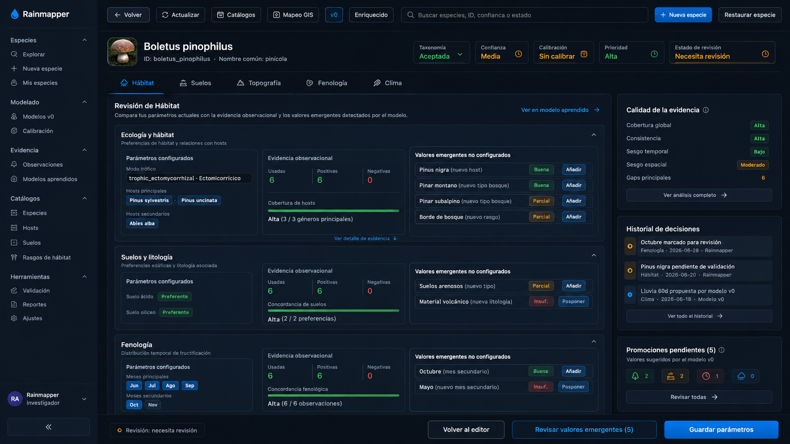

# Rediseño de la pantalla Parámetros de setas

Documento vivo para guiar y mantener el rediseño de la pantalla `Parámetros`
del mantenimiento de especies de setas.

## Objetivo

La pantalla `Parámetros` debe permitir comparar, de forma legible y
operativa, tres cosas sin mezclar responsabilidades:

- los parámetros actualmente configurados en `mushroom_profiles.json`;
- la evidencia observacional reconstruida y aprendida desde observaciones
  locales;
- los posibles valores emergentes que conviene revisar manualmente.

La pantalla no debe modificar perfiles automáticamente a partir del modelo
aprendido. Su papel inicial es enseñar diferencias, soporte y gaps para que el
usuario pueda decidir después desde los flujos de revisión apropiados.

## Principios de diseño

- La UI debe ser coherente, usable a nivel humano y entendible sin leer JSON.
- La aplicación es multiidioma; todo texto visible nuevo debe ir a
  `mushroom-data/mushroom_labels.json`, con entradas `en`, `es` y `ca`.
- No se deben mostrar claves raw del modelo si existe label de catálogo o de
  UI.
- No se debe sacrificar la legibilidad conseguida en iteraciones anteriores.
- La comparación aprendida debe ser compacta, de lectura rápida y no
  dominante.
- Las acciones destructivas o de promoción de parámetros deben quedar fuera de
  esta primera fase.
- Los campos que se oculten visualmente por tabs no deben perderse al guardar.

## Referencia visual

El mockup de referencia es:

```text
docs/mushrooms/ui/profiles/mushroom-parameters-redesign.png
```



No debe copiarse literalmente. La parte relevante ahora es el cuerpo de la
pantalla: secciones internas por dominio y bloques de comparación entre
parámetros configurados, evidencia observacional y valores emergentes. La
navegación lateral del mockup queda como dirección futura, no como requisito de
esta fase.

## Estado antes del rediseño

La pantalla `Parámetros` mostraba en una sola vista:

- modelo climático;
- pesos de scoring;
- ecología y hábitat;
- suelos y litología;
- topografía;
- fenología.

En modo `v0` ya estaba más compacta y ocultaba parte de los campos enriched,
pero seguía concentrando demasiada información en una sola pantalla. Añadir
evidencia aprendida encima de ese layout habría degradado la legibilidad.

## Cambio implementado inicial

Se han añadido tabs internos dentro de `Parámetros`:

- `Ecología`;
- `Suelos`;
- `Topografía`;
- `Fenología`;
- `Meteorología`.

En modo `v0`, `Meteorología` queda oculta porque los umbrales enriquecidos no
son parte activa de la proyección v0 actual.

La URL conserva el tab activo con:

```text
parameter_view=<habitat|soils|topography|phenology|climate>
```

La pantalla sigue usando un único formulario de guardado. Los paneles inactivos
se ocultan visualmente, pero sus campos permanecen en el DOM para no perder
datos al guardar. Esto es importante porque el backend de `save_profile_parameters`
actualiza varios bloques del perfil a la vez.

Las pestañas internas deben comportarse visualmente como pestañas reales, no
como botones de acción. La pestaña activa queda conectada con el contenido y
las pestañas inactivas mantienen una jerarquía discreta.

En las secciones con comparación, la columna de `Modelo aprendido` debe heredar
la misma métrica visual que la columna de parámetros configurados: mismo
padding base, misma escala tipográfica de subtítulo y altura alineada con la
subsección principal. El objetivo es que la comparación parezca parte de la
misma herramienta y no un panel técnico añadido al lado.

En el tab `Ecología`, la comparación debe leerse por bloques equivalentes:

- `Modo trófico` en la columna de perfil frente a métricas de observaciones en
  la columna aprendida;
- `Hosts` frente a hosts aprendidos;
- `Tipos de bosque` frente a bosques aprendidos;
- `Rasgos de hábitat` frente a rasgos aprendidos.

La nota explicativa de comparación de solo lectura no debe ocupar espacio en
esta vista compacta; esa responsabilidad queda documentada aquí y en la
pantalla de `Evidencia`.

Estado visual al cierre 2026-07-04:

- los tabs internos ya son pestañas reales;
- la pantalla de `Parámetros` permite cambiar de especie desde la cabecera;
- el tab `Ecología` ya usa dos columnas: perfil configurado y `Modelo v0 aprendido`;
- el modelo aprendido ya muestra observaciones usadas/positivas/negativas y
  valores aprendidos por hosts, bosques y rasgos de hábitat;
- queda pendiente pulir la alineación vertical exacta entre columnas,
  especialmente en `Tipos de bosque` y `Rasgos de hábitat`;
- la navegación lateral del mockup sigue siendo dirección futura, no requisito
  de este cierre.

## Comparación con modelo aprendido

Se ha empezado a mostrar evidencia aprendida junto a los parámetros
configurados.

### Ecología

Muestra comparación para:

- hosts;
- tipos de bosque;
- rasgos de hábitat.

Para cada grupo se muestra:

- coincidencia con el perfil;
- valores observados por el modelo aprendido que no están configurados;
- soporte positivo y ratio observado.

### Suelos

Muestra comparación para:

- tendencias/tipos de suelo.

Litología se mantiene solo como parámetro configurado, porque el modelo
aprendido v0 actual no la usa como eje operativo principal.

### Topografía

Muestra comparación para:

- rango de altitud configurado en el perfil;
- rango de altitud observado en las observaciones positivas;
- media observada.

No se infieren nuevos umbrales ni se cambian rangos del perfil.

## Lo que NO hace todavía

- No promueve valores emergentes al perfil.
- No ajusta rangos de altitud automáticamente.
- No calcula pesos productivos.
- No convierte el modelo aprendido en predictor operativo.
- No compara fenología todavía, porque el modelo aprendido actual no resume
  meses como feature propia.
- No compara clima todavía en la pantalla `Parámetros`, aunque el modelo
  aprendido ya contiene lluvia, temperatura y humedad por ventanas.
- No cambia la navegación global superior de `Mantenimiento de especies` por
  una navegación lateral.

## Dirección de diseño

La dirección esperada para el cuerpo de la pantalla es:

```text
Sección activa
  Parámetros configurados
  Evidencia observacional / modelo aprendido
  Valores emergentes no configurados
```

No tiene por qué materializarse siempre como tres columnas fijas. En pantallas
estrechas, la evidencia puede bajar debajo de los parámetros configurados.

## Próximos pasos

1. Pulir alineación vertical en `Ecología`: `Modo trófico` frente a métricas,
   `Hosts` frente a hosts, `Tipos de bosque` frente a bosques y `Rasgos de
   hábitat` frente a rasgos.
2. Ajustar alturas, anchos y scrolls internos si alguna sección pierde
   legibilidad en portatil o desktop.
3. Extender comparación a `Suelos` y `Topografía` con el mismo lenguaje visual.
4. Añadir comparación climática en el tab `Meteorología`, probablemente con
   bloques por:
   - lluvia 7/14/21/30/60/90 días;
   - temperatura 7/14/21/30 días;
   - humedad 7/14/21/30 días.
5. Añadir comparación fenológica solo cuando el modelo aprendido genere
   evidencia temporal por meses o ventanas de temporada.
6. Convertir valores emergentes en propuestas revisables, pero sin aplicar
   cambios automáticos.
7. Evaluar más adelante si la navegación lateral del mockup debe sustituir o
   complementar los tabs superiores de la aplicación.

## Riesgos

- Ocultar inputs por tabs puede provocar pérdidas de datos si se cambia el
  guardado parcial en el futuro. Cualquier refactor debe revisar
  `profile_parameters_from_form`.
- La pantalla puede saturarse si se añaden demasiadas métricas climáticas sin
  agrupar.
- El modelo aprendido actual es descriptivo. Sus valores no son umbrales
  productivos.
- Con pocas observaciones, los valores emergentes pueden ser ruido. La UI debe
  mostrar soporte y gaps, no conclusiones fuertes.

## Archivos relacionados

- `rainmapper-app/app/mushroom_profiles_ui.py`
- `rainmapper-app/app/web_server.py`
- `rainmapper_core/mushroom_learned_model.py`
- `mushroom-data/mushroom_labels.json`
- `docs/mushrooms/mushroom-predictor-design-es.md`
- `docs/mushrooms/mushroom-parameter-reconstruction-lab-plan-es.md`
- `docs/mushrooms/ui/profiles/mushroom-observations-ui-current-state-es.md`
